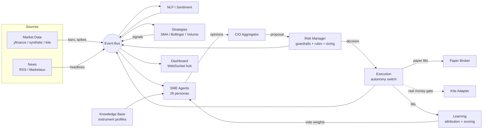

# Agentic Trading Server

An always-on, server-oriented agentic system for the Indian equity market (NSE).
It monitors prices and volume, scrapes and scores news, runs a roster of LLM-backed
**subject-matter expert (SME) agents** that debate each opportunity, aggregates their
views through a **CIO**, sizes positions under hard risk guardrails, and learns from
the outcomes of its own (paper) trades — all behind a live, multi-page web dashboard.

**Built for the Indian market.** The universe is NSE large caps +
indices + commodity ETFs; the base currency is INR; the fee model
charges brokerage, STT, exchange fees, stamp duty, and GST the Indian
way; market-data polling respects the NSE calendar (09:15–15:30 IST,
exchange holidays); fundamentals cover NSE symbols; the option-chain
monitor reads NIFTY IV; and the broker integration path is Zerodha
Kite, gated behind the real-money switch.

It is **paper-first and safety-first**: real money is impossible to trade until you
explicitly open a config-only gate. Out of the box it runs on a laptop or Raspberry Pi
with no API keys, no database server, and no internet strictly required.

> ⚠️ **Not financial advice.** This is a personal research/engineering project. Markets
> are adversarial; a backtest or a paper-trading streak is not an edge. Read the
> [Safety model](#safety-model) and [Path to real money](#path-to-real-money) before
> even thinking about live capital.

---

## Table of contents

- [What it does](#what-it-does)
- [Architecture](#architecture)
- [The pipeline](#the-pipeline)
- [The dashboard](#the-dashboard)
- [Repository layout](#repository-layout)
- [Quick start](#quick-start)
- [Configuration](#configuration)
- [Safety model](#safety-model)
- [SMEs and the LLM](#smes-and-the-llm)
- [Learning and self-governing rules](#learning-and-self-governing-rules)
- [Running the pieces](#running-the-pieces)
- [Docker deployment](#docker-deployment)
- [Bare-metal / Raspberry Pi (systemd)](#bare-metal--raspberry-pi-systemd)
- [Path to real money](#path-to-real-money)
- [The quant toolkit](#the-quant-toolkit)
- [Tests](#tests)

---

## What it does

- **Watches the market.** Polls OHLCV for a curated NSE universe (~50 large-caps across
  sectors + key index/commodity ETFs like `NIFTYBEES`, `GOLDBEES`, `SILVERBEES`),
  persists bars, and flags volume spikes.
- **Reads the news.** Pulls RSS/free-tier feeds, de-duplicates, maps headlines to
  tickers, and scores sentiment (finance-tuned FinBERT when provisioned, VADER
  fallback — see [docs/nlp_sentiment.md](docs/nlp_sentiment.md)).
- **Thinks like a desk.** A roster of 26 expert personas (technicals, value, macro,
  geopolitics, sectors, ETFs, risk, …) each produce a grounded opinion; a **CIO**
  aggregates them with track-record-weighted voting into a proposed position.
- **Manages risk.** A risk manager enforces immutable guardrails (position/sector caps,
  gross exposure, per-order value, daily loss limit, rate limits), then a Kelly-capped
  allocator sizes the trade.
- **Executes safely.** A four-state autonomy switch (`OFF → PAPER → APPROVAL → AUTO`)
  routes the decision to a realistic paper broker (Zerodha-style fees + slippage) or,
  once the real-money gate is open, to a Kite adapter.
- **Learns.** Fills are attributed back to the SMEs that drove them; forward returns
  update each SME's hit-rate, Brier score, and vote weight, promoting or demoting them.
- **Governs itself.** Beyond the immutable guardrails, an adaptive rulebook can propose,
  shadow, and activate new conservative-only rules within meta-limits it cannot exceed.
- **Shows you everything.** A multi-page dashboard with a live pipeline view, agent/SME
  activity, news flow, graphical logs, toast notifications, and control buttons.

---

## Architecture

A **modular monolith**: one process, many fault-isolated services coordinating over an
event bus and a scheduler. Every external dependency has an in-process fallback, so the
system boots and the dashboard always comes up even if a feed, key, or DB is missing.



**Core infrastructure** (`ats/core/`): typed config (pydantic-settings), structured
JSON logging with secret redaction, SQLAlchemy 2.0 models, Pydantic schemas, an async
event bus (`InMemoryEventBus` or `RedisStreamBus`), and a hash-chained, tamper-evident
audit log + runtime key/value state.

**Storage**: SQLite by default; swap to PostgreSQL/TimescaleDB by changing one URL.
**Event bus**: in-memory by default; Redis Streams for multi-service scale.

---

## The pipeline

Services communicate by publishing/subscribing to canonical event topics:

| Stage | Service | Publishes |
|---|---|---|
| Market Data | `market_data` | `market.bar`, `market.volume_spike` |
| News Scraper | `scraper` | `news.item` |
| NLP / Sentiment | `nlp` | `news.sentiment` |
| Strategies | `strategies` | `strategy.signal` |
| SME Agents | `agents` | `agent.opinion`, `agent.proposal` |
| Risk Manager | `risk` | `exec.decision` |
| Execution | `execution` | `exec.order`, `exec.fill`, `exec.approval_request` |
| Learning | `learning` | (updates SME track records) |
| Rules | `rules` | `rules.change` |

The scheduler drives the cadence (defaults): market scan every **60s**, agent cycle
every **120s**, news poll every **300s** — so the pipeline updates in steady waves.

---

## The dashboard

Open `http://127.0.0.1:8000`. One WebSocket (`/ws`) fans every event out to all pages;
a shared header carries live status pills and the control buttons (mode selector, kill
switch). Toast notifications fire on any page for volume spikes, approvals, fills,
decisions, and alerts.

| Page | Route | What you see |
|---|---|---|
| **Overview** | `/` | Equity, real PnL, positions, watchlist news + sentiment, decisions, approvals, leaderboard |
| **Pipeline** | `/pipeline` | Eight stage boxes that flash as events pass through; per-stage counters, throughput bars, newest activity |
| **Agents** | `/agents` | Full SME roster (family, base weight, earned vote weight), live opinion stream, macro tilt, leaderboard |
| **News** | `/news` | Live headline feed (watchlist hits highlighted), sentiment board, ingested/scored/hits counters |
| **Logs** | `/logs` | Colour-coded event stream by pipeline stage, pause toggle, live topic-rate bars |

Read/control APIs: `/api/health`, `/api/state`, `/api/dashboard`, `/api/pipeline`,
`/api/agents`, `/api/logs`, `POST /api/mode`, `POST /api/kill`,
`GET|POST /api/approvals/...`.

---

## Repository layout

```
ats/                         # the agentic trading server
├── core/                    # config, logging, db, models, schemas, event bus, state
├── server/                  # FastAPI app, orchestrator, control API, dashboard + WS hub
│   ├── static/              #   app.css, app.js (shared client runtime)
│   └── templates/           #   base + overview/pipeline/agents/news/logs pages
└── services/
    ├── market_data/         # pluggable data sources (yfinance/synthetic/kite), polling
    ├── scraper/             # RSS/Marketaux collectors, dedup, ticker mapping
    ├── nlp/                 # sentiment (VADER/FinBERT), NER, vector store (RAG)
    ├── strategies/          # SMA crossover, Bollinger mean-reversion, volume breakout
    ├── knowledge/           # instrument profiles (company/ETF/fund knowledge base)
    ├── agents/              # SME registry + runtime, LLM client, tools, CIO aggregator
    ├── risk/                # guardrails, adaptive-rule clamp, Kelly-capped allocator
    ├── execution/           # autonomy switch, paper broker, fees, portfolio, kite stub
    ├── learning/            # fill attribution + SME scoring/promotion
    ├── rules/               # self-governing rule engine (lifecycle + meta-limits)
    └── dashboard/           # snapshot builder + event→WebSocket bridge
quant/                       # standalone analytics toolkit (indicators, valuation, backtest, risk)
scripts/                     # harness.py, train_smes.py, smoke.py, demo.py, backup.sh
deploy/                      # Dockerfile, docker-compose.yml, ats.service, .env.example
tests/                       # safety-critical unit tests + quant tests
```

---

## Quick start

Requires Python **3.11+**.

```bash
# 1. Clone and create a virtualenv
git clone git@github.com:usopp-sama/agentic-trading.git
cd agentic-trading
python3 -m venv .venv && source .venv/bin/activate

# 2. Install
pip install -r requirements.txt

# 3. (optional) configure — defaults are safe (PAPER mode, no keys needed)
cp deploy/.env.example .env

# 4. Run the server
python -m ats.server
```

Then open **http://127.0.0.1:8000**.

- Defaults to real (delayed) NSE data via `yfinance`, falling back to a deterministic
  synthetic generator **per symbol** if a fetch fails — so it still boots fully offline.
- To force offline/deterministic mode: `ATS_DATA_SOURCE=synthetic python -m ats.server`.
- The SMEs use a **grounded mock LLM** by default (no API key). See
  [SMEs and the LLM](#smes-and-the-llm) to wire a real model.

---

## Configuration

All settings are environment variables prefixed `ATS_`, loaded from a repo-root `.env`
(see `deploy/.env.example`). Secrets are `repr`-hidden and redacted from logs.

| Variable | Default | Purpose |
|---|---|---|
| `ATS_ENV` / `ATS_DEBUG` | `dev` / `true` | Environment + debug logging |
| `ATS_DB_URL` | `sqlite:///var/ats.db` | SQLite or `postgresql+psycopg://…` |
| `ATS_EVENT_BUS` | `memory` | `memory` or `redis` |
| `ATS_REDIS_URL` | `redis://localhost:6379/0` | Redis Streams bus/cache |
| `ATS_VECTOR_STORE` | `memory` | `memory` or `chroma` (if installed) |
| `ATS_NLP_SENTIMENT_MODEL` | `auto` | `auto` (FinBERT, VADER fallback) \| `finbert` \| `vader` ([docs](docs/nlp_sentiment.md)) |
| `ATS_NLP_FINBERT_DOWNLOAD` | `false` | Allow runtime FinBERT weight download (default: cache-only, no startup hang) |
| `ATS_DATA_SOURCE` | `yfinance` | `yfinance` \| `synthetic` \| `kite` |
| `ATS_TRADING_MODE` | `PAPER` | `OFF` \| `PAPER` \| `APPROVAL` \| `AUTO` |
| `ATS_REAL_MONEY_ENABLED` | `false` | **Master real-money gate** (config-only) |
| `ATS_PAPER_STARTING_CAPITAL` | `1000000` | Paper book size (₹) |
| `ATS_LLM_PROVIDER` | `mock` | `mock` \| `ollama` \| `openai` |
| `ATS_LLM_MODEL` / `ATS_LLM_CIO_MODEL` | `mock-1` | Per-agent and CIO models |
| `ATS_MAX_POSITION_PCT` | `0.10` | Max 10% capital per name |
| `ATS_MAX_SECTOR_PCT` | `0.35` | Max 35% per sector |
| `ATS_MAX_GROSS_EXPOSURE_PCT` | `1.00` | No leverage in v1 |
| `ATS_DAILY_LOSS_LIMIT_PCT` | `0.03` | 3% daily loss → kill switch |
| `ATS_MAX_TRADE_VALUE` | `50000` | Per-order absolute cap (₹) |
| `ATS_MAX_ORDERS_PER_MIN` | `30` | Rate limit |
| `ATS_MARKET_SCAN_INTERVAL_S` | `60` | Market poll cadence |
| `ATS_AGENT_CYCLE_INTERVAL_S` | `120` | Agent cycle cadence |
| `ATS_NEWS_POLL_INTERVAL_S` | `300` | News poll cadence |
| `ATS_MARKETAUX_API_KEY` | — | Marketaux news (free tier: 100 req/day) |
| `ATS_MARKETAUX_MIN_INTERVAL_S` | `1200` | Min gap between Marketaux calls (~72/day, under the free cap) |
| `ATS_EMAIL_SMTP_HOST` / `_PORT` | — / `587` | SMTP host + port (587 STARTTLS, 465 TLS) — alerts & digest |
| `ATS_EMAIL_SMTP_USER` / `_PASSWORD` | — | SMTP login (use an app password, not your account password) |
| `ATS_EMAIL_FROM` / `_TO` | — | Sender + comma-separated recipients (set all three of host/from/to to enable) |
| `ATS_KITE_API_KEY` / `_SECRET` / `_ACCESS_TOKEN` | — | Zerodha (deferred) |

Free-tier API keys (`ATS_MARKETAUX_API_KEY`, `ATS_FRED_API_KEY`, Telegram, …) are all
optional; the system degrades gracefully without them.

---

## Safety model

Multiple independent layers stand between the agents and your money:

1. **The real-money gate** — `ATS_REAL_MONEY_ENABLED` is the master switch. While it is
   `false`, real orders are *impossible* regardless of mode; everything routes to the
   paper broker. It can **only** be changed in config, never over the API or dashboard.
2. **The autonomy switch** — `OFF` blocks all execution; `PAPER` simulates fills;
   `APPROVAL` requires your explicit ✓ per trade; `AUTO` proceeds on its own (still
   gated by #1).
3. **Immutable guardrails** — position/sector caps, gross-exposure limit, per-order
   value cap, daily-loss limit, and order rate limits apply in *all* live modes and
   cannot be overridden by adaptive rules.
4. **The kill switch** — one click halts execution immediately; auto-engages if the
   daily loss limit is breached.
5. **Tamper-evident audit log** — every mode change, decision, and fill is recorded in a
   hash-chained log; the dashboard surfaces whether the chain still verifies.

---

## SMEs and the LLM

Each SME is a persona (YAML-defined: family, scope, base weight, inputs) that reasons
over **grounded** inputs — real indicators, volume stats, sentiment, and instrument
knowledge — never free-floating speculation. The CIO aggregates opinions using
track-record-weighted voting plus a macro tilt.

By default `ATS_LLM_PROVIDER=mock`: a deterministic, grounded heuristic so the entire
system runs with **no API key**. To use a real model:

```bash
# Local & free — install Ollama, then:
ollama pull llama3.1
# in .env:
ATS_LLM_PROVIDER=ollama
ATS_LLM_MODEL=llama3.1
ATS_LLM_BASE_URL=http://localhost:11434

# Or hosted:
ATS_LLM_PROVIDER=openai
ATS_LLM_MODEL=gpt-4o-mini
ATS_LLM_API_KEY=...        # your key, your bill
```

A stronger model can be assigned to the CIO for synthesis via `ATS_LLM_CIO_MODEL`.

---

## Learning and self-governing rules

- **Attribution & scoring** — when a fill happens, it is linked to the SMEs whose votes
  drove it. Forward returns update each SME's hit-rate, Brier score, and PnL
  contribution, which adjusts their **vote weight**. Sustained performers get promoted
  (more influence); poor ones get demoted toward shadow status.
- **Adaptive rulebook** — the system can propose new *conservative-only* rules (e.g.
  "skip overbought entries", "trim in high volatility"). New rules are validated against
  **meta-limits** (they can never loosen a protected guardrail), shadow-tested, then
  activated — with a full version history.

To bootstrap SME track records from real historical performance (an honest walk-forward
backtest, not random seeding):

```bash
python scripts/train_smes.py
```

---

## Running the pieces

```bash
python -m ats.server          # the always-on server + dashboard (uvicorn on :8000)
python scripts/harness.py     # boot the orchestrator headless, drive cycles, print state
python scripts/train_smes.py  # calibrate SME vote weights from historical backtests
python scripts/smoke.py       # end-to-end smoke test via FastAPI TestClient
pytest                        # unit tests (safety invariants + quant toolkit)
```

---

## Docker deployment

The image is multi-arch (amd64/arm64), runs as a non-root user, drops all capabilities,
and exposes a health check.

### Option A — standalone (SQLite + in-memory bus)

Simplest; everything in one container. Good for a laptop or Pi.

```bash
# Build (from repo root)
docker build -f deploy/Dockerfile -t ats:latest .

# Run — bind to localhost only, persist the data dir
docker run --rm \
  -p 127.0.0.1:8000:8000 \
  -v ats_data:/app/var \
  --env-file .env \
  ats:latest
```

Open http://127.0.0.1:8000. To include Postgres/Redis drivers in the image, build with
`--build-arg INSTALL_EXTRAS=true`.

### Option B — full stack (Postgres/TimescaleDB + Redis) via Compose

Brings up the app with a TimescaleDB and a Redis, all hardened (non-root, no docker
socket, localhost-only, resource limits, healthchecks).

```bash
# 1. Provide config at repo root (compose reads ../.env relative to deploy/)
cp deploy/.env.example .env

# 2. Set a strong Postgres password (used by the app + the DB)
export POSTGRES_PASSWORD='choose-a-strong-one'

# 3. Build and start
cd deploy
docker compose up --build -d

# Logs / status / stop
docker compose logs -f app
docker compose ps
docker compose down            # add -v to also drop data volumes
```

Compose wires the app to `postgresql+psycopg://ats:<password>@postgres:5432/ats` and the
Redis Streams bus automatically. The app is published on `127.0.0.1:8000` only — for
remote access use Tailscale/VPN, **never** expose `0.0.0.0`.

### Multi-arch build (e.g. build on a Mac for a Raspberry Pi)

```bash
docker buildx build --platform linux/amd64,linux/arm64 \
  -f deploy/Dockerfile -t <your-registry>/ats:latest --push .
```

---

## Bare-metal / Raspberry Pi (systemd)

For an always-on box without Docker, supervise the standalone mode with systemd:

```bash
# Deploy code to /opt/ats with its own venv + .env, then:
sudo cp deploy/ats.service /etc/systemd/system/ats.service
sudo systemctl daemon-reload
sudo systemctl enable --now ats
journalctl -u ats -f
```

The unit auto-restarts on crash (with crash-loop protection), runs least-privilege
(`NoNewPrivileges`, `ProtectSystem=strict`, read-write only on `var/`), and caps memory.

Encrypted, timestamped backups of the SQLite DB + state:

```bash
scripts/backup.sh
```

---

## Path to real money

This system is intentionally hard to point at live capital. The intended progression:

1. **Paper, offline** → validate the plumbing.
2. **Paper, live data** (default) → watch behaviour over weeks; train SMEs.
3. **Shadow** → log what it *would* do against live data without trading.
4. Generate Zerodha **Kite Connect** credentials, fill `ATS_KITE_*`, install
   `kiteconnect`, and test the adapter in `APPROVAL` mode with tiny size.
5. Only after sustained, honest out-of-sample performance and a compliance review:
   open `ATS_REAL_MONEY_ENABLED=true`, stay in `APPROVAL`, and size up slowly.

A paper-trading streak is **not** proof of edge. Treat every step as falsification, not
confirmation.

---

## The quant toolkit

`quant/` is a standalone, look-ahead-safe analytics library the server builds on:
OHLCV data + `PriceStore`, technical indicators (SMA/EMA/RSI/MACD/Bollinger/vol),
valuation (DCF, DDM, ETF NAV premium/discount, cost-of-carry), a declarative screener,
a vectorized backtester, and Kelly position sizing. It runs fully offline:

```bash
python scripts/demo.py                       # offline synthetic demo
python scripts/demo.py --online --ticker AAPL
python -m quant.projects.silverbees_nav      # SILVERBEES NAV premium/discount
```

Run the first roadmap mini-project (SILVERBEES NAV premium/discount):

```bash
python -m quant.projects.silverbees_nav            # live data
python -m quant.projects.silverbees_nav --offline  # synthetic data
```

## Package layout

| Module | What it does |
|---|---|
| `quant.data` | Fetch OHLCV via `yfinance`; persist to SQLite (`PriceStore`). Synthetic generator for offline use. |
| `quant.analysis.indicators` | SMA, EMA, RSI (Wilder), MACD, Bollinger Bands, ATR, Donchian channels, annualized vol. |
| `quant.analysis.regime` | Market regime classifier: trend (up/down/range) x volatility (calm/normal/crisis) + style tilt matrix. |
| `quant.analysis.valuation` | Two-stage DCF, dividend discount model, margin of safety, ETF NAV premium/discount, cost-of-carry futures price. |
| `quant.analysis.screener` | Declarative, rule-based screener with ranking. |
| `quant.backtest` | Vectorized, look-ahead-safe signal backtester + the anti-overfitting toolkit: walk-forward optimization, block-bootstrap Monte Carlo drawdowns, parameter-plateau scoring, deflated Sharpe ratio. |
| `quant.risk` | Kelly criterion (discrete + continuous), fractional Kelly, capped position sizing. |
| `quant.options` | Black-Scholes-Merton pricing + Greeks, implied vol (bisection), CRR binomial tree (American exercise). |
| `quant.projects` | End-to-end mini-projects (SILVERBEES NAV analysis). |

## Strategy library (roadmap Part 7)

Proven strategy families implemented in `ats.services.strategies.library`,
each tagged with a style the regime layer understands:

| Strategy | Family | Core rule |
|---|---|---|
| `donchian_trend` | Trend following (7.1) | Buy 55-bar breakout, exit below 20-bar low; conviction in ATR units. |
| `ts_momentum` | Time-series momentum (7.1/7.2) | Sign of 12-month return skipping the latest month; vol-scaled conviction. |
| `rsi2_reversion` | Short-term mean reversion (7.3) | RSI(2) < 10 above the 200-SMA buys the pullback; > 70 exits. |
| `pairs_zscore` | Pairs / stat arb (7.4) | Z-score of log price ratio; long the cheap leg past 2σ (long-only book). |
| `factor_composite` | Factor investing (7.10) | Top-N basket by momentum + low-vol + value + quality percentile ranks; ~quarterly rebalance. |
| `nav_premium` | ETF NAV arbitrage (7.5) | SILVERBEES/GOLDBEES premium vs rolling fair ratio to COMEX silver/gold; buy the discount, exit the premium. |
| `vol_premium` | Volatility risk premium (7.7) | Sells defined-risk NIFTY iron condors when ATM IV is rich vs realized; 50% profit target, 2x credit stop; never in crisis regime; paper-only. |
| `sma_crossover` | Trend | 20/50 SMA crossover baseline. |
| `mean_reversion` | Mean reversion | Bollinger %b band reversion. |
| `volume_breakout` | Momentum | Price breakout confirmed by volume z-score. |

## Autonomy & safety services (roadmap Part 10)

| Component | What it does |
|---|---|
| `ats.services.watchdog` | Dead-man's switch: tracks bar heartbeats (market-hours aware), alerts on staleness, engages the kill switch after sustained silence. Never auto-releases — a human re-arms. |
| `ats.services.email` | Preferred alert channel: the `notify()` funnel emails alerts, the daily digest, and approval requests over TLS (STARTTLS/SSL); `EmailService` forwards bus alerts (strategy decay, feed degrade/recover). Dormant without SMTP config. |
| `ats.services.telegram` | One-tap approvals (autonomy L1): staged orders arrive as messages with Approve/Reject buttons wired to the same audited approval path as the dashboard; alerts forwarded. Dormant without a token. |
| `ats.services.execution.options_book` | Defined-risk options paper execution: credit spreads/iron condors with worst-case margin reserved at open — losses are bounded by construction. |

## India-market data layer

| Component | What it does |
|---|---|
| `ats.services.market_data.calendar` | NSE trading calendar: IST hours (09:15–15:30), 2026 holiday list, post-close grace window. Live-source polling pauses off-hours. |
| `ats.services.fundamentals` | Ratios for NSE equities (P/E, P/B, ROE, D/E, margins) via pluggable providers: yfinance (`.NS`) live, deterministic synthetic offline. Feeds value/quality factors, the screener, and agents. |
| `ats.services.market_data.option_chain` | NIFTY option chain via the nseindia.com API (cookie warm-up, browser headers, graceful failure) or a synthetic chain offline. |
| `ats.services.options_data` | Polls the chain, computes ATM IV, put-call ratio, and the IV premium over 20-day realized vol — the vol-risk-premium monitor that the future defined-risk options sleeve (7.7) will trade on. |

Four coordination layers keep multiple strategies from conflicting
(roadmap Part 8): the **CIO** nets opposing views into one proposal per
symbol; **virtual sleeves** (`ats.services.strategies.sleeves`) mark each
strategy's own book to market daily for attribution and flag decaying
sleeves (rolling-Sharpe alert); the **regime service**
(`ats.services.regime`) dampens conviction of styles that mismatch the
current market regime and halves new-exposure sizing in crisis volatility;
and the **capital allocator** (`ats.services.strategies.allocation`)
recomputes bounded risk-parity weights across sleeves daily — staging
automatically from inverse-vol to correlation-aware equal risk
contribution with a bounded performance tilt as sleeve history deepens —
applied as dampen-only conviction multipliers (the top sleeve keeps 1.0).

## Design notes

- **No look-ahead bias.** The backtester shifts signals by one bar before
  applying them — a signal generated on day *t* is traded on day *t+1*.
- **Offline-first.** Every module runs without internet via a deterministic
  GBM synthetic price generator, so demos and tests are reproducible.
- **TimescaleDB-ready.** `PriceStore` uses a `(symbol, date)` schema and
  parameterized SQL, so migrating from SQLite to PostgreSQL + TimescaleDB
  is a connection swap, not a rewrite.

---

## Tests

```bash
pytest
```

Covers safety-critical invariants (fee math, guardrails, autonomy routing, rule
meta-limits, position sizing, audit-chain integrity) plus the quant toolkit
(indicators, valuation, backtester).

## Roadmap mapping

This repo covers **Phase 1–3** of Part 5 in the roadmap (data pipeline,
analysis engine, signals + sizing) plus the first hands-on project, and
now the first slices of the multi-strategy build: the proven-strategy
library (Part 7: trend, momentum, mean reversion, pairs, factor
composite), regime detection (Part 7.12), sleeve P&L attribution +
decay detection (Parts 8.2/8.5), regime-aware risk scaling, and
inverse-vol capital allocation across sleeves (Part 8.4, stage 2).
The options pricing/Greeks calculator (Phase 5) is in `quant.options`,
and the strategy library is complete: all nine roadmap families,
including the defined-risk vol-premium sleeve trading paper iron
condors off the NIFTY IV monitor. Autonomy infrastructure (watchdog
dead-man's switch, Telegram one-tap approvals) is in. The agentic SME
intelligence layer — persona-driven experts, a CIO aggregator, a RAG
knowledge base with hybrid reliability-weighted retrieval, self-evolving
context-only directives, and an interactive expert console with living
theses and multi-expert debate — is documented in roadmap Part 14 and
`docs/smx.md`. News sentiment now runs finance-tuned FinBERT (with a
VADER fallback) — see [docs/nlp_sentiment.md](docs/nlp_sentiment.md).
Still ahead — folding the experts console into the multi-page
dashboard, ML-based signals with walk-forward validation, and the Kite
adapter when the paper track record earns real money.
