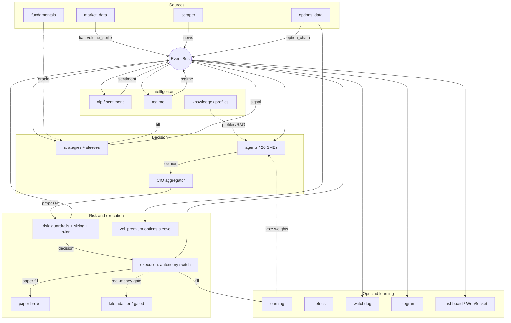
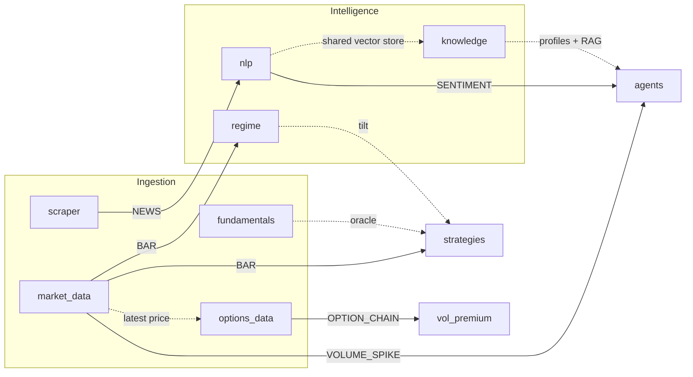
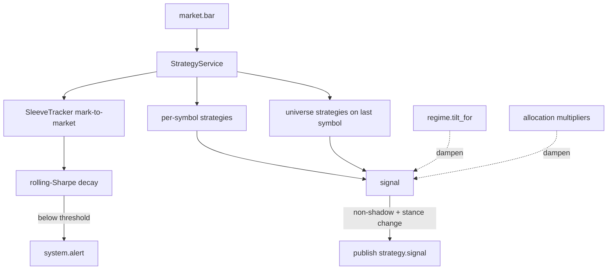
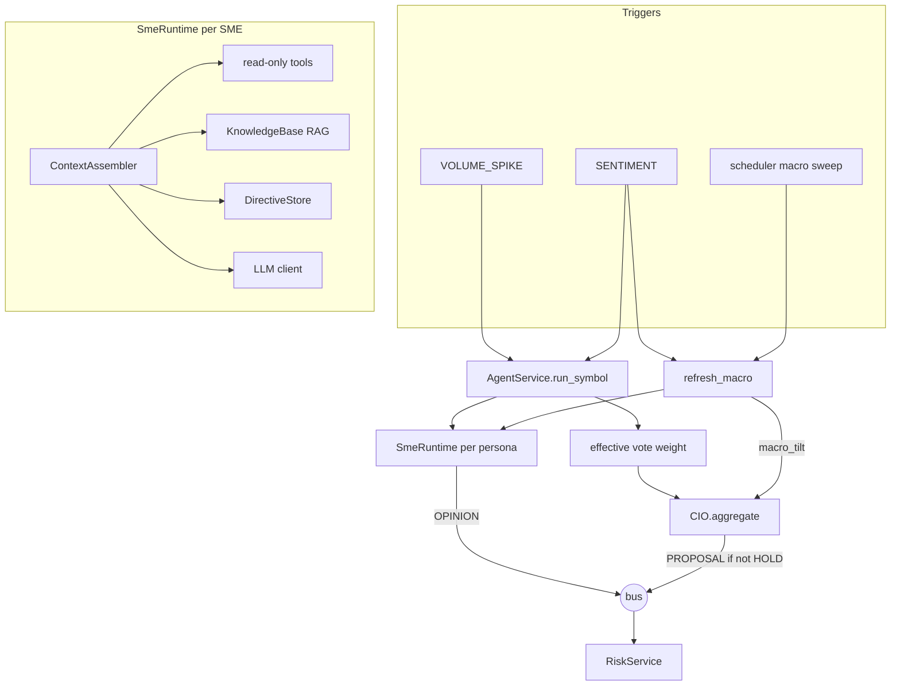
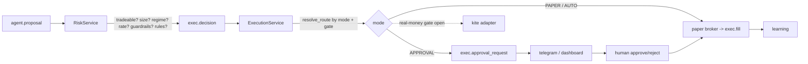
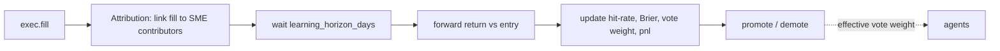
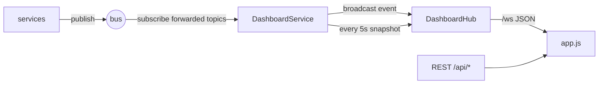

# System Architecture

> How the Agentic Trading Server is structured and how the pieces play together.
> This is the authoritative, code-grounded architecture reference. For the
> product pitch and quick start see [README.md](../README.md); for the SME
> intelligence design see [smx.md](smx.md) and [sme_knowledge_base.md](sme_knowledge_base.md).

---

## 1. System overview

The Agentic Trading Server is an always-on, server-oriented system for the
Indian equity market (NSE). It watches prices and volume, scrapes and scores
news, runs a roster of LLM-backed subject-matter expert (SME) agents that
debate each opportunity, aggregates their views through a **CIO**, sizes
positions under hard risk guardrails, executes against a realistic paper
broker, and learns from the outcomes — all behind a live, multi-page web
dashboard.

Three properties define the design:

- **Modular monolith.** One process hosts ~25 fault-isolated services that
  coordinate over an in-process event bus and a shared scheduler. Each service
  is registered independently and a failing/missing one is skipped, so the
  server always boots and the dashboard always comes up.
- **Paper-first, safety-first.** Real money is *impossible* until a config-only
  gate is opened. Multiple independent layers (autonomy switch, immutable
  guardrails, kill switch, hash-chained audit) sit between the agents and money.
- **Offline-first.** Every external dependency (market data, news, LLM, DB,
  bus, vector store) has an in-process fallback, so the whole system runs
  deterministically on a laptop or Raspberry Pi with no API keys and no
  internet.

The codebase splits in two:

- **`ats/`** — the agentic trading server (core infra, FastAPI server,
  services).
- **`quant/`** — a standalone, look-ahead-safe analytics toolkit the server
  builds on (indicators, valuation, backtester, risk sizing, options pricing).

---

## 2. Architecture at a glance

Sources feed an event bus; intelligence and strategy services turn raw data
into signals; SME agents and the CIO turn signals into a proposal; risk and
execution turn the proposal into a (paper) fill; learning feeds outcomes back
into the agents; and a dashboard service mirrors the whole bus to the browser.



The services actually wired (in registration order) are listed in
[ats/server/wiring.py](../ats/server/wiring.py) lines 20-39:
`market_data`, `regime`, `fundamentals`, `options_data`, `scraper`, `nlp`,
`strategies`, `knowledge`, `agents`, `risk`, `execution`, `vol_premium`,
`telegram`, `watchdog`, `learning`, `metrics`, `rules`, `dashboard`.

> Note: this diagram supersedes the smaller one in the README, which predates
> the `regime`, `fundamentals`, `options_data`, `vol_premium`, `telegram`,
> `watchdog`, and `metrics` services.

---

## 3. Core infrastructure (`ats/core/`)

Everything below the services lives in [ats/core/](../ats/core/). It is the
shared substrate: typed config, structured logging, persistence, in-memory
contracts, the event bus, and tamper-evident runtime state.

| File | Responsibility |
| --- | --- |
| [config.py](../ats/core/config.py) | Pydantic-settings `Settings` (env prefix `ATS_`, `.env` at repo root, `extra="ignore"`); cached `get_settings()`; ensures `var/` exists. Secrets use `Field(repr=False)`. |
| [logging.py](../ats/core/logging.py) | Structured JSON logging to stdout + optional rotating file; secret-key redaction and opaque-token scrubbing. |
| [db.py](../ats/core/db.py) | SQLAlchemy 2.0 engine from `db_url`; `init_db()` creates tables; `session_scope()` transactional context manager. |
| [models.py](../ats/core/models.py) | ORM tables: `Instrument`, `Ohlcv`, `NewsItem`, `SentimentScore`, `Signal`, `SmeOpinion`, `Decision`, `Order`, `Fill`, `Position`, `PnlDaily`, `Strategy`, `Rule`, `RuleVersion`, `Approval`, `AuditLog`, expert/thesis/directive tables; the slow-loop registry (`Hypothesis`, `HypothesisEvent`, `ResearchNote`, `AllocationRecommendation`); the analytics layer (`Fundamental`, `FinancialStatements`, `AnalyticsSnapshot`, `FlowDaily`); and `KvState`. |
| [schemas.py](../ats/core/schemas.py) | Pydantic in-memory contracts (not ORM): `Stance`, `Horizon`, `TradingMode` enums; `Opinion`, `SignalModel`, `ProposedPosition` with validators. |
| [events.py](../ats/core/events.py) | `Topic` constants, `Event` dataclass, `EventBus` protocol, `InMemoryEventBus` (asyncio), `RedisStreamBus` (optional), and `build_event_bus()`. |
| [state.py](../ats/core/state.py) | Runtime KV store, kill switch, trading-mode flag, real-money gate, and the hash-chained audit log. |

### Configuration

All settings are environment variables prefixed `ATS_` (see
[deploy/.env.example](../deploy/.env.example)). Key groups: web server
(`host`, `port`, `dashboard_token`), DB (`db_url`), event bus (`event_bus`,
`redis_url`), vector store (`vector_store`), LLM (`llm_provider`, `llm_model`,
`llm_cio_model`), trading mode/safety (`trading_mode`, `real_money_enabled`),
market data (`data_source`), risk guardrails (position/sector/gross caps,
daily-loss limit, per-order cap, rate limit), and scheduler cadences. Secrets
are `repr`-hidden and redacted from logs. The computed `is_real_money_active`
requires `real_money_enabled` **and** a live mode (`config.py` ~249-252).

### Runtime state and the audit chain ([state.py](../ats/core/state.py))

`state.py` is the single source of truth for live operational state, stored in
the `KvState` table so it survives restarts:

- **Generic KV** (`get_kv`/`set_kv`, ~41-50): peak equity, the options book,
  the learning horizon, etc.
- **Kill switch** (`is_killed`/`engage_kill_switch`/`release_kill_switch`,
  ~55-68).
- **Trading mode** (`get_mode`/`set_mode`, ~73-85): validates
  `OFF`/`PAPER`/`APPROVAL`/`AUTO`.
- **Real-money gate** (`real_money_active()`, ~88-95): requires the config flag,
  a live mode, and not-killed.
- **Audit** (`audit()`/`verify_audit_chain()`, ~100-131): each entry stores
  `SHA256(prev_hash + actor + action + sorted-JSON payload)`, forming a chain
  the dashboard can re-verify. Every mode change, kill, decision, and fill is
  audited.

---

## 4. Orchestration & lifecycle

The server is a FastAPI app whose lifespan boots the infrastructure and the
service graph.

```mermaid
sequenceDiagram
  participant U as uvicorn
  participant A as app.lifespan
  participant B as bootstrap.seed_all
  participant W as wiring.build_orchestrator
  participant O as Orchestrator
  U->>A: start
  A->>A: configure_logging, init_db
  A->>B: seed instruments / strategies / guardrails
  A->>W: build orchestrator
  W->>O: register each service (fault-isolated)
  A->>O: orch.start()
  O->>O: bus.start(); each service.start(ctx); scheduler.start()
  Note over O: running... events + scheduled jobs
  U->>A: shutdown
  A->>O: orch.stop() (reverse order)
```

- **App factory + lifespan** ([ats/server/app.py](../ats/server/app.py)):
  `configure_logging` -> `init_db()` -> `seed_all()` ->
  `build_orchestrator()` -> `orch.start()`. It mounts three routers
  (control `api`, `experts_api`, `results_api`), the dashboard, and an optional
  token-gate middleware.
- **Seeding** ([ats/services/bootstrap.py](../ats/services/bootstrap.py)):
  idempotent `seed_instruments()` (the NSE `UNIVERSE` from
  [ats/services/reference.py](../ats/services/reference.py)),
  `seed_strategies()`, and `seed_guardrails()` (creates `Rule` + first
  `RuleVersion`). Existing rows are skipped.
- **Wiring** ([ats/server/wiring.py](../ats/server/wiring.py)): a static list of
  `(module, class)` pairs. Each is imported and registered inside a
  `try/except`; a missing module or optional dependency is logged and skipped
  so the server still boots.
- **Orchestrator** ([ats/server/orchestrator.py](../ats/server/orchestrator.py)):
  owns the `EventBus` and an `AsyncIOScheduler`, plus a `registry` dict mapping
  service name -> instance. Services receive a `ServiceContext(bus, scheduler,
  orchestrator)` in `start()` and use it to subscribe to topics and register
  scheduled jobs. `orchestrator.get(name)` is how services reach each other
  synchronously (the "oracle" pattern, see section 5).

### Scheduler cadences (defaults)

| Job | Interval | Source setting |
| --- | --- | --- |
| Market scan (`poll_all`) | 60s | `market_scan_interval_s` |
| Agent macro sweep | `max(300, agent_cycle_interval_s * 3)` | `agent_cycle_interval_s` |
| News poll | 300s | `news_poll_interval_s` |
| Option-chain poll | configurable | `option_chain_interval_s` |
| Dashboard snapshot | 5s | (fixed in dashboard service) |
| Analytics close pass | 15:50 IST cron (+ on boot) | — |
| Analytics poll (movers/VWAP) | 60s | — |
| Statements refresh | Sun 18:00 IST cron | `statements_source` |
| Flows collect + veto | 19:00 IST cron | `flows_*` |
| Research weekly / monthly / nightly | Sat 10:00 / 1st-Sun 10:30 / 20:00 IST | `research_enabled` |
| Daily equity / digest / metrics | NSE close cron | — |

Per-symbol SME runs and strategy evaluation are **event-driven** (off
`market.volume_spike`/`news.sentiment` and `market.bar` respectively), not on a
fixed per-symbol timer.

---

## 5. The event pipeline

Services are decoupled: they communicate by publishing/subscribing to canonical
topics defined in [ats/core/events.py](../ats/core/events.py) (lines 28-44).
The default bus is an in-process asyncio queue; swapping `ATS_EVENT_BUS=redis`
moves to Redis Streams with the same interface and no code change.

### Canonical topics

| Topic constant | String | Primary producer | Primary consumers |
| --- | --- | --- | --- |
| `TICK` / `BAR` | `market.tick` / `market.bar` | market_data | strategies, regime, watchdog |
| `VOLUME_SPIKE` | `market.volume_spike` | market_data | agents, dashboard |
| `REGIME` | `market.regime` | regime | dashboard (consumers mostly poll) |
| `OPTION_CHAIN` | `market.option_chain` | options_data | vol_premium, dashboard |
| `NEWS` | `news.item` | scraper | nlp, dashboard |
| `SENTIMENT` | `news.sentiment` | nlp | agents, dashboard |
| `SIGNAL` | `strategy.signal` | strategies | dashboard |
| `OPINION` | `agent.opinion` | agents | dashboard |
| `PROPOSAL` | `agent.proposal` | agents (CIO) | risk |
| `DECISION` | `exec.decision` | risk | execution, dashboard |
| `ORDER` / `FILL` | `exec.order` / `exec.fill` | execution | learning, dashboard |
| `APPROVAL_REQUEST` | `exec.approval_request` | execution | telegram, dashboard |
| `RULE_CHANGE` | `rules.change` | (reserved) | — |
| `ALERT` | `system.alert` | market_data, strategies, watchdog | telegram, dashboard |

### Subscribe / publish matrix

| Service | Subscribes | Publishes |
| --- | --- | --- |
| market_data | — | `BAR`, `VOLUME_SPIKE`, `ALERT` (feed health) |
| scraper | — | `NEWS` |
| nlp | `NEWS` | `SENTIMENT` |
| regime | `BAR` (reference symbol) | `REGIME` (on change) |
| fundamentals | — | — (oracle only) |
| options_data | — | `OPTION_CHAIN` |
| strategies | `BAR` | `SIGNAL` (non-shadow), `ALERT` (decay) |
| knowledge | — | — (oracle only) |
| agents | `VOLUME_SPIKE`, `SENTIMENT` | `OPINION`, `PROPOSAL` |
| risk | `PROPOSAL` | `DECISION` |
| execution | `DECISION` | `FILL`, `APPROVAL_REQUEST` |
| vol_premium | `OPTION_CHAIN` | — (audit only) |
| telegram | `APPROVAL_REQUEST`, `ALERT` | — (HTTP out) |
| watchdog | `BAR` | `ALERT` |
| learning | `FILL` | — |
| metrics | — | — (cron file export) |
| rules | — | — (audit only) |
| dashboard | most topics (not `TICK`/`BAR`) | — (forwards to WebSocket) |

`exec.order` and `rules.change` exist as constants but are not currently
published.

### Two coordination channels

The bus is the **asynchronous** channel (fire-and-forget events). Alongside it,
services use a **synchronous oracle** channel: `ctx.orchestrator.get("name")`
returns another service instance so a caller can query current state directly.
Examples: strategies and risk read `regime.current()`; execution reads the
portfolio; agents pull `strategies`, `knowledge`, and `fundamentals` to build
context. `market.bar` is effectively the system clock that drives strategies,
regime, and the watchdog heartbeat.

---

## 6. Data & intelligence layer

These services turn the outside world (prices, news, fundamentals, options)
into structured, in-process facts that everything downstream reasons over.



### market_data ([ats/services/market_data/](../ats/services/market_data/))

- **Pluggable sources** ([sources.py](../ats/services/market_data/sources.py)):
  a `DataSource.poll(symbol)` protocol with `SyntheticDataSource` (deterministic
  GBM, ~6% inflated-volume bars for spike testing), `YFinanceDataSource`,
  `NseLiveSource` (yfinance daily + cached intraday, `.NS` mapping), and a
  `KiteDataSource` stub. `ResilientDataSource` wraps a live source with a
  per-symbol cache and synthetic fallback, exposing `is_live()` for feed health.
  `build_data_source()` honors `ATS_DATA_SOURCE` (`nse_live`/`yfinance`/`kite`,
  default synthetic).
- **NSE calendar** ([calendar.py](../ats/services/market_data/calendar.py)):
  09:15-15:30 IST sessions, holiday sets, and `is_polling_window()` (session +
  45-min post-close grace). Live polling pauses off-hours; synthetic always
  runs.
- **Service** ([service.py](../ats/services/market_data/service.py)): on start
  loads the active `Instrument` watchlist, optionally batch-prefetches, backfills
  history, and schedules `poll_all`. Each poll upserts bars, publishes
  `Topic.BAR`, detects volume spikes (`z >= 3.0` and volume `>= 2x` the
  30-bar mean) and publishes `Topic.VOLUME_SPIKE`. Feed degradation publishes
  `Topic.ALERT` and flips `feed_healthy()` (used by execution). Acts as an
  oracle: `get_history`, `latest_price`, `intraday`, `watchlist`, `data_status`.
- **Option chain** ([option_chain.py](../ats/services/market_data/option_chain.py)):
  `SyntheticOptionChain` and `NseOptionChain` (httpx + cookie warm-up) returning
  an `OptionChainSummary` (spot, ATM IV, PCR, expiry). Consumed by
  `options_data`, not by `MarketDataService` itself.

### scraper ([ats/services/scraper/](../ats/services/scraper/))

RSS collectors (Moneycontrol, ET, Business Standard, LiveMint, BusinessLine), a
Marketaux collector (if an API key is set), and a `MockCollector` fallback used
only when live collectors return zero items. Each item is SHA-256 deduped on
`title|url`, sanitized, ticker-mapped via the NLP `TickerMapper`, and published
as `Topic.NEWS`.

### nlp ([ats/services/nlp/](../ats/services/nlp/))

- **Sentiment** ([sentiment.py](../ats/services/nlp/sentiment.py)): backend is
  config-driven via `ATS_NLP_SENTIMENT_MODEL` (`auto`/`finbert`/`vader`).
  `auto` (default) prefers the finance-tuned FinBERT transformer and falls back
  to the lexical VADER scorer when `transformers`/`torch` are not installed, so
  the offline target still runs with zero extra deps. Scores in `[-1, 1]`; the
  active backend is recorded on each `SentimentScore` row.
- **Ticker mapping** ([ner.py](../ats/services/nlp/ner.py)): a `TickerMapper`
  built from the `Instrument` table (names, symbol roots) with whole-word regex
  matching, plus sector-keyword matching.
- **Vector store** ([vectorstore.py](../ats/services/nlp/vectorstore.py)): an
  `InMemoryVectorStore` doing hybrid hashed bag-of-words cosine + BM25, scaled by
  a `reliability` metadata field; optional Chroma backend via
  `ATS_VECTOR_STORE=chroma`. A shared singleton (`get_vector_store()`) is reused
  by both the SME knowledge base and the knowledge-service instrument profiles.
- **Service** ([service.py](../ats/services/nlp/service.py)): subscribes to
  `NEWS`, scores sentiment, indexes the doc, persists `SentimentScore` per ticker
  plus a pseudo-symbol `MARKET`, and publishes `Topic.SENTIMENT`. Oracle methods:
  `recent_sentiment`, `market_sentiment`, `recent_news`, `search`.

### fundamentals ([ats/services/fundamentals/](../ats/services/fundamentals/))

Pluggable providers (`SyntheticFundamentals`, `YFinanceFundamentals`) producing a
`FundamentalSnapshot` (P/E, P/B, ROE, D/E, margins, yield, market cap). No bus
events — a pure oracle (`get`, `all_latest`) consumed by the factor/value
strategies and by SME context. Non-EQ instruments (indices/ETFs/commodities) are
skipped up front via a cached instrument-type map, so no doomed vendor call is made.

Also owns the **financial-statements layer** (QA-5): a weekly, off-hours
(Sun 18:00 IST) refresh persists `FinancialStatements` rows (income/balance/cash-
flow lines) from yfinance or a paid/manual CSV export
([statements.py](../ats/services/fundamentals/statements.py),
[import_csv.py](../ats/services/fundamentals/import_csv.py), and
`scripts/import_statements.py`). Those lines feed the **fair-value surface**
([fair_value.py](../ats/services/fundamentals/fair_value.py)): the two-stage DCF
wired to real inputs with a wacc × growth sensitivity grid and a margin-of-safety
verdict, refusing on thin data rather than guessing.

### analytics ([ats/services/analytics/](../ats/services/analytics/))

The deterministic analytics engine (QA-7). A **close pass** (15:50 IST + on boot,
from stored history — no boot network) computes a full per-symbol snapshot —
technical summary (`quant.analysis.summary`), pivot/Fibonacci levels
(`quant.analysis.levels`), candlestick patterns (`quant.analysis.patterns`), fair
value, and screener metrics — and persists one `AnalyticsSnapshot` row per
(symbol, day) so the dashboard reads results back without recomputation. A **poll
pass** (1 min, in-memory) recomputes VWAP + volume-confirmed movers
(`quant.analysis.intraday`). Oracle methods `get`, `table`, `movers`, `screener`
back `/api/analytics*`, `/api/movers`, `/api/screener`, the Control Room heatmap,
and the Screener page. All heavy math is the pure `quant.analysis` modules; the
service only wires data in and persists results out, and **never proposes a
trade** — analytics feed pages, strategy features, and the slow loop's
pre-digested tables.

### options_data ([ats/services/options_data/](../ats/services/options_data/))

Polls the option-chain source on a schedule (gated to the NSE session for live
chains), pulls spot from `market_data`, computes 20-day realized vol via
`quant.analysis.indicators`, derives the **IV premium** (ATM IV - realized), and
publishes `Topic.OPTION_CHAIN`. This is the vol-risk-premium monitor the
`vol_premium` sleeve trades on.

### regime ([ats/services/regime/](../ats/services/regime/))

Subscribes to `BAR` (reference symbol only, default Nifty). Classifies trend
(price vs 200-SMA, +/-2% band -> up/down/range) x volatility (realized-vol
percentile -> calm/normal/crisis). Publishes `Topic.REGIME` on change. As an
oracle it exposes `current()`, `tilt_for(style)` (dampen-only style multipliers),
and `is_crisis()`, queried synchronously by strategies, risk, and vol_premium.

### knowledge ([ats/services/knowledge/](../ats/services/knowledge/))

Builds a structured profile + RAG text for every instrument (sector themes,
EQ/ETF/INDEX specifics) and indexes them in the shared vector store as
`profile:{symbol}`. Oracle methods: `get_profile`, `search_by_theme`,
`route_view_to_vehicle`. Feeds both the SME context and the SME knowledge base.

---

## 7. Strategy layer ([ats/services/strategies/](../ats/services/strategies/))

A library of proven, look-ahead-safe strategies, each tagged with a *style* the
regime layer understands, organized into virtual sleeves with daily capital
allocation.



- **Contracts** ([base.py](../ats/services/strategies/base.py)): a per-symbol
  `Strategy.evaluate(symbol, df)` and a `UniverseStrategy.evaluate_universe(...)`,
  both producing `SignalModel`s with clamped conviction and a `style` tag.
- **Families** ([library.py](../ats/services/strategies/library.py) +
  `library_trend_mr.py`, `library_events.py`, `library_factors.py`): per-symbol
  (`sma_crossover`, `mean_reversion`, `volume_breakout`, `donchian_trend`,
  `rsi2_reversion`, `ts_momentum`, plus 52-week/MACD-ADX/OU-Keltner and
  event/sentiment/seasonal strategies, plus `tech_confluence` — the analytics-
  engine sleeve that buys a strong technical-summary at a pivot/fib support) and
  universe (`pairs_zscore`, `factor_composite`, `nav_premium`, cross-sectional/
  dual momentum, value, quality, size, low-vol, cointegration pairs).
- **Lifecycle**: each strategy has a DB status — `paper`, `shadow`, or
  `paused`. Shadow strategies still compute and publish signals, but marked
  `shadow: true`: the consensus trader ignores them for the main book while the
  league runs each one's **solo account** (so it earns a real, out-of-sample
  track record with zero risk). Promotion from shadow to paper is gated by the
  backtest harness ([backtest.py](../ats/services/strategies/backtest.py)) using
  `quant.backtest.validation`; strategies are also registered as `Hypothesis`
  rows so they walk the same lifecycle audit trail.
- **Service** ([service.py](../ats/services/strategies/service.py)): on each
  `BAR` it marks sleeves to market, runs per-symbol strategies, and on the last
  watchlist symbol runs universe strategies. Each signal is dampened by the
  regime tilt and the sleeve allocation multiplier, used to update the virtual
  holding, and (if the stance changed and is non-neutral, non-shadow) persisted
  and published.
- **Virtual sleeves** ([sleeves.py](../ats/services/strategies/sleeves.py)): a
  per-strategy equal-weight long-only paper book, marked daily for attribution.
  Returns accrue **before** the signal updates (no look-ahead). Tracks rolling
  Sharpe, max drawdown, and decay detection -> `Topic.ALERT`.
- **Capital allocation**
  ([allocation.py](../ats/services/strategies/allocation.py)): auto-stages from
  inverse-vol (stage 2) to correlation-aware equal-risk-contribution (stage 3)
  to a bounded Sharpe tilt (stage 4) as sleeve history deepens. Applied as
  **dampen-only** conviction multipliers — the top sleeve keeps 1.0.

These three layers (CIO netting, regime tilt, sleeve allocation) plus the
risk allocator are what keep multiple strategies from conflicting — all of them
can only *reduce* exposure, never amplify a raw signal.

---

## 8. The SME agent layer ([ats/services/agents/](../ats/services/agents/))

This is the "trading desk": a roster of LLM-backed subject-matter experts, each
grounded in real signals and retrieved domain knowledge, whose opinions a CIO
aggregates into one proposal per symbol. The design rationale lives in
[smx.md](smx.md); the knowledge-base curriculum in
[sme_knowledge_base.md](sme_knowledge_base.md).



### Module map

| File | Responsibility |
| --- | --- |
| [service.py](../ats/services/agents/service.py) | `AgentService`: loads personas, wires LLM/KB/directives/console, subscribes to triggers, runs `run_symbol`/`refresh_macro`/`debate`, publishes proposals. |
| [registry.py](../ats/services/agents/registry.py) | `load_personas()` / `families()`: read `personas/*.yaml`, apply defaults, dedupe by id. |
| [runtime.py](../ats/services/agents/runtime.py) | `SmeRuntime`: per-SME loop (assemble context -> LLM -> validate -> cache/debounce -> persist -> publish `OPINION`). |
| [context.py](../ats/services/agents/context.py) | `ContextAssembler`: deterministic signal normalization to `[-1,1]`, evidence bundle, KB + directive retrieval. |
| [tools.py](../ats/services/agents/tools.py) | Read-only `Providers` + tool functions (`get_technical`, `get_volume`, `get_sentiment`, `get_news`...). No mutations. |
| [llm_client.py](../ats/services/agents/llm_client.py) | `MockLLMClient` (signal-weighted heuristic) and `HttpLLMClient` (Ollama/Gemini/OpenAI); `select_llm_clients()` tiers SME vs CIO + health check. |
| [knowledge_base.py](../ats/services/agents/knowledge_base.py) | `KnowledgeBase`: ingest corpus + `var/knowledge` + profiles, chunk, family-tag, retrieve via the shared vector store. |
| [directives.py](../ats/services/agents/directives.py) | `DirectiveStore`: durable per-expert rules in DB, indexed at reliability 100. |
| [cio.py](../ats/services/agents/cio.py) | `CIO.aggregate()`: weighted directional voting + macro tilt -> `ProposedPosition`. |
| [console.py](../ats/services/agents/console.py) | `ExpertConsole`: interactive chat, threads, living theses, remember/forget directives. |
| [personas/](../ats/services/agents/personas/) | 4 YAML roster files (26 experts). |
| [corpus/](../ats/services/agents/corpus/) | 7 shipped markdown primers. |

### How an SME becomes an expert

An SME is not a fine-tuned model. At answer time it is a composition assembled
by the `ContextAssembler`: a **persona** (role + system prompt from YAML),
**live grounding** (normalized technicals, volume, sentiment, news), **retrieved
domain knowledge** (top-k RAG chunks scoped to the expert's family), and
**memory** (the conversation thread + durable directives). These are stitched
into the prompt as untrusted *DATA*; the LLM reasons over them. The retrieved
knowledge is where expertise comes from — a thin knowledge base yields a shallow
expert regardless of model quality.

### Roster: 26 personas

| Family | File | Count | Scope | Active vs shadow |
| --- | --- | --- | --- | --- |
| A — Market/Quant | [family_a_market_quant.yaml](../ats/services/agents/personas/family_a_market_quant.yaml) | 5 | symbol | all active |
| B — Macro/Thematic | [family_b_pillars.yaml](../ats/services/agents/personas/family_b_pillars.yaml) | 16 | market | all shadow (weight 0) |
| C — Instruments | [family_c_instrument.yaml](../ats/services/agents/personas/family_c_instrument.yaml) | 4 | symbol | 2 active, 2 shadow |
| RISK — Risk Governor | [risk_governor.yaml](../ats/services/agents/personas/risk_governor.yaml) | 1 | symbol | active, never votes on direction |

Personas are **data-only YAML** — there are no per-expert Python classes. An
SME's effective vote weight is `max(persona.weight, promoted_weight) *
vote_weight` from its DB track record, so the learning loop can promote a shadow
expert into an active voter (and demote the reverse). Family B contributes a
single book-level **macro tilt** rather than per-symbol votes; the RISK family
is always excluded from CIO direction weights.

### Knowledge base (RAG)

Three layers feed retrieval ([knowledge_base.py](../ats/services/agents/knowledge_base.py)):
the shipped `corpus/` primers (reliability 90), operator notes in
`var/knowledge/` (95), and generated instrument profiles (88); authored
runtime directives sit on top at 100. Content is chunked by markdown
heading/paragraph (<=900 chars), family-tagged (from YAML front-matter or the
filename prefix), and retrieved via the shared vector store filtered to
`{family, "all"}`. Raw documents are ingested offline via
[scripts/ingest_knowledge.py](../scripts/ingest_knowledge.py) from `library/`
into cleaned `var/knowledge/*.md`; see [library/README.md](../library/README.md)
and [sme_knowledge_base.md](sme_knowledge_base.md) for the full pipeline.

### CIO aggregation ([cio.py](../ats/services/agents/cio.py))

Per SME: `contribution = weight * (stance.direction / 2) * conviction`. The
weighted mean is blended with the macro tilt (`macro_gain` default 0.3), clipped,
and thresholded: `BUY` if net `>= 0.15`, `SELL` if `<= -0.15`, else `HOLD`.
`target_weight = net * max_weight`. Non-HOLD proposals are published as
`Topic.PROPOSAL` for the risk service.

### Interactive console + experts API

[console.py](../ats/services/agents/console.py) and
[experts_api.py](../ats/server/experts_api.py) expose a **read/reason-only**
surface (no order or risk mutation): roster + synthetic CIO, grounded chat with
thread memory, `revisit` (re-opine with a thesis-revision trail),
multi-expert `debate` (rounds of peer opinions aggregated by the CIO), living
theses, and directive CRUD (`remember`/`forget`). The console reuses the same
`ContextAssembler` and LLM clients as the autonomous pipeline, with the CIO
optionally on a stronger model via `ATS_LLM_CIO_MODEL`.

---

## 9. Risk, execution & safety

Between the CIO's proposal and any (paper) fill stand the most safety-critical
services. Risk is **mandatory** — a proposal never skips guardrails.



### Risk service ([ats/services/risk/](../ats/services/risk/))

1. Subscribes to `PROPOSAL`; skips non-tradeable types (only `EQ`/`ETF`) and
   missing-price symbols.
2. Sizes via the **Kelly-capped allocator**
   ([allocator.py](../ats/services/risk/allocator.py)): conviction -> win
   probability (`0.5 + 0.4*conviction`), full Kelly with symmetric payoff, then
   fractional Kelly at 0.5 scale; long-only.
3. Applies a **crisis-regime** scale-down (increases only).
4. Enforces an **order rate limit** (`max_orders_per_min` over a 60s deque).
5. Applies **immutable guardrails**
   ([guardrails.py](../ats/services/risk/guardrails.py)): long-only floor, daily
   loss limit (veto new risk + engage kill switch), max position %, max sector %,
   max gross exposure (no leverage), max per-order value.
6. Applies **adaptive rules** (block / scale BUY deltas only) from the rules
   service.
7. Persists a `Decision` (rationale, contributors, rules applied). Approved,
   non-blocked decisions publish `Topic.DECISION`.

### Execution service ([ats/services/execution/](../ats/services/execution/))

- **Four-state autonomy switch**
  ([autonomy.py](../ats/services/execution/autonomy.py)): `OFF` blocks all
  execution; `PAPER` simulates fills; `APPROVAL` requires explicit per-trade
  approval; `AUTO` proceeds on its own. The kill switch blocks every route.
- **Real-money gate**: `real_money_active()` requires `ATS_REAL_MONEY_ENABLED`,
  a live mode, and not-killed. The `KiteDataSource`/`kite_adapter` are present
  but `submit()` raises `NotImplementedError` in v1 — real orders are
  structurally impossible. The gate is **config-only**, never openable via API
  or dashboard.
- **Fee model** ([fees.py](../ats/services/execution/fees.py)): Zerodha-style
  delivery charges (brokerage capped at Rs 20, STT on sell, exchange txn, GST,
  SEBI, stamp on buy). The paper broker
  ([paper_broker.py](../ats/services/execution/paper_broker.py)) adds 5 bps
  adverse slippage, writes `Order` + `Fill`, and updates cash/positions.
- **Approval flow**: in `APPROVAL` mode a `Draft` is stashed, an `Approval` row
  written, and `Topic.APPROVAL_REQUEST` published; `approve_decision` /
  `reject_decision` resolve it (from dashboard or Telegram) on the same audited
  path. Drafts can be rebuilt from the `Decision` row after a restart.
- **Daily P&L**: scheduled `record_equity()` tracks peak equity in KV state and
  upserts `PnlDaily` (equity, net, gross, fees, drawdown); a post-close cron
  pushes a daily digest.

### Self-governing rules ([ats/services/rules/](../ats/services/rules/))

A second, conservative-only layer on top of the code guardrails. Adaptive rules
follow a `propose -> validate -> activate -> retire` lifecycle, are versioned
(`RuleVersion`) and audited, and can only `block` or `scale_size` (factor in
`(0,1)`) on protected metrics. `violates_meta_limits()` guarantees a rule can
**never loosen** a guardrail.

### Operational safety

- **Watchdog** ([ats/services/watchdog/](../ats/services/watchdog/)): a
  dead-man's switch on `BAR` heartbeats (market-hours aware). Sustained
  staleness publishes `Topic.ALERT` and, if `watchdog_auto_kill`, engages the
  kill switch. It never auto-releases — a human re-arms.
- **Telegram** ([ats/services/telegram/](../ats/services/telegram/)): one-tap
  approvals. Staged orders arrive with Approve/Reject buttons wired to the same
  audited path; callbacks are accepted only from the configured chat id. It
  cannot change mode or the real-money gate. Dormant without a token.
- **Vol-premium sleeve** ([ats/services/vol_premium/](../ats/services/vol_premium/)):
  an **isolated** options paper book that sells defined-risk NIFTY iron condors
  off `OPTION_CHAIN` events when IV is rich, with worst-case margin reserved at
  open (losses bounded by construction). It never enters in a crisis regime, is
  paper-only, and does **not** flow through the equity `PROPOSAL`/`DECISION`/
  `FILL` path.

### The safety model in layers

1. The **real-money gate** (config-only master switch).
2. The **autonomy switch** (OFF/PAPER/APPROVAL/AUTO).
3. **Immutable guardrails** (apply in all live modes; rules cannot override).
4. The **kill switch** (manual or auto on daily-loss breach).
5. The **hash-chained audit log** (every mode change, decision, fill).

---

## 10. Learning loop

The system closes the loop on its own fills so that good experts gain influence
and poor ones lose it.



- **Attribution** ([ats/services/learning/](../ats/services/learning/)):
  subscribes to `FILL`, loads the driving `Decision.contributors`, and writes an
  `Attribution` row (entry price, side, contributors).
- **Scoring** ([scoring.py](../ats/services/learning/scoring.py)): after
  `learning_horizon_days` (default 5), compares forward return vs entry. A
  contributor is correct if `sign(contribution) == sign(forward_return)`. It
  updates each SME's hit rate, incremental Brier score, vote weight (clamped to
  `[0.1, 2.0]`), and PnL contribution.
- **Promotion**: with enough samples (min 12), shadow -> active at hit rate
  `>= 0.55`, active -> shadow at `<= 0.40`. These records feed back into the
  agent layer's effective vote weight (section 8). Bootstrap honest starting
  weights from a walk-forward backtest with
  [scripts/train_smes.py](../scripts/train_smes.py).
- **Metrics** ([ats/services/metrics/](../ats/services/metrics/)): a post-close
  cron exports per-strategy and per-SME parquet files plus a `research_log.jsonl`
  to `var/metrics/` when enabled. No bus events.

---

## 11. Web & dashboard layer

The FastAPI app serves JSON APIs and a multi-page HTML dashboard, with one
WebSocket fanning every event out to all open pages.



### Server modules

- **App** ([app.py](../ats/server/app.py)): factory + lifespan (section 4),
  mounts routers + dashboard + optional token gate.
- **Control API** ([api.py](../ats/server/api.py), prefix `/api`):
  `GET /health` (DB ping, kill, mode, feed/LLM/watchdog status),
  `GET /state`, `POST /kill`, `POST /mode`, and the approval queue
  (`GET /approvals`, `POST /approvals/{id}/approve|reject`). The real-money gate
  is intentionally not exposed.
- **Results API** ([results_api.py](../ats/server/results_api.py), prefix
  `/api`): `opportunities`, `ohlcv`, `annotations`, `trades`, `equity_curve`,
  `news`, `brief` (cached morning brief), `watchlist`, `explain`, `digest`.
- **Experts API** ([experts_api.py](../ats/server/experts_api.py), prefix
  `/api/experts`): the read/reason-only console endpoints (section 8).
- **Auth** ([auth.py](../ats/server/auth.py)): a pure-ASGI `TokenGateMiddleware`
  applied to HTTP + WebSocket when `ATS_DASHBOARD_TOKEN` is set, with
  constant-time compare and an `HttpOnly; SameSite=Strict` cookie.
- **WebSocket hub** ([hub.py](../ats/server/hub.py)): a singleton tracking
  connections, the last snapshot, a rolling 300-event history, and per-topic
  counters. New clients get the cached snapshot + recent history immediately.
- **Dashboard routes** ([dashboard.py](../ats/server/dashboard.py)): HTML pages,
  legacy redirects, and the dashboard JSON routes (`/api/dashboard`,
  `/api/pipeline`, `/api/agents`, `/api/logs`, `WS /ws`).
- **Dashboard service** ([ats/services/dashboard/](../ats/services/dashboard/)):
  the bus->WebSocket bridge. It subscribes to the forwarded topics (everything
  except `TICK`/`BAR`), wraps each event for the hub, and broadcasts a full
  `build_snapshot(orchestrator)` every 5 seconds.

### Pages (current)

| Page | Route | Shows |
| --- | --- | --- |
| Today | `/` | LLM brief, top opportunities, portfolio snapshot, watchlist news, recent decisions |
| Opportunities | `/opportunities` | Ranked setups + detail drawer |
| Charts | `/charts` | Watchlist + annotated candlesticks (Lightweight Charts) |
| Portfolio | `/portfolio` | KPIs, equity curve, holdings, trade blotter |
| News | `/news` | Filterable feed + in-app reader |
| Experts | `/experts` | SME chat, debate, theses, directives |
| System | `/system` | Pipeline stages, SME roster, leaderboard, event stream |

Legacy routes redirect: `/overview` -> `/`, and `/pipeline`/`/agents`/`/logs`
-> `/system`. See [dashboard_redesign.md](dashboard_redesign.md) for the design
rationale.

> The README's "The dashboard" table still lists the pre-redesign pages
> (Overview/Pipeline/Agents/News/Logs); the table above reflects the current
> templates.

### Bus -> browser flow

A service publishes an event; the in-memory bus dispatches it to
`DashboardService._forward`, which calls `hub.broadcast({type: "event", ...})`;
the hub appends to its history, bumps counters, and fans the JSON to every `/ws`
client. In parallel, the 5s snapshot job pushes a `{type: "snapshot"}` message.
The browser ([static/app.js](../ats/server/static/app.js)) maintains one
auto-reconnecting WebSocket, updates the shared header (mode, kill, equity,
feed) from snapshots, and fires toasts + per-page handlers on events. Tick/bar
are *not* forwarded; the System page's Market Data stage uses 24h `Ohlcv` row
counts as persistent throughput.

---

## 12. The `quant/` toolkit ([quant/](../quant/))

A standalone, look-ahead-safe analytics library the server builds on. It is
**library-only** — not an orchestrator service — and runs fully offline.

| Submodule | Purpose |
| --- | --- |
| `quant.data` | Fetch OHLCV via yfinance; synthetic GBM generator; local `PriceStore` (SQLite, `(symbol, date)` schema). |
| `quant.analysis.indicators` | SMA/EMA/RSI/MACD/Bollinger/ATR/Donchian, annualized vol. |
| `quant.analysis.regime` | Trend x volatility regime classifier + style tilt matrix. |
| `quant.analysis.valuation` | DCF, DDM, margin of safety, ETF NAV premium/discount, cost-of-carry. |
| `quant.analysis.screener` | Declarative rule-based screener. |
| `quant.analysis.cointegration` | Pairs/stat-arb statistics. |
| `quant.backtest` | Vectorized signal backtester + anti-overfitting toolkit (walk-forward, block-bootstrap MC drawdowns, deflated Sharpe). |
| `quant.risk` | Kelly (discrete + continuous), fractional Kelly, capped sizing. |
| `quant.options` | Black-Scholes-Merton pricing + Greeks, implied vol, CRR binomial tree. |
| `quant.projects` | End-to-end mini-projects (SILVERBEES NAV). |

Which services import which parts:

| Consumer | `quant` imports |
| --- | --- |
| `market_data/sources.py` | `data.fetch` (synthetic, fetch, batch) |
| `strategies/library*.py` | `analysis.indicators`, `analysis.cointegration` |
| `strategies/backtest.py` | `backtest.engine`, `backtest.validation` |
| `regime/service.py` | `analysis.regime` |
| `options_data/service.py` | `analysis.indicators` (annualized vol) |
| `risk/allocator.py` | `risk.sizing` |
| `vol_premium`, `execution/options_book` | `options` (BS price) |
| `agents/tools.py`, `agents/context.py` | `analysis.indicators` |

The "no look-ahead" rule is enforced at the source: the backtester shifts
signals by one bar (a signal on day *t* trades on day *t+1*).

---

## 13. Storage & deployment topology

Every infrastructure choice has a zero-config default and a scale-up option,
selected purely by configuration:

| Concern | Default | Scale-up |
| --- | --- | --- |
| Database | SQLite (`var/ats.db`) | PostgreSQL / TimescaleDB (`ATS_DB_URL`) |
| Event bus | in-process asyncio | Redis Streams (`ATS_EVENT_BUS=redis`) |
| Vector store | in-memory hashed BoW + BM25 | Chroma (`ATS_VECTOR_STORE=chroma`) |
| Market data | synthetic / yfinance | NSE live / Kite (gated) |
| LLM | grounded mock | Ollama / OpenAI / Gemini |

Deployment options ([deploy/](../deploy/), [deployment_lan.md](deployment_lan.md)):

- **Standalone container** (SQLite + in-memory bus) — laptop or Raspberry Pi.
- **Compose stack** — app + TimescaleDB + Redis, all hardened (non-root, no
  docker socket, localhost-only, resource limits, healthchecks).
- **systemd** — bare-metal always-on with crash-loop protection and
  least-privilege sandboxing; `scripts/backup.sh` for encrypted DB/state backups.

The app binds to `127.0.0.1` only; remote access is expected via Tailscale/VPN,
never `0.0.0.0`.

---

## 14. Evolution (from git history)

The architecture grew in roughly this order (most recent last):

1. **Initial monolith + dashboard** — event bus, orchestrator, FastAPI server,
   first WebSocket UI.
2. **Quant toolkit + strategy library** — indicators, valuation, backtester;
   the proven-strategy families and factor/inverse-vol allocation.
3. **Regime, sleeves, allocation** — regime detection, virtual-sleeve P&L
   attribution + decay, correlation-aware risk parity.
4. **India data layer** — NSE calendar, fundamentals pipeline, NIFTY
   option-chain monitor, live market/news data.
5. **Autonomy & safety** — restart-safe risk state and full daily P&L, the
   vol-premium options sleeve, Telegram approvals, the watchdog.
6. **SME experts** — per-domain RAG knowledge base, persona-driven experts, the
   CIO aggregator, the interactive console with living theses and multi-expert
   debate, SMX-style hybrid retrieval + self-evolving directives, Gemini
   provider.
7. **Dashboard redesign** — the results-first multi-page UI (themes, charts,
   auth gate, opportunities) folding the experts console into the shared layout.
8. **Hardening for the paper run** — month-long paper-run hardening, the
   academic strategy library, decisive paper-sim recommendations, and the SME
   knowledge-base curriculum.

See [month_paper_run.md](month_paper_run.md) for the current operating plan.

---

## 15. Cross-references

| Document | What it covers |
| --- | --- |
| [README.md](../README.md) | Product overview, quick start, config table, safety model, run commands. |
| [smx.md](smx.md) | The agentic SME intelligence design (personas, retrieval, directives, debate). |
| [sme_knowledge_base.md](sme_knowledge_base.md) | RAG curriculum: how to author/ingest knowledge, sourcing list per family. |
| [nlp_sentiment.md](nlp_sentiment.md) | News sentiment backends (VADER/FinBERT), config, FinBERT provisioning + TLS-proxy notes. |
| [dashboard_redesign.md](dashboard_redesign.md) | Rationale for the results-first multi-page dashboard. |
| [month_paper_run.md](month_paper_run.md) | The month-long paper-run operating plan. |
| [deployment_lan.md](deployment_lan.md) | LAN/Docker deployment and the token gate. |
| [library/README.md](../library/README.md) | Raw-knowledge ingestion folder layout and the ingester. |

> Maintenance note: the README's Architecture diagram and Dashboard table
> predate the current service list and page set. This document is the
> authoritative source for both; refresh those README sections when convenient.
