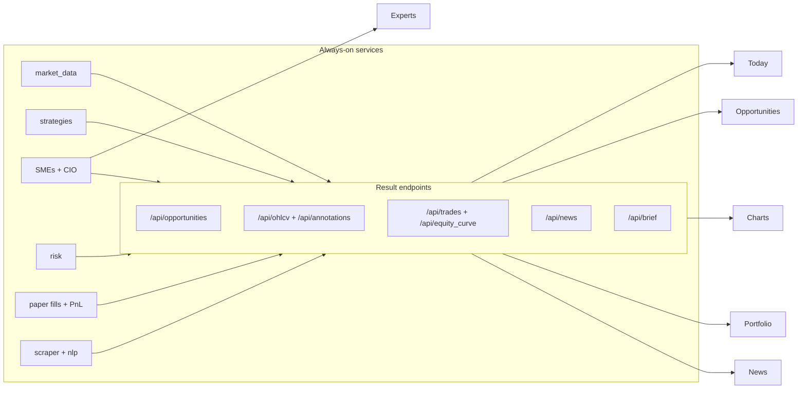

# Dashboard Redesign — Results-First Cockpit

> Status: implemented. This document is the design contract for the dashboard
> rebuild. It describes the vision, information architecture, data contracts,
> the pluggable theming engine, and how to extend it. All phases below are done.

## 1. Why

The old dashboard was a numbers-heavy "mini Bloomberg": one cluttered page,
a dominant blue theme, and almost none of what the always-on services actually
*compute*. The backend already produces strategy signals, SME opinions, CIO
proposals, risk decisions, paper fills + PnL, news + sentiment and theses — but
most of it was never exposed over REST, and there was no single concept that
linked *a signal → an expert view → a chart → an action*.

The redesign answers four questions, in order:

1. **What did our algorithms find?** (opportunities, in plain English)
2. **What did we do about it, and why?** (trades + rationale)
3. **Show me the chart.** (live + annotated)
4. **What's the news?** (an in-app reader)

Numbers are available on demand; words and results come first.

## 2. Principles

- Results before raw data; words before tables.
- Progressive disclosure — cards expand into detail; the firehose lives under **System**.
- Surface everything the background services already compute.
- It should be **fun**: a pluggable, animated, multi-theme look you can switch on a whim.
- LAN-first: runs on a server laptop, reachable from any device at home.

## 3. Information architecture

| Page | Purpose |
|------|---------|
| **Today** (home, `/`) | An LLM-written brief, top opportunities, one-line portfolio status, "what changed since you last looked", top news on your holdings. |
| **Opportunities** (`/opportunities`) | Ranked feed of money-making setups the algos found. Each card: symbol, the setup (strategy/SME), conviction, plain-English thesis, mini annotated chart, key risks + invalidation, strategy hit-rate, status (idea/proposed/acted). Click → detail. |
| **Charts** (`/charts`) | Live + historical candlesticks (TradingView Lightweight Charts, vendored) with annotations: entries/exits, signal flips, SME notes, news markers. Symbol search + watchlist. |
| **Portfolio** (`/portfolio`) | Money in real terms: equity curve (annotated), holdings at live marks, realized/unrealized PnL, and the **trade blotter** (every paper trade and what drove it), plus per-strategy/sleeve attribution. |
| **News** (`/news`) | Readable in-app feed (no leaving the site) with filters (holdings / sector / sentiment), ticker tags, sentiment, and an optional LLM "why this matters" note + reader pane. |
| **Experts** (`/experts`) | The chat / debate / theses / directives console, restyled. |
| **System** (`/system`) | Pipeline + logs + agent roster, for the curious. Mode/kill controls stay in the header. |



## 4. Data contracts (REST)

All under the existing `/api` surface; added in `ats/server/results_api.py`.

| Endpoint | Returns |
|----------|---------|
| `GET /api/opportunities` | Ranked list: `{symbol, score, conviction, setup, strategy, thesis, risks, invalidation, hit_rate, status, contributors[]}`. |
| `GET /api/opportunities/{symbol}` | The above + chart annotations + contributing signals/opinions. |
| `GET /api/ohlcv?symbol=&interval=&limit=` | `{symbol, interval, candles:[{time,open,high,low,close,volume}]}` (Lightweight-Charts shaped). |
| `GET /api/annotations?symbol=` | Markers from fills, signals, sme_opinions, news_items. |
| `GET /api/trades` | Blotter from orders + fills + decisions. |
| `GET /api/equity_curve` | From `pnl_daily`. |
| `GET /api/news` / `GET /api/news/{id}` | Full feed (body, tickers, sentiment, paging) + reader; optional allow-listed full-article fetch. |
| `GET /api/brief` | LLM CIO narrative grounded on the snapshot (cached, refreshable); templated fallback. |

WebSocket (`/ws`) additionally forwards the previously-dropped `REGIME`,
`OPTION_CHAIN`, `ALERT` topics and emits `opportunity` events.

### The Opportunity aggregator

`ats/services/opportunities/` joins the latest non-neutral `Signal`, the latest
`SmeOpinion` per symbol, CIO proposals and `Decision`s into a ranked, scored
list, attaching a plain-English explanation (LLM if available, else templated
from the contributors + rationale). Computed on demand from the in-memory
`_latest` cache + DB.

## 5. Theming engine (pluggable, multi-theme + animations)

The whole UI is built on **theme tokens** so a theme is "swap a stylesheet
(+ optional JS), keep the markup". This is the extension point for anime /
three.js themes later without touching any page.

- **Token-driven base** — `static/app.css` declares CSS custom properties
  (`--bg`, `--panel`, `--accent`, `--green/red/amber/blue`, `--radius`,
  `--font`, `--shadow`, `--speed` …). Pages reference tokens only.
- **Registry + switcher** — `static/themes.js`. Each theme is
  `{ id, name, css?, js?, variants? }`. The header palette applies
  `data-theme="<id>"` on `<html>`, lazy-loads the theme's CSS/JS, runs the
  previous theme's `unmount()` and the new theme's `mount(root)`, and persists
  the choice (theme / light-dark variant / motion) in `localStorage` so every
  device remembers its own vibe. Applied **before paint** to avoid a flash.
- **Theme 1 — Modern** (default): calm "ink" look. Teal/emerald accents (no
  dominant blue), editorial type, soft rounded cards + subtle shadows. Light
  and dark variants via `data-variant`.
- **Theme 2 — Minecraft** (the fun one): blocky aesthetic — square corners,
  beveled "block" borders + offset shadows, a vendored OFL pixel font, original
  pixel/voxel-inspired CSS textures (not Mojang assets), inventory-slot cards,
  hotbar nav, pixel cursor, item-pickup toasts.
- **Animation layer** — shared in `app.js`/`app.css`: card/page reveals,
  number count-ups, smooth chart loads, and lightweight cursor effects (a soft
  cursor-follow glow on Modern; block-break particle puffs on Minecraft). All
  gated by `prefers-reduced-motion` and a header **Motion: Fluid/Calm** toggle.

### Authoring a new theme (the contract)

1. Add `static/themes/<id>.css` that overrides the tokens (and any structural
   rules under your theme's `[data-theme="<id>"]` selector).
2. (Optional) `static/themes/<id>.js` that registers hooks:
   ```js
   ATSTheme.define('<id>', { mount(root){ /* canvas/webgl/cursor fx */ }, unmount(){ /* cleanup */ } });
   ```
   A `mount(root)` can attach a full canvas/WebGL background — this is how a
   future three.js or anime theme plugs in.
3. Register it in `REGISTRY` in `themes.js` (`{ name, css, js?, variants? }`)
   and add a button to the palette in `templates/base.html`.

## 6. Live / intraday data

`ats/services/market_data/sources.py` gains an `NseLiveSource` (pinned OSS NSE
library) selected via `ATS_DATA_SOURCE=nse_live`, giving live quotes + 1m/5m
intraday candles. It's cache + rate-limit aware and falls back to `yfinance`
(daily) / `synthetic` (offline). The adapter is pluggable so Zerodha **Kite**
drops in later without touching the pages.

## 7. Surprises (beyond the brief)

- Morning brief + "what changed since you last looked" intraday narrative.
- **"Explain this" everywhere** — click a signal/number → LLM explains it.
- **Alerts center** with browser notifications (new opportunities, fills,
  volume spikes, regime shifts, strategy-decay warnings).
- Opportunity cards as research notes (edge estimate + hit-rate + invalidation).
- PnL storytelling (equity curve annotated with what drove the moves).
- Watchlist editing from the UI; mobile-responsive; daily-digest archive.

## 8. Safety

- New endpoints validate inputs (symbol/interval allow-lists, paging caps).
- Full-article fetch is **domain allow-listed** with private-IP-range blocking (SSRF guard).
- LAN auth is optional (`ATS_DASHBOARD_TOKEN`); bind to LAN only — see
  `deployment_lan.md`. Never expose to the public internet without a proxy/VPN.
- Vendored assets only (no runtime CDN): Lightweight Charts (MIT) + the pixel
  webfont (OFL). Original CSS for the Minecraft look, not Mojang assets.

## 9. Phasing (all complete)

0. ✅ Design doc + theming engine + Modern theme + nav reorg + `ATS_HOST/PORT` + LAN doc.
1. ✅ Result endpoints (`opportunities`, `ohlcv`+`annotations`, `trades`, `equity_curve`, `news`, `brief`) + WS topics (`REGIME`/`OPTION_CHAIN`) + tests.
2. ✅ Pages: Today, Opportunities (+detail), Charts (Lightweight Charts), Portfolio (equity curve + blotter), News reader; experts restyled; pipeline/logs/agents folded into System.
3. ✅ Minecraft theme + the shared fluid/cursor animation layer.
4. ✅ Live OSS NSE adapter (`NseLiveSource`, intraday + quotes, fallback).
5. ✅ Surprises (alerts center + browser notifications, "explain this" popovers, watchlist editing, daily-digest archive, mobile polish); verified (179 tests pass + full server smoke of every new page/endpoint).
