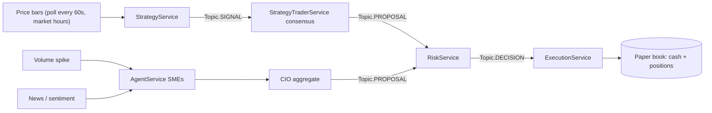

# Handoff — 2026-06-30

Branch: `feat/sme-experts`. Paper-only (real-money gate hard-off). This document
captures the current state of the agentic trading system, what changed in the
most recent work block, how to run it, and what to do next.

---

## 1. TL;DR

The system now has **two fully independent autonomous trading paths** that both
run the moment the server starts and both place paper orders through one shared
risk gate onto one shared book:

1. **Programmed quant strategies** (no LLM cost) — trade off price action.
2. **SME agent pipeline** (Gemini) — trades off volume spikes and news.

The paper book was resized from Rs 10 lakh to **Rs 1 lakh** for a controlled
dress rehearsal, and there is a new **Strategies** dashboard page to watch the
quant strategies act. Everything below was built and verified (unit tests + an
end-to-end synthetic smoke that produced real paper fills).

---

## 2. Architecture: the two independent paths



- **Path 1 (quant, no LLM):** a price bar triggers `StrategyService`
  (`ats/services/strategies/service.py`), which emits signals on
  `Topic.SIGNAL`. The new `StrategyTraderService`
  (`ats/services/execution/strategy_trader.py`) nets a *consensus* of the
  `paper`-status strategies per symbol and publishes a `Topic.PROPOSAL`. Works
  even if Gemini is offline.
- **Path 2 (SME, LLM):** a volume spike or news/sentiment event triggers
  `AgentService` (`ats/services/agents/service.py`) -> SMEs -> CIO -> proposal.
  Works even if the strategies are all flat.
- **Convergence (by design):** both publish `Topic.PROPOSAL` into the same
  `RiskService` -> `ExecutionService`. Risk applies sizing (fractional-Kelly
  capped at `max_position_pct`), the immutable guardrails (per-name/sector/gross
  caps, 3% daily-loss kill switch), the long-only clamp, the rate limiter
  (`max_orders_per_min`), and a per-decision duplicate-fill guard. Neither path
  can double-stack a name beyond the position cap because Risk nets desired vs
  current quantity.

---

## 3. What changed in this work block

| Area | Files | Purpose |
|------|-------|---------|
| Strategy auto-trade (core) | `ats/services/execution/strategy_trader.py` (new), `ats/server/wiring.py`, `ats/core/config.py` | Bridge strategy signals -> consensus -> proposal -> existing Risk/Execution rails. No LLM spend. Master switch + thresholds. |
| Strategies dashboard | `ats/server/templates/strategies.html` (new), `ats/server/results_api.py`, `ats/server/dashboard.py`, `ats/server/templates/base.html`, `ats/services/strategies/service.py` | New `/strategies` page + `/api/strategies`: roster (paper vs shadow), live calls, sleeve P&L, and what the strategies actually traded with the votes behind each order. |
| Holdings-scoped news | `ats/services/agents/service.py` | News mentioning a held name is always evaluated (bypasses cooldown/cap) so the book reacts to fresh information. |
| Plans / docs | `docs/plans/monday_dummy_run.md` (new), this handoff | Detailed dress-rehearsal plan + handoff. |
| Tests | `tests/test_strategy_trader.py` (new) | 7 unit tests for the consensus -> proposal logic (buy/exit thresholds, netting, cooldown, index skip, long-only no-op). |

Not in git (intentional): `.env` (secrets/local config) and `library.rar`
(122 MB source archive; `*.rar` now gitignored).

---

## 4. Configuration

The Rs 1 lakh book + auto-trade knobs are set in the local, gitignored `.env`:

```
ATS_PAPER_STARTING_CAPITAL=100000      # Rs 1 lakh paper book
ATS_MAX_TRADE_VALUE=15000              # per-order cap (10% position cap = Rs 10k still binds first)
ATS_VOL_SLEEVE_CAPITAL=10000           # options vol-premium sleeve ~10%
ATS_STRATEGY_AUTOTRADE_ENABLED=true    # master switch for Path 1
# ATS_STRATEGY_TRADE_BUY_THRESHOLD=0.12  net consensus score to open a position
# ATS_STRATEGY_TRADE_EXIT_THRESHOLD=0.0  net score at/below which a held name is flattened
# ATS_STRATEGY_TRADE_MIN_AGREE=1         min agreeing strategies to open
# ATS_STRATEGY_TRADE_COOLDOWN_S=300      per-symbol anti-churn cooldown
```

Defaults for these live in `ats/core/config.py` (Settings). Risk guardrails
(`max_position_pct=0.10`, `max_sector_pct=0.35`, `daily_loss_limit_pct=0.03`,
`max_orders_per_min=30`) are also there.

---

## 5. Running it

Reset the book to match the configured capital (server must be stopped first):

```
.venv/bin/python -m scripts.reset_paper_book --yes
```

Start the server detached (survives the launching shell on macOS):

```
.venv/bin/python -c "import subprocess; subprocess.Popen(['.venv/bin/python','-m','ats.server'], stdout=open('logs/server_run.out','a'), stderr=subprocess.STDOUT, start_new_session=True)"
```

Dashboard: `http://127.0.0.1:8000`. Boot takes ~20-25s (FinBERT loads from
`var/models/finbert/`). Health: `grep finbert_loaded logs/server_run.out`.

### Always-on loops (APScheduler, `ats/server/orchestrator.py`)
Market poll 60s, news poll 300s, macro sweep ~360s, equity snapshot, intraday
digests (10:00/13:00 IST), close digest (15:45), watchdog 60s. All run
continuously; live data + autonomous evals are gated to NSE hours, news is still
fetched/scored 24/7.

---

## 6. Dashboard pages

`/` Today, `/opportunities`, **`/strategies` (new)**, `/charts`, `/portfolio`
(equity, holdings, blotter, P&L), `/activity` (orders + full "why"), `/news`,
`/experts`, `/llm` (Gemini call history + spend), `/logs`, `/system`.

The **Strategies** page is where you watch Path 1: which strategies are `paper`
(can trade) vs `shadow` (recorded only), their current live calls, sleeve
Sharpe, and the orders the consensus actually drove.

---

## 7. Monday dummy-run procedure

Full detail in `docs/plans/monday_dummy_run.md`. Short version:
1. Pre-open: confirm `.env` has the Rs 1L + autotrade vars; reset the book.
2. Start the server; confirm equity = Rs 1,00,000 and auto-trade ON on `/strategies`.
3. 09:15 IST: watch `/strategies` (live calls), `/portfolio` (holdings/P&L),
   `/activity` (orders + reasoning).
4. EOD: review the close digest email + per-strategy behavior.

These are mostly swing strategies, so expect a handful of considered entries,
not hyperactivity, and no forced intraday square-off (exits fire when strategies
flip).

---

## 8. Verification status

- Rs 1L book live: reset wiped the old 10L state; cash/equity = Rs 1,00,000.
- `StrategyTraderService` wired, registered in the orchestrator, 7 unit tests pass.
- `/strategies` + `/api/strategies` return HTTP 200 (9 paper, 16 shadow strategies).
- End-to-end synthetic smoke (throwaway DB): signals -> consensus -> proposal ->
  Risk -> Execution produced **real paper fills across 14 names**; Risk
  guardrails (rate-limit, not-tradeable rejects) confirmed firing.
- FinBERT sentiment active (not the VADER fallback); `TMPV.NS` replaces the
  delisted `TATAMOTORS.NS`.
- Pending: actual fills at the live Monday open (no bars fire on weekends).

---

## 9. Safety / caveats

- Paper-only: `ATS_REAL_MONEY_ENABLED=false`; the Kite adapter refuses real
  orders without the gate.
- Long-only; SELLs clamped to holdings (cannot sell what we do not own).
- Both paths share the rate limiter; a synthetic flood will rate-limit (correct).
- Shadow strategies never take capital until promoted to `paper`.

---

## 10. Suggested next steps

- Run Monday, then tune `strategy_trade_*` thresholds from observed behavior.
- Decide promote/retire of shadow strategies by sleeve Sharpe after some history.
- Optional: a per-path on/off toggle for cleaner observation (one path at a time).
- Optional: move to an always-on host for the month-long run (NLP runs locally;
  Gemini stays an API call).
