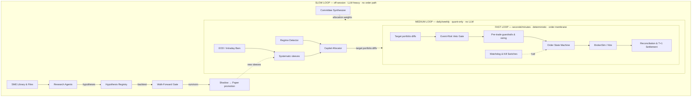

# Handoff — 2026-07-12

Branch: `feat/live-readiness-l1-l2-l6`  
Status: Paper-ready, live-readiness L1/L2/L6 hardened, backtest harness upgraded.  
This document outlines the major architectural transformations, feature additions, and performance optimizations implemented since the June 30, 2026 handoff.

---

## 1. TL;DR

The system has undergone a major evolution from a "laboratory" to a highly structured, performance-oriented, and live-ready trading platform:
1. **Three-Loop Architecture:** Heavy LLM calls have been removed from the hot execution path. A deterministic, quant-only core handles medium-loop daily/weekly decisions, while a fast-loop "protective membrane" handles real-time risk, order lifecycle, and T+1 reconciliation. The LLM is repurposed as an off-session, slow-loop "research factory" producing backtestable hypotheses.
2. **Segregated Accounts & League:** The paper book has been split into independent simulated broker portfolios. The main system, the legacy SME agent path, a buy-and-hold benchmark, and 9+ solo strategies each have their own simulated ledger and demat accounts to compete in a virtual "Strategy League" (`/league` page).
3. **Quant Analytics Engine:** A deterministic, zero-cost analysis layer replicates Bloomberg/investing.com features (pivot levels, candlestick patterns, a 12-check confluence scoring system, intraday VWAP, Piotroski F-score, Altman Z, and cashflow-based DCF fair value estimates) to drive screeners and reduce LLM dependencies.
4. **Ops Console & Live-Readiness:** Observability is now split from the money dashboard via a dedicated Ops Console (`/ops`) featuring a live system map, hardware resource tracking, telemetry spans, and news API quotas. The system is hardened with a network-first service worker, a batched Zerodha `KiteLiveSource`, an 08:45 IST pre-open GO/NO-GO email audit, and daily automated backups.
5. **Backtest Harness Upgrades:** The vectorized backtester now replays long-short strategies (like pairs trading) correctly, handles data gaps explicitly, and streams legible plain-English progress logs.

---

## 2. The Three-Loop Architecture & Segregated Portfolios



### The Fast Loop: Order Membrane
- **Event-Risk Veto Gate (`ats/services/risk/event_calendar.py`):** Blocks entries (but allows exits) during earnings windows (±1 session), index rebalances, key macro events (RBI MPC, Union Budget), or local-NLP extreme sentiment spikes (FinBERT).
- **Order State Machine (`ats/services/execution/order_lifecycle.py`):** Transitions orders through `STAGED -> SUBMITTED -> FILLED | REJECTED | CANCELLED`. Limit-order defaults protect against slippage, and a price-deviation guard stages orders if the LTP moves more than 50 bps before submission.
- **Reconciliation (`ats/services/execution/reconcile.py`):** Periodically asserts that internal cash and positions exactly match broker/depository truth, halting trading instantly upon detecting any anomaly.

### Segregated Portfolios & The Strategy League
- **`AccountLedger` (`ats/services/accounts/ledger.py`):** Double-entry ledger modeling cash, holds, and settled transactions per account.
- **`DematAccount` & `DematHolding` (`ats/services/accounts/demat.py`):** Implements Indian market T+1 settlement. Fills create a `pending` ledger state; the close pass transitions them to `settled`. Over-selling of unsettled holdings is strictly blocked.
- **The League Dashboard (`/league`):** Displays equity curves and performance statistics (Sharpe, max drawdown, win rate, fees paid) for the main system, benchmark (NIFTYBEES buy-and-hold), legacy SME path, and individual strategies, giving the operator direct comparative evidence.

---

## 3. Quant Analytics Engine

Rather than paying for LLM queries to parse fundamentals and technical indicators, a zero-marginal-cost mathematical layer computes and exposes classic indicators:
- **QA-1 Levels (`quant/analysis/levels.py`):** Computes classic pivots (R1–S3) and Fibonacci retracements.
- **QA-2 Candlesticks (`quant/analysis/patterns.py`):** Evaluates 8 key patterns (engulfing, hammer, shooting star, doji, morning/evening star, marubozu).
- **QA-3 Confluence Summary (`quant/analysis/summary.py`):** Blends 12 technical criteria to yield a unified score from -12 (Strong Sell) to +12 (Strong Buy).
- **QA-4 Intraday (`quant/analysis/intraday.py`):** Intraday VWAP curves and volume-confirmed movers (filtering out low-volume tickers).
- **QA-5 Statements & Quality (`quant/analysis/quality.py`):** Stores complete annual statements. Computes Piotroski F-Score (0-9), Altman Z-Score, payout ratios, and dividend safety.
- **QA-6 Valuation Surface (`ats/services/fundamentals/fair_value.py`):** Computes intrinsic value using a free cashflow-based DCF. Generates a 3x3 sensitivity grid mapping WACC vs Growth, gating the output behind strict data-richness rules.
- **UI Screener (`/screener`):** Tabbed interface filtering symbols by Value, Quality, Momentum, or Dividend Safety presets, with CSV data exports.

### The Control Room Page (`/control`)
A high-density, real-time dashboard modeled after a mission control console:
- **Left Pane:** Real-time heatmap of all 54 symbols. Colors represent confluence scores (bright green for strong buy, dark red for strong sell); block size maps to momentum magnitude. Hovering displays quick tooltips; clicking reveals symbol details.
- **Centre Pane:** Live ticker streaming active signals, convictions, and staging states.
- **Right Pane:** Consolidated system status including equity metrics, trading mode dropdown (OFF, PAPER, APPROVAL, AUTO), a global Kill Switch, a countdown timer to the next rebalance, and loop status indicators.
- **Bottom Command Palette:** A command bar (prompted by `>`) enabling rapid symbol lookup, pane toggles, or reports generation.

---

## 4. Performance Fixes & System Observability

### event-loop lag resolved
Synchronous network requests (e.g. yfinance, Yahoo cookie crawls) and CPU-heavy operations (pandas-based strategy evaluations, weekly/monthly analytics close passes) previously blocked FastAPI's single thread, causing the UI to freeze for 1–2 minutes.
- **Off-loop Execution:** Wrapped all blocking operations in `asyncio.to_thread` to run them in worker threads, maintaining a responsive main event loop.
- **Database Optimizations:** Added WAL mode to SQLite (`ats/core/db.py`), indexed the `news_id` column on `SentimentScore` to eliminate N+1 queries during dashboard snaps, and cached the UI payload.
- **Warming & Boot Performance:** Implemented a warm-boot mechanism that skips historical backfills for up-to-date database symbols, dropping startup times to under 10 seconds.
- **Client Resource Savings:** Pauses WebSocket and DOM re-renders when the dashboard tab is hidden (`document.hidden`).

### The Ops Console (`/ops`)
A dedicated dashboard area for the operator ("the engine room"):
- **System Map:** An interactive, animated node-graph visualizer representing active services, message brokers, and message rates (events/min). Nodes change colors dynamically based on health status.
- **Resources:** Tracks live system diagnostics including memory (attributing FinBERT weights and database size caches) and CPU utilization via `psutil`.
- **Model Logs:** Exposes local model (VADER vs FinBERT) latencies, sentiment score distributions, and a detailed feed of Gemini call logs (token counts, request payloads, and billing burns).

---

## 5. Live-Readiness & Hardening

The repository has been structured to make going live a matter of changing configuration rather than rewriting code:
- **Zerodha Login Callback (`http://127.0.0.1:8000/kite/callback`):** An OAuth endpoint to exchange Zerodha's daily request token for an active `access_token`, storing it in the configuration state.
- **Keyed News Scrapers:** Added newsapi.org, newsdata.io, and currentsapi.services collectors, self-throttled to remain within free-tier quotas. Active credits are tracked on `/ops`.
- **`KiteLiveSource`:** Batch queries LTP values for up to 500 symbols in a single call to respect Kite's 3 req/s rate limit. Automatically falls back to yfinance/nse_live if the daily token is missing.
- **Pre-Open Audit:** Runs daily at 08:45 IST, checking feed health, API token statuses, disk space, and billing limits to email a unified GO/NO-GO report.
- **Nightly Backups:** Automatically dumps WAL-consistent SQLite databases.

---

## 6. Backtest Harness Upgrades

The vectorized backtester (`scripts/run_backtests.py`) is the ultimate gatekeeper for promoting strategies from `shadow` to `paper`.
- **Long-Short Replay (`long_short = True`):** Prevents stat-arb strategies (e.g., pairs trading) from being flattened to long-only. The engine now records short legs and models short-sale margins correctly, restoring realistic Sharpe ratios for `pairs_zscore` and `coint_pairs`.
- **Data Gap Identification:** Explicitly isolates and flags data gaps (such as missing historical sentiment grids for event strategies) as `skip (data gap)` rather than penalizing them with zero scores.
- **Terminal Polish:** Streams progress sequentially and logs complete outputs to `var/metrics/backtest_run_<date>.log`, outputting a legible summary table of trades, win rates, and P&L.

---

## 7. Current Project Structure & Map

```
quant/                  # Pure math library (no server, no db, no IO)
  ├── analysis/         # Indicators, levels, patterns, summary, valuation
  ├── backtest/         # Vectorized backtest engine & validation math
  └── risk/             # Position sizing & portfolio math
ats/                    # The running application & event bus
  ├── core/             # config.py, db.py, models.py, events.py, telemetry.py
  ├── server/           # app.py, dashboard.py, api.py, templates/
  └── services/         # Background services registered in wiring.py
        ├── market_data/# yfinance / nse_live / Kite feeds
        ├── execution/  # BrokerSim, order lifecycle, reconcile, notify
        ├── accounts/   # Bank ledger & Demat settlement
        ├── risk/       # Event calendar, limits, sizing
        ├── agents/     # LLM research agents, CIO, and cost limits
        └── scraper/    # RSS + news API collectors
scripts/                # run_backtests.py, reset_paper_book.py, backup.py
docs/                   # Reading guide, plans, and historical handoffs
var/                    # Sqlite DB, logs, and cache assets (gitignored)
```

---

## 8. Next Steps & Action items

1. **Daily Token Login Routing:** Configure the Zerodha Kite Developer console redirect URL to `http://127.0.0.1:8000/kite/callback` and populate the Kite keys in `.env` (`docs/kite_setup.md`).
2. **Execute the 3-Year Backtest:** Run `python scripts/run_backtests.py --kite --period 3y` to evaluate strategies on real historical Zerodha data under the new harness.
3. **Verify the Go-Live Hardening:** Confirm pre-open GO/NO-GO email templates route correctly.
4. **Deploy L3, L4, and L5:** Once the current 1-week paper run stabilizes, complete the portfolio Zerodha panel (L3), split the Ops Console to port `8001` (L4), and build the user profiles login database (L5).
