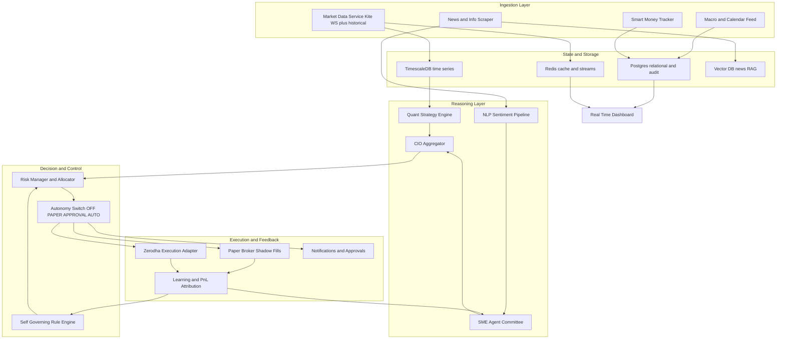
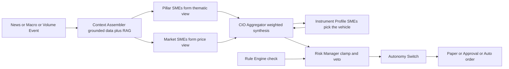

# Grand Plan: Always-On Agentic Trading Server

## 1. Vision and Guiding Principles

Build a long-running server (not scripts/packages) that monitors markets and news 24/7, runs a committee of finance subject-matter-expert (SME) agents, allocates capital across strategies like a fund-of-funds, trades on Zerodha in paper or real mode, learns from its PnL, and maintains its own evolving rulebook under human-set hard guardrails.

Principles:
- Safety first: real money is always bounded by immutable, code-enforced caps. The LLM never bypasses risk/authorization logic (defense in depth).
- Paper-first: every strategy proves itself on paper before earning real capital.
- Everything is logged and attributable: each decision traces to the SMEs, signals, news, and rules that produced it.
- Grounded agents: SMEs are LLM personas backed by real quantitative models/data feeds, not free-form opinion.
- Multi-arch and modular: runs on ARM (RPi) or x86 (Ryzen laptop); components are independently restartable.

## 2. High-Level Architecture

## 3. Tech Stack

- Language: Python 3.11+ with asyncio (extends existing quant package).
- API and orchestration: FastAPI (REST plus WebSocket for live dashboard).
- Scheduling: APScheduler for periodic jobs (lightweight, ARM-friendly). Upgrade path to Celery plus Redis if needed.
- Message bus: Redis Streams for inter-service events (tick events, signals, decisions, fills).
- Time-series DB: TimescaleDB (Postgres extension) for ticks, OHLCV, features, sentiment.
- Relational DB: Postgres for orders, positions, PnL, rules, agent decisions, audit log.
- Cache and hot state: Redis.
- Vector DB: Qdrant or Chroma for news embeddings and RAG retrieval by SMEs.
- NLP: HuggingFace transformers (FinBERT), VADER, spaCy NER, sentence-transformers.
- LLM: pluggable provider (user-managed) via a thin client interface; supports hosted APIs or local Ollama.
- Containerization: Docker plus Docker Compose, multi-arch images.
- Process supervision: Docker restart policies and healthchecks, or systemd units on bare metal.
- Dashboard: FastAPI backend plus React frontend with WebSocket. MVP fallback: Streamlit.
- Observability: structured JSON logging with secret redaction, health endpoints, optional Prometheus plus Grafana.
- Secrets: .env loaded into a secrets manager abstraction, broker tokens encrypted at rest, never hardcoded.

## 4. Repository and Service Layout

Evolve the current repo into a server. Proposed top-level layout:
- `server/` FastAPI app, lifespan, routers, websocket hub.
- `services/market_data/` Kite WebSocket ticker, historical backfill, volume-spike detector.
- `services/scraper/` news, RSS, social, filings collectors.
- `services/nlp/` sentiment, NER, embeddings, event classification.
- `services/agents/` SME personas, tools, CIO aggregator, LLM client.
- `services/strategies/` quant strategies wrapping `quant.analysis` and `quant.backtest`.
- `services/risk/` risk manager, fund-of-funds allocator, sizing (wraps `quant.risk`).
- `services/execution/` broker adapter interface, Zerodha adapter, paper broker, autonomy switch.
- `services/learning/` PnL attribution, track records, weight updates, promotion/demotion, retraining.
- `services/rules/` rule engine, guardrails, adaptive rule lifecycle.
- `services/notify/` Telegram and email, approval workflow.
- `core/` config, db, redis, logging, security, event bus, schemas (pydantic models).
- `dashboard/` frontend.
- `deploy/` Dockerfiles, docker-compose, systemd units, env templates.
- `quant/` existing toolkit, reused as the analytics library.

## 5. Core Data Model (key tables)

- `instruments` symbol, exchange, kite_token, sector, lot_size, tick_size.
- `ticks` (hypertable) instrument, ts, ltp, volume, bid, ask, oi.
- `ohlcv` (hypertable) instrument, ts, interval, o, h, l, c, v.
- `fundamentals` instrument, period, revenue, eps, fcf, ratios.
- `news_items` id, ts, source, url, title, body, tickers, raw_hash.
- `sentiment_scores` news_id or symbol, ts, model, label, score, horizon.
- `signals` id, ts, strategy, instrument, stance, conviction, features.
- `sme_opinions` id, ts, sme, instrument, stance, conviction, horizon, rationale, risks.
- `decisions` id, ts, instrument, action, size, mode, rationale_ref, rules_applied.
- `orders` id, decision_id, broker, status, qty, price, type, ts, broker_order_id.
- `fills` order_id, ts, qty, price, fees, slippage.
- `positions` account, instrument, qty, avg_price, mtm, realized, unrealized.
- `pnl_daily` account, date, gross, fees, net, drawdown.
- `strategies` id, name, type, status (paper, shadow, live), allocation_pct.
- `strategy_allocations` strategy_id, date, weight, capital.
- `sme_track_record` sme, window, hit_rate, brier, pnl_contrib, vote_weight.
- `rules` id, scope, type (guardrail, adaptive), expression, status, version.
- `rule_versions` rule_id, version, change, evidence, author (human or agent), ts.
- `approvals` decision_id, channel, requested_ts, responded_ts, result, actor.
- `audit_log` ts, actor, action, payload_hash (append-only, tamper-evident).

## 6. LLMs and the SME Agent Framework

### 6.1 How LLMs are used (mechanics)

The LLM is the reasoning engine, not the data engine and not the risk engine. It does five things:
- Turns unstructured inputs (news, filings, transcripts, macro commentary) into structured, comparable opinions.
- Reasons over multiple grounded inputs to form a stance per instrument.
- Synthesizes many SME opinions into a portfolio view (the CIO agent).
- Explains every decision in plain language for the dashboard and audit log.
- Proposes adaptive rules with rationale (subject to the rule lifecycle in Section 11).

Where the LLM is deliberately NOT used: it never computes prices, indicators, PnL, or risk limits, and it never places orders. Those are deterministic code. The LLM only emits a proposal; code validates, clamps, and executes. This is the core safety boundary.

The agent loop for one SME, per evaluation cycle:
1. Trigger: a scheduler tick (every N minutes), a news event, or a volume-spike event from the Redis bus.
2. Context assembly (deterministic, no LLM): the runtime gathers exactly this SME's grounded inputs - relevant indicators, fundamentals, the top-k most relevant recent documents from the vector DB (RAG), macro readings, and the SME's own recent track record.
3. Prompt construction: a fixed system prompt (mandate plus biases plus the required output schema) plus the assembled context as clearly delimited structured data.
4. LLM call with read-only tools: the SME may call tools such as get_indicator, get_fundamentals, get_option_chain, search_news, get_instrument_profile. Tools return JSON; the model iterates until it can answer.
5. Structured output: the model must return JSON matching the opinion schema {instrument, stance, conviction 0-1, horizon, rationale, key_risks, suggested_size, evidence_refs}. We validate with pydantic and reject-and-retry on schema violations.
6. Persist: the opinion is written to sme_opinions with links to its evidence (news ids, feature snapshot) for full traceability.

Engineering details:
- Structured outputs enforced via function-calling / JSON-schema constrained decoding, validated with pydantic.
- Tools given to SMEs are strictly read-only; only the execution service can write, and only through the autonomy switch. SMEs cannot place orders.
- RAG: each SME query retrieves the most relevant current documents per instrument so the model reasons on fresh facts, not stale training data.
- Cost and determinism control: low temperature for analysis; cache opinions keyed by (sme, instrument, input_hash) so identical context is not re-billed; batch instruments; debounce so the LLM is called only when inputs change materially; tiered routing - a cheap model for routine scoring, a stronger model for CIO synthesis and rule proposals.
- Provider abstraction: a thin LLMClient interface with implementations for your hosted API and a local Ollama fallback; the model per role is config-driven. You manage keys and model choice.
- Prompt-injection defense: scraped content is untrusted. Keep it in a delimited data channel separate from instructions, instruct models to treat retrieved text as data only, never expose write/execution tools to reading SMEs, and let model output influence sizing only as a suggestion the Risk Manager clamps.

### 6.2 SME taxonomy (four families)

- Family A - Market and Quant SMEs: read price, volume, and derivatives data.
- Family B - Economic-Pillar and Thematic SMEs: read news, macro, and world events and reason about market impact. This is the family you asked to expand - the pillars of the economy.
- Family C - Instrument-Profile SMEs: know what a given company, ETF, or mutual fund actually is and does, so the committee picks the right vehicle to express a view.
- Governor - Risk Manager: clamps and vetoes, never seeks opportunity.

### 6.3 Full SME roster

Family A - Market and Quant:
- Technical Analyst: grounded in `quant.analysis.indicators` plus chart-pattern detectors; momentum, mean reversion, RSI/MACD/Bollinger, MA regimes. Data: OHLCV.
- Volume and Order-Flow Analyst: volume surges, unusual activity, liquidity, bid-ask imbalance, delivery percentage. Data: ticks, depth, NSE delivery. Serves your volume-spike requirement.
- Fundamental and Value Analyst: grounded in `quant.analysis.valuation`; DCF, DDM, ratios, margin of safety. Data: fundamentals, filings.
- Quantitative and StatArb Analyst: cointegration, pairs, factor models, ARIMA/GARCH. Data: OHLCV history.
- Derivatives and Options Strategist: option chain, IV vs HV, greeks, max pain, PCR, hedging. Data: NSE F&O.
- Market Microstructure Analyst: intraday flow, opening range, VWAP deviation, circuits.

Family B - Economic-Pillar and Thematic (each maps a world or economic development to instruments and a stance):
- Macro Economist: rates, inflation, GDP, IIP, money supply, growth cycle.
- Monetary Policy and Central Bank Watcher: RBI MPC, FOMC, ECB; rate path, liquidity, stance shifts.
- Fiscal Policy and Government Watcher: Union budget, deficits, capex, taxation, subsidies, PLI schemes.
- Geopolitics Analyst: wars, conflicts, sanctions, regional instability and risk-on/off impact.
- Foreign Relations and Diplomacy Analyst: bilateral ties, treaties, summits such as G20 and BRICS, diplomatic shifts affecting sectors or countries.
- International Trade and Tariffs Analyst: import/export policy, tariffs, trade deals, supply-chain shifts, anti-dumping duties.
- Currency and FX Analyst: USDINR, DXY, capital flows, RBI intervention; impact on importers, exporters, IT, pharma.
- Energy and Commodities Macro Analyst: crude, gas, coal, base and precious metals supply-demand, OPEC; impact on energy-sensitive sectors.
- Regulatory and Policy Analyst: SEBI, RBI, sector regulators such as TRAI and IRDAI, legislation, major court rulings.
- Industrial and Infrastructure Analyst: capex cycle, PMI, core-sector output, construction, logistics.
- Agriculture and Monsoon Analyst: monsoon, MSP, rural demand, food inflation; impact on FMCG, auto, fertilizers.
- Labor, Demographics and Consumption Analyst: employment, wages, consumer confidence, festive and seasonal demand.
- Technology and Innovation Analyst: tech cycles, AI and semiconductor trends, IT spending, disruption risk.
- Climate, Energy-Transition and ESG Analyst: weather shocks, transition policy, carbon, renewables.
- Global Markets and Risk-Sentiment Analyst: US, EU, and Asia markets, VIX, bond yields, GIFT Nifty, cross-asset risk appetite.
- Political and Electoral Analyst: elections, policy-continuity risk, central and state political events.

Family C - Instrument-Profile (the experts who know what each vehicle actually is):
- Company-Profile SME: each company's business model, revenue mix, segments, customers, competitors, management, moat, and key risks. Built from annual reports, investor presentations, and filings, indexed in the vector DB.
- ETF-Profile SME: each ETF's mandate, underlying index, holdings, expense ratio, tracking error, liquidity, and NAV mechanics (reuses our SILVERBEES NAV work).
- Mutual-Fund-Profile SME: each fund's category, mandate, top holdings, manager, expense ratio, exit load, and style (large/mid/small, value/growth).
- Peer and Supply-Chain Mapper: maps a company to peers, suppliers, customers, and substitutes, so a thematic view is routed to the right names.

Governor:
- Risk Manager: VaR, CVaR, correlation, exposure, drawdown, Kelly caps. Has veto and clamp power within the hard guardrails.

### 6.4 How we build a single SME (repeatable recipe)

For each SME we create:
1. A persona spec (YAML): id, name, family, mandate, biases, time horizon, the data feeds it consumes, the tools it may call, its output schema, and its evaluation cadence.
2. A system-prompt template that states the mandate and forces the JSON opinion schema.
3. A context assembler: a deterministic function that pulls exactly the grounded inputs this SME needs and nothing else (controls cost and focus).
4. A grounding model or dataset: the quantitative model or knowledge base that anchors it (the Technical SME is anchored by computed indicators; the Company-Profile SME by a RAG index of filings).
5. Registration in a registry with an initial vote weight; the learning loop later adjusts the weight from the SME's track record.
6. Tests and a backtest harness: replay historical news and data to confirm the SME emits reasonable, schema-valid opinions before it joins the live committee. New SMEs always start in shadow.

### 6.5 News-to-action flow

Worked example: a headline that crude oil will spike. The Energy/Commodities and Geopolitics pillar SMEs turn it into a thematic view (energy costs up, risk-off). The Instrument-Profile SMEs translate that into concrete names (oil marketing companies negative, upstream producers positive, paints and aviation negative) and pick the best vehicle - a single stock, a sector ETF, or a fund - given liquidity and the account mandate. The CIO synthesizes, Risk clamps the size, Rules check constraints, and the autonomy switch routes it to paper, approval, or auto.

### 6.6 CIO aggregation

A CIO meta-agent collects all SME opinions, weights them by track record and regime fit, resolves conflicts, and converts the thematic consensus into a concrete, ranked set of proposed positions with size and confidence. It then defers to the Risk Manager and Rule Engine before anything reaches the autonomy switch.

## 7. Information Scraping (what to collect and credible sources)

Information types:
- Market and price data, indices, F&O, volumes, delivery percentage.
- Corporate announcements and filings, results, board meetings, corporate actions.
- Financial statements and ratios.
- Business and company news.
- Macro data and economic calendar.
- Social sentiment.
- Analyst ratings and target prices.
- Smart money: FII and DII flows, bulk and block deals, insider and SAST disclosures, mutual fund holdings, superinvestor portfolios.
- Commodity and global cues: COMEX, MCX, LBMA, EIA, crude, DXY, US markets, GIFT Nifty.

Credible sources:
- Market and execution: Zerodha Kite Connect API, NSE India, BSE India.
- Fundamentals: Screener.in, Trendlyne, Tickertape, MoneyControl, Financial Modeling Prep API, Alpha Vantage, Tiingo, Finnhub.
- Filings and announcements: NSE and BSE corporate announcement feeds, SEBI.
- News APIs: Marketaux (finance-specific), Finnhub news, NewsAPI.org, GNews, NewsData.io; Indian outlets Economic Times, LiveMint, Business Standard, MoneyControl RSS, Reuters.
- Macro: RBI DBIE, MOSPI, FRED, World Bank, Trading Economics, Investing.com calendar.
- Social: Reddit API (PRAW), StockTwits, Twitter/X API (paid), curated Telegram channels.
- Smart money: NSE bulk and block deals, MoneyControl FII/DII, Trendlyne and Screener superinvestors.
- Commodities: MCX, LBMA, CME COMEX, EIA, World Gold Council, Silver Institute.

Scraping discipline: respect robots.txt and rate limits, prefer official APIs over HTML scraping, cache and de-duplicate by content hash, store provenance (source plus url plus ts), and treat all scraped content as untrusted input (sanitize before it reaches agents or storage).

## 8. NLP and Sentiment Pipeline

- Ingest: normalize news and social text, de-duplicate, language-detect.
- Entity linking: spaCy NER plus a ticker dictionary to map text to instruments.
- Sentiment: FinBERT (finance-tuned) for news; VADER as a fast social baseline; ensemble into a per-symbol per-window score.
- Event classification: zero-shot or LLM tagging into classes (earnings beat or miss, guidance, M and A, regulatory, management change, macro shock).
- Embeddings and RAG: sentence-transformers to embed articles into the vector DB so SMEs can retrieve the most relevant recent context for a symbol.
- Output features: rolling sentiment, sentiment momentum, news volume spike, surprise score, fed into signals and the News SME.
- Placement: runs on the always-on host CPU for batch; heavy LLM reasoning uses the external provider you manage.

## 9. Paper Trading, Shadow Mode, and the Learning Loop

- Paper broker simulates fills against live quotes with a configurable slippage and fee model, mirroring Zerodha charges.
- Shadow mode: untrusted strategies and new SMEs trade only on paper in parallel with the live book, so we observe judgment quality without risk.
- PnL attribution: every fill traces to a decision, its contributing SMEs, signals, and rules, so we can score each component.
- Scoring: per SME and per strategy we track hit rate, calibration (Brier score), risk-adjusted PnL contribution, and sample size.
- Adaptation: SME vote weights and strategy allocations update from track records (ensemble weighting, meta-labeling).
- Promotion and demotion: a strategy graduates paper to a small real allocation when it clears thresholds (minimum trades, Sharpe, hit rate, max drawdown limit); it is demoted or paused on breach.
- Retraining: ML components retrain on a walk-forward, purged schedule to avoid lookahead and overfitting.

## 10. Fund-of-Funds Allocation and Risk

- Treat each strategy and SME-driven sleeve as a sub-fund. The allocator distributes capital across them like a mutual fund distributes across assets, to maximize risk-adjusted net return.
- Methods: start with risk parity and Kelly-capped sizing (reuse `quant.risk`), evolve to mean-variance or hierarchical risk parity over strategy return streams.
- Hard risk controls (always on): max position size, max sector and single-name exposure, max gross and net exposure, daily loss limit, max trades per minute, no trading during halts or circuits, kill switch.

## 11. Self-Governing Rule Engine

Two layers:
- Immutable guardrails (human-only, code-enforced, agent cannot change): capital caps, loss limits, instrument allowlist, leverage, trading hours, rate limits, kill switch. Enforced in code, not by the LLM.
- Adaptive rules (agent may propose): for example avoid a symbol after consecutive losses, cut size in high-VIX regimes, skip earnings-day entries, blacklist a noisy news source. Each proposal must include evidence and a backtest.

Rule lifecycle: propose, validate or backtest, shadow-enforce, activate, monitor, retire. Every change is versioned with rationale and author (human or agent). Adaptive changes auto-apply only within meta-limits set by guardrails; anything beyond requires human approval. Full append-only audit trail.

## 12. Autonomy Switch and Zerodha Execution

- Mode switch with four states, settable globally and per strategy: OFF (kill, flatten optional), PAPER (simulated only), APPROVAL (real orders require your acknowledgment via dashboard or Telegram with a timeout and safe default to reject), AUTO (fully autonomous within guardrails). This delivers both autonomous and approval-based real trading as requested.
- Two-stage commit for live orders: the system drafts an order with a preview, then commits on explicit approval (APPROVAL) or on passing all guardrails (AUTO).
- Zerodha specifics to handle for always-on operation: daily access-token expiry and refresh (semi-automated login with TOTP), API rate limits and order throttling, websocket reconnection and gap backfill, order-state reconciliation on restart, and market-hours and holiday calendars.
- Compliance research task (India): confirm current SEBI and exchange retail algo-trading requirements for API-based automated order placement (registration, static IP, broker approval) before enabling AUTO with real capital. This is a checklist item, not legal advice.
- v1 default: the global mode ships as PAPER and the real-money gate is disabled in config. APPROVAL and AUTO, the Zerodha adapter, and the caps are fully built and tested but cannot place real orders until the gate is explicitly enabled after paper/shadow validation and the compliance checklist.

## 13. Dashboard

A real-time web app served by the FastAPI backend over WebSocket:
- Live portfolio, positions, MTM, PnL, drawdown, exposure heatmap.
- Watchlist with price and volume-spike alerts.
- Pending approvals with one-click approve or reject and reasoning.
- Agent transparency: per-symbol SME opinions, CIO synthesis, signals, and the news that drove them.
- Strategy board: paper vs shadow vs live, allocations, track records.
- Rulebook viewer with version history and a control to toggle modes and the kill switch.
- Logs and health of every service.

## 14. Security and Secrets (must-haves)

- Never hardcode secrets; load from environment or a secrets manager; encrypt broker tokens at rest.
- Bind the dashboard and API to localhost or a private network (Tailscale or VPN); never expose publicly. Require authenticated login with secure session cookies.
- Treat the broker credential as crown jewels: separate it from the codebase, restrict file permissions, audit every use.
- Sanitize all scraped and tool inputs; the LLM output is never trusted for authorization or risk decisions.
- Append-only, tamper-evident audit log of all decisions, approvals, and rule changes.

## 15. API Keys and Accounts to Obtain (with purpose)

v1 starting set (chosen - free tier where possible):
- Marketaux: finance news with ticker tagging. Free tier. Required for the news pipeline in v1.
- Alpha Vantage and/or Financial Modeling Prep: fundamentals. Free tier. Required; we will compare Indian-name coverage and may supplement with Screener.in.
- FRED API key: macro data. Free. Required.
- Telegram Bot token: notifications and (later) trade approvals. Free. Recommended.
- LLM provider key: you manage this; the system needs an endpoint and key. Required for SMEs.
- NSE and BSE official feeds: prices, announcements, delivery, bulk/block deals. No key, but respect rate limits.

Deferred until we enable real money (build against, obtain when ready):
- Zerodha Kite Connect: live market data plus order execution. Paid monthly subscription. Needed to leave PAPER mode; for v1 we develop against the paper broker and yfinance/NSE data.

Optional add-ons (later, to enrich signals):
- Reddit API (PRAW) - free; Twitter/X API - paid; NewsData.io or GNews - broader news; Finnhub - combined news plus fundamentals plus sentiment; Trendlyne or Tickertape - smart-money and ratings if API access is available.

## 16. Hardware Recommendation

Your Ryzen 5 with 16GB is more than enough to run the entire core, FinBERT on CPU, Postgres/TimescaleDB, Redis, and the dashboard. Recommended setup:
- Primary always-on host: either the Ryzen laptop (disable sleep, ideally on a UPS) or, for lower power 24/7, a Raspberry Pi 5 (8GB) with an NVMe SSD.
- Run heavy LLM reasoning via your external provider (as you said you will handle AI), so the host does not need a GPU.
- The RPi AI HAT (Hailo) helps for converted, quantized vision or NLP models, but FinBERT and LLMs are awkward to port to it; treat the AI HAT as optional and not on the critical path. Better near-term role for an RPi: dedicated ingestion plus dashboard plus DB node, with reasoning offloaded to the API.
- If you want a single dedicated 24/7 box, a mini-PC (for example an Intel N100, 16GB, NVMe) is an excellent low-power x86 option. Multi-arch Docker images mean the same stack runs on either.

## 17. Phased Execution Roadmap

Phases map to the todos below. Each phase ends with a runnable, observable milestone and acceptance criteria. We build the safe core (data plus paper plus risk) before connecting real money, and enable AUTO only after paper and shadow results plus the compliance checklist are satisfied.

## 18. Finalized v1 Scope and Remaining Questions

Finalized decisions for v1:
- Universe: Nifty 100/200 constituents plus key indices (Nifty 50, Bank Nifty) plus SILVERBEES. Roughly 100-200 instruments. The agent runtime scopes work to control LLM cost (see note below).
- Asset scope: cash equity plus ETFs plus commodities (MCX, e.g. silver via SILVERBEES and MCX silver). No F&O or options in v1.
- Horizon: swing and positional (multi-day) as the primary mode; intraday signals can inform entries but v1 is not a low-latency intraday engine.
- Capital: PAPER-ONLY for v1. The full real-money path (Zerodha order placement, APPROVAL and AUTO modes, caps) is built and tested but the real-money gate stays disabled until paper and shadow results plus the compliance checklist are satisfied. Default global mode is PAPER.
- Data providers to start (free tier): Marketaux for finance news, Alpha Vantage and/or Financial Modeling Prep free tier for fundamentals, NSE and BSE official feeds for prices/announcements/delivery, FRED for macro, plus curated RSS. Collectors are provider-agnostic so we can swap or add later.

LLM cost-scoping note for a 100-200 name universe: market SMEs run on a name only when triggered (price/volume event, news hit, or a scheduled scan slice), not on every name every minute. Pillar SMEs run thematically (on macro/news events), not per-name. Opinions are cached by input hash and debounced, and routine scoring uses a cheaper model than the CIO. This keeps the universe broad without LLM cost exploding.

Remaining questions to resolve as we go:
- Exact Nifty 100 vs Nifty 200 cut, and whether to add any of your existing holdings.
- The specific MCX commodity contracts to track beyond silver (e.g. gold, crude).
- Real-money caps (per-trade, daily-loss, max deployed) to pre-configure for the day we enable APPROVAL - design now, enable later.
- Choice between Alpha Vantage and FMP for fundamentals once we see coverage of Indian names (may need Screener.in scraping as a supplement).

## 19. Dockerization and Container Topology

Everything ships as containers orchestrated by Docker Compose, built multi-arch (amd64 plus arm64) so the identical stack runs on the Ryzen laptop, a mini-PC, or an RPi 5.

Containers:
- app-api: FastAPI REST plus WebSocket; dashboard backend and control plane.
- worker-marketdata: Kite ticker and ingestion, volume-spike detector.
- worker-scraper: news, social, filings, and smart-money collectors.
- worker-nlp: FinBERT, VADER, spaCy NER, embeddings.
- worker-agents: SME committee, CIO, LLM client.
- worker-strategies: quant strategies wrapping the existing toolkit.
- worker-execution: broker adapters, paper broker, autonomy switch.
- worker-learning: PnL attribution and scheduled retraining.
- postgres: with the TimescaleDB extension.
- redis: cache and Streams bus.
- qdrant: vector DB for news and instrument-profile RAG.
- dashboard-frontend: static frontend, or served by app-api.
- optional: prometheus plus grafana for metrics.

Container practices (aligned with the supply-chain and container security rules):
- Pin base images by digest; use slim or distroless bases; run as a non-root USER; drop Linux capabilities; read-only root filesystem with tmpfs for scratch.
- Per-container CPU and memory limits; healthchecks; restart policy unless-stopped.
- Secrets via Docker secrets or a read-only mounted env file, never baked into images; never mount the docker socket; no privileged containers.
- Named volumes for postgres, redis, and qdrant; scheduled encrypted backups.
- One internal compose network; expose only the dashboard/API port, bound to localhost or the Tailscale interface, never published to 0.0.0.0.
- Build with docker buildx for multi-arch; keep a tight .dockerignore.

Local development uses the same compose file with override files; production differs only in env, exposed ports, and resource limits.