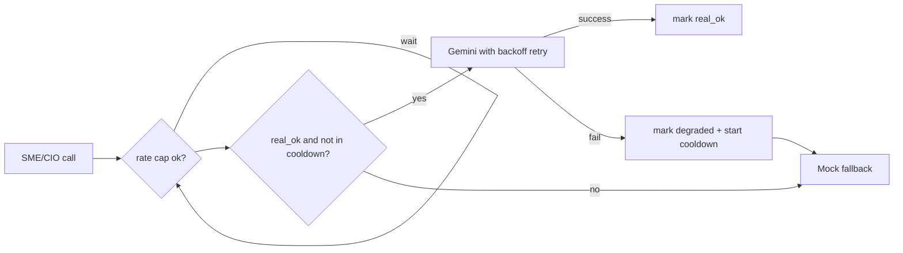

## Gemini upgrade + month-long resilience

### Part A - Account upgrade (you do this; instant, no minimum spend)
1. Google AI Studio -> Billing -> "Set up billing"; create/link a Google Cloud billing account. Linking alone moves the project from Free to Tier 1.
2. Add a prepay credit balance (Tier 1 only serves paid requests while the balance is positive).
3. In Google Cloud Console -> Billing -> Budgets & alerts, set a small budget alert (e.g. $10/month) so an unattended run can never surprise you.
4. Verify on the AI Studio Billing page that the project shows Tier 1.

Effect: `gemini-2.5-flash` goes from ~10 RPM / ~250-1500 RPD (free) to ~1,000-2,000 RPM / ~1,500 RPD. Flash pricing ~ $0.15/1M input, ~$0.60/1M output; a month of paper reasoning is typically a few dollars.

### Part B - Why billing alone is not enough
In [ats/services/agents/llm_client.py](ats/services/agents/llm_client.py), `select_llm_clients()` probes Gemini once at startup and, on any failure, returns a `MockLLMClient` that is pinned for the entire session (`ats/services/agents/service.py` stores it as `self._runtime.llm` + `self._llm_status`). There is also no 429 backoff and no rate cap. So a single transient 429 at startup keeps you on the mock until a manual restart.

### Part C - Code hardening (I implement after you confirm)

1. Retry + backoff in `HttpLLMClient._complete` ([ats/services/agents/llm_client.py](ats/services/agents/llm_client.py)): wrap the `httpx.post`/`raise_for_status` in a retry loop that retries on 429/500/503 with exponential backoff, honoring a `Retry-After` header when present, up to `llm_max_retries`. Applies to all providers.

2. New `ResilientLLMClient` (same file) wrapping the real client + a `MockLLMClient`:
   - Serves the real client; on failure serves mock for that one call but keeps a `_real_ok` flag + last-failure time.
   - While degraded, skips the real client for `llm_recover_cooldown_s` (so we never pay a full timeout per SME), then re-probes. This is the auto-recover: once billing clears the 429, real reasoning resumes within the cooldown with no restart.
   - Exposes live `status()` and `is_real`.
   - `select_llm_clients()` returns `ResilientLLMClient` instead of permanently downgrading.

3. Client-side rate cap: a process-wide thread-safe limiter in `_complete` enforcing `llm_max_rpm` (sleep-to-interval). Off by default; set a sane value so concurrent SME calls never burst past the tier.

4. Live health: `AgentsService.llm_status()` ([ats/services/agents/service.py](ats/services/agents/service.py)) returns the client's live `status()` so `/api/health` reflects real-vs-degraded dynamically (today it returns a frozen startup dict).

5. Config additions in [ats/core/config.py](ats/core/config.py): `llm_max_retries` (3), `llm_backoff_base_s` (2.0), `llm_recover_cooldown_s` (180), `llm_max_rpm` (0 = off).

6. Budget-safe model split in [.env](.env): `ATS_LLM_MODEL=gemini-2.5-flash-lite` (SMEs - cheaper, higher RPD) and `ATS_LLM_CIO_MODEL=gemini-2.5-flash` (CIO synthesis). Exact IDs confirmed against AI Studio before setting.

### Part D - Tests + docs
- New `tests/test_llm_resilience.py`: 429-then-200 retry succeeds; real-fail falls back to mock and marks degraded; recovery after cooldown; rate-limiter spacing. All mock `httpx`/the real client - no network.
- New `docs/llm_provider.md`: billing/Tier-1 steps, the resilience behavior, recommended model split, and the budget alert. Note to rotate the currently hardcoded Gemini key in `.env`.

### Operational note
After billing + `.env` changes, restart the server; `/api/health` `llm` block should show `real: true` and no longer `downgraded`. Deterministic digests/summary already work regardless, so emails/dashboard stay correct even if the LLM is briefly degraded.