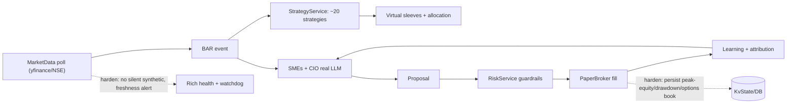

# Month-Long Paper Trading: Go-Live Hardening + Strategy Library

The engine already has the right bones: APScheduler + in-memory event bus ([ats/server/orchestrator.py](ats/server/orchestrator.py)), a paper broker with Zerodha-style fees and 5bps slippage ([ats/services/execution/paper_broker.py](ats/services/execution/paper_broker.py)), SQLite persistence ([ats/core/models.py](ats/core/models.py)), 9 strategies with virtual sleeves + inverse-vol/ERC allocation ([ats/services/strategies/](ats/services/strategies/)), and an SME learning loop ([ats/services/learning/service.py](ats/services/learning/service.py)). The SME mock output you saw comes from `MockLLMClient.chat()` in [ats/services/agents/llm_client.py](ats/services/agents/llm_client.py) because `ATS_LLM_PROVIDER` defaults to `mock`.

Assumed decisions (questions were skipped, using recommended defaults): SME reasoning on Ollama (local default) + OpenAI-compatible API option; start on the free yfinance/NSE feed with a clean Kite adapter slot; daily/swing cadence as the primary book.

## Data -> decision -> learning loop (and where we harden it)

## Phase 0 - Flip the switches (config + real SME)
- Set the go-live env in `.env` (see [deploy/.env.example](deploy/.env.example)): `ATS_TRADING_MODE=PAPER`, `ATS_DATA_SOURCE=nse_live`, `ATS_RESPECT_MARKET_HOURS=true`, `ATS_REAL_MONEY_ENABLED=false`, `ATS_DASHBOARD_TOKEN=...`.
- Enable real SMEs (both backends supported by `build_llm_client()`): Ollama default (`ATS_LLM_PROVIDER=ollama`, `ATS_LLM_MODEL=llama3.1`) with an API fallback path documented (`ATS_LLM_PROVIDER=openai`, `ATS_LLM_BASE_URL`, `ATS_LLM_API_KEY`). Add a tiny startup self-check that logs whether the LLM endpoint actually answered (today `is_real` stays true even if HTTP fails and falls back to mock text).
- Fix empty grounding ("knowledge: []"): pre-seed `var/knowledge/` and ensure `get_knowledge_base().ingest_all()` runs before the console serves requests ([ats/services/agents/service.py](ats/services/agents/service.py)); add a couple of NSE/India primer docs so retrieval returns chunks.

## Phase 1 - Reliability hardening (must-fix for an unattended month)
Critical gaps from the readiness audit, in priority order:
- Restart-safe risk state: persist `ExecutionService._peak_equity`/drawdown and the `OptionsPaperBook` to `KvState`/DB and reload on start ([ats/services/execution/service.py](ats/services/execution/service.py), [ats/services/execution/options_book.py](ats/services/execution/options_book.py)). Today a crash resets drawdown and silently drops open option spreads, defeating the daily-loss kill switch.
- Feed integrity: stop silent per-symbol synthetic fallback masquerading as live ([ats/services/market_data/sources.py](ats/services/market_data/sources.py) `ResilientDataSource`). Tag synthetic bars, expose a live-vs-synthetic ratio, and alert/halt new entries when the live feed degrades. Tune the watchdog for yfinance delay so it does not false-trip during real hours ([ats/services/watchdog/service.py](ats/services/watchdog/service.py)).
- Market calendar: extend `NSE_HOLIDAYS` beyond 2026 and apply `is_polling_window()` gating to the news scraper, agents, and options poll (currently 24/7) ([ats/services/market_data/calendar.py](ats/services/market_data/calendar.py)).
- Observability: enrich `GET /api/health` ([ats/server/api.py](ats/server/api.py)) with last-bar age, live/synthetic ratio, kill-switch state, DB ping, and orchestrator status; add file logging with rotation (stdout-only today, [ats/core/logging.py](ats/core/logging.py)); schedule a daily digest push at close via the existing notify path ([ats/services/execution/notify.py](ats/services/execution/notify.py)); populate `PnlDaily.gross`/`fees` ([ats/services/execution/service.py](ats/services/execution/service.py)).

## Phase 2 - Strategy library expansion (the "plethora"), academically grounded
Each new strategy subclasses `Strategy` or `UniverseStrategy` in [ats/services/strategies/library.py](ats/services/strategies/library.py), with paper citations in docstrings. Existing 9 stay. New additions:

Trend / momentum:
- Cross-sectional momentum (top/bottom decile, 12-1) - Jegadeesh & Titman (1993).
- 52-week-high momentum - George & Hwang (2004).
- Dual momentum (absolute + relative) - Antonacci (2014).
- MACD trend + ADX/DMI filter - Appel; Wilder (classic technical).

Mean reversion:
- Short-term (1-week) reversal, universe - Lehmann (1990) / Jegadeesh (1990).
- Ornstein-Uhlenbeck / Keltner-channel z-score reversion.

Stat arb:
- Cointegration pairs (Engle-Granger test) upgrading `PairsZScore` - Gatev, Goetzmann & Rouwenhorst (2006); Engle & Granger (1987).

Factor (dedicated single-factor sleeves, split out from `FactorComposite` so each gets its own track record):
- Value - Fama & French (1992/1993).
- Quality (QMJ) - Asness, Frazzini & Pedersen (2019).
- Low-volatility / Betting-Against-Beta - Frazzini & Pedersen (2014).
- Size - Banz (1981).

Event / sentiment / seasonal / vol:
- Post-earnings-announcement drift (uses [ats/services/fundamentals/](ats/services/fundamentals/)) - Bernard & Thomas (1989).
- News-sentiment momentum (uses existing NLP `SentimentScore`) - Tetlock (2007).
- Turn-of-month seasonality - Ariel (1987).
- Volatility-targeting overlay - Moreira & Muir (2017); existing iron-condor sleeve maps to variance risk premium - Carr & Wu (2009).

## Phase 2b - Register + parameterize + test
- Append instances to `default_strategies()` / `default_universe_strategies()` and add metadata rows in [ats/services/reference.py](ats/services/reference.py) with `status="shadow"` so new strategies log signals without taking capital until validated.
- Add a per-strategy params block in [ats/core/config.py](ats/core/config.py) (lookbacks, thresholds, z-entry/exit) so the "variables" you want to fine-tune are config, not code edits.
- Unit tests per strategy in [tests/test_strategy_library.py](tests/test_strategy_library.py) using engineered price paths.

## Phase 3 - Recording & fine-tuning instrumentation
- Daily export of per-strategy and per-SME metrics (returns, hit rate, Sharpe, turnover, vote_weight) to `var/metrics/*.parquet` for offline analysis - builds on `SleeveTracker.stats()` and `SmeTrackRecord`.
- Fix the attribution horizon: `LearningService.evaluate()` currently scores on the next price tick; make the forward-return horizon configurable (e.g. 5d) and persist in-flight attribution config ([ats/services/learning/service.py](ats/services/learning/service.py)).
- A lightweight "research log" that snapshots active params + rolling performance so month-end A/B comparisons are reproducible.

## Phase 4 - Backtest + shadow validation gate
- One command wiring all strategies through [quant/backtest/engine.py](quant/backtest/engine.py) with `walk_forward`, `monte_carlo_drawdowns`, and `deflated_sharpe_ratio` from [quant/backtest/validation.py](quant/backtest/validation.py).
- Promotion rule: a strategy moves `shadow -> paper` only after it clears a deflated-Sharpe / min-sample bar, mirroring the SME `promotion_decision()` pattern.

## Phase 5 - Run playbook + references
- A `docs/month_paper_run.md` covering start/stop (systemd/launchd per [docs/deployment_lan.md](docs/deployment_lan.md)), daily health checks, the weekly review ritual, and backup/restore of `var/ats.db`.
- Academic references appendix (links below).

## Academic references
- Time-series momentum: Moskowitz, Ooi & Pedersen (2012), JFE - https://www.sciencedirect.com/science/article/pii/S0304405X11002613
- Cross-sectional momentum: Jegadeesh & Titman (1993), J. Finance - https://www.bauer.uh.edu/rsusmel/phd/jegadeesh-titman93.pdf
- 52-week-high momentum: George & Hwang (2004), J. Finance - https://onlinelibrary.wiley.com/doi/10.1111/j.1540-6261.2004.00695.x
- Pairs trading: Gatev, Goetzmann & Rouwenhorst (2006) - http://stat.wharton.upenn.edu/~steele/Courses/434/434Context/PairsTrading/PairsTradingGGR.pdf
- Betting-Against-Beta / low-vol: Frazzini & Pedersen (2014), JFE - https://pages.stern.nyu.edu/~lpederse/papers/BettingAgainstBeta.pdf
- Post-earnings drift: Bernard & Thomas (1989), J. Accounting Research - https://www.jstor.org/stable/2491062
- Variance risk premium (short-vol): Carr & Wu (2009), RFS - https://engineering.nyu.edu/sites/default/files/2019-01/CarrReviewofFinStudiesMarch2009-a.pdf
- Additional (cited in docstrings): Fama & French (1992/1993) value; Asness, Frazzini & Pedersen (2019) QMJ; Banz (1981) size; Lehmann (1990) short-term reversal; Engle & Granger (1987) cointegration; Antonacci (2014) dual momentum; Moreira & Muir (2017) volatility-managed portfolios; Ariel (1987) turn-of-month; Tetlock (2007) media sentiment.

## Notes / trade-offs
- yfinance is delayed and not exchange-real-time; it is adequate for a daily-bar swing paper test but the watchdog must tolerate the delay and the Kite slot is left clean for a later real-time upgrade.
- Long-only constraint in the paper portfolio ([ats/services/execution/portfolio.py](ats/services/execution/portfolio.py)) means short legs of factor/pairs strategies are recorded as signals but only the long leg trades; this is acceptable for paper evaluation and noted in the metrics.