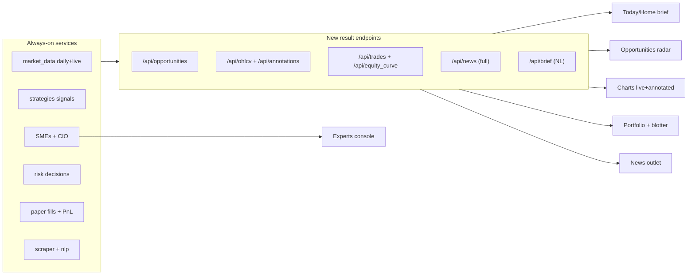

# Results-First Dashboard Redesign

## What you'll get (the vision)

Not a Bloomberg terminal. A cockpit that answers, in this order: *What did our algorithms find? What did we do about it, and why? Show me the chart and the news.* Plain-English first, numbers on demand. Runs on your server laptop; you open it from any laptop/phone on your home network.

Core principles: results before raw data; words before tables; progressive disclosure (cards expand on demand); everything the background services already compute gets surfaced; and it should be *fun* — a pluggable, animated multi-theme look you can switch on a whim (a sleek Modern theme and a playful Minecraft theme to start, more later).

## Decisions locked

- Live/intraday data via a free open-source NSE library behind a pluggable adapter (Zerodha Kite drops in later).
- LLM: Ollama on the server laptop, with hosted API-key models as an option. Both already supported in `[ats/services/agents/llm_client.py](ats/services/agents/llm_client.py)`.

## The core gap this fixes

The backend already computes almost everything you want to see (strategy signals, SME opinions, CIO proposals, risk decisions, paper fills + PnL, news + sentiment, theses) but **almost none of it is exposed via REST**, and there is **no "opportunity" concept** linking a signal -> expert view -> chart -> action. We add result-oriented endpoints and an Opportunity aggregator, then build pages around them.

## Information architecture (new pages)

- **Today (home)**: an LLM-written brief ("here's what the system sees"), top opportunities, one-line portfolio status, what changed since you last looked, top news affecting holdings.
- **Opportunities (the Radar)**: ranked feed of money-making setups the algos found. Each card = symbol, the setup (which strategy/SME), conviction, plain-English thesis, mini annotated chart, key risks + invalidation level, strategy's historical hit-rate, status (idea/proposed/acted). Click -> detail with full chart + expert debate + Revisit.
- **Charts**: live + historical candlesticks (TradingView Lightweight Charts, MIT, vendored locally) with annotations — entries/exits, signal flips, SME notes, news markers. Symbol search + watchlist; live quotes via the OSS adapter.
- **Portfolio**: money in real terms — equity curve (annotated), holdings at live marks, realized/unrealized PnL, and the **trade blotter** (every paper trade: entry/exit, qty, price, fees, realized PnL, what drove it), plus per-strategy/sleeve attribution.
- **News outlet**: readable in-app feed (no leaving the site) with filters (my holdings / sector / sentiment), ticker tags, sentiment, and an optional LLM "why this matters to you" note; a reader pane.
- **Experts**: the chat/debate/theses/directives console (already rebuilt) restyled to the new theme.
- **System**: pipeline + logs + agent roster demoted here for the curious; mode/kill controls stay in the header.

## Backend changes (expose the results)

New module `ats/services/opportunities/` (aggregator): join latest non-neutral signals (`Signal`), SME opinions (`SmeOpinion`), CIO proposals, and decisions (`Decision`) per symbol into a ranked, scored opportunity list; attach a plain-English explanation (LLM if available, else templated from contributors/rationale). Compute on demand from in-memory `_latest` + DB; persist later if needed.

New/extended endpoints (in `[ats/server/dashboard.py](ats/server/dashboard.py)` or a new `ats/server/results_api.py`):

- `GET /api/opportunities` and `/api/opportunities/{symbol}` (detail + chart annotations).
- `GET /api/ohlcv?symbol=&interval=&limit=` — candles from the `ohlcv` store (daily) and the live adapter (intraday), shaped for Lightweight Charts.
- `GET /api/annotations?symbol=` — markers from `fills`, `signals`, `sme_opinions`, `news_items`.
- `GET /api/trades` (blotter from `orders`+`fills`+`decisions`) and `GET /api/equity_curve` (from `pnl_daily`).
- `GET /api/news` (full feed: body, tickers, sentiment, paging) + `GET /api/news/{id}` (reader); optional full-article fetch via readability.
- `GET /api/brief` — LLM CIO narrative grounded on the snapshot (cached, refreshable); templated fallback.
- WebSocket: forward the currently-dropped `REGIME`, `OPTION_CHAIN`, `ALERT` topics and add `opportunity` events.

## Live/intraday data adapter

Extend `[ats/services/market_data/sources.py](ats/services/market_data/sources.py)` with an `NseLiveSource` using a pinned OSS library (proposed: `indian-stock-market`, which offers `get_ohlc_data(sym, "1Min"/"5Min")` + live quotes + streaming with intraday backfill). Selected via a new `data_source="nse_live"`, keeping `yfinance` (daily backfill) and `synthetic` (offline). Cache + rate-limit aware; pluggable so Kite replaces it later. New config: `intraday_interval`, etc.

## Theming engine (pluggable, multi-theme + animations)

The whole UI is built on theme tokens so a theme is "swap a stylesheet (+ optional JS), keep the markup". This is the architecture that lets us add anime / three.js themes later without touching pages.

- **Token-driven base**: refactor `[ats/server/static/app.css](ats/server/static/app.css)` so all pages use CSS custom properties (`--bg`, `--panel`, `--accent`, `--pos`, `--neg`, `--radius`, `--font`, `--shadow`, `--motion`, ...). Pages reference tokens only; never hard-coded colors.
- **Theme registry + switcher** (`ats/server/static/themes.js`): a small registry where each theme is `{ id, name, css, fonts?, mount?(root), unmount?() }`. A header theme picker applies `data-theme="<id>"` on `<html>`, lazy-loads the theme's CSS/JS, runs its optional `mount()` (for animated backgrounds / cursor effects) and the previous theme's `unmount()`, and persists the choice in `localStorage` (so every device remembers its own vibe). Themes live in `ats/server/static/themes/<id>.css` (+ optional `<id>.js`).
- **Theme 1 - Modern** (default): the calm, sleek "ink" look from this plan. Drop the dominant blue; emerald/teal positive, warm amber highlights, red risk; editorial type for briefs; whitespace; soft rounded cards + subtle shadows. Includes light and dark variants.
- **Theme 2 - Minecraft** (the fun one): blocky pixel aesthetic - square corners, hard 3px "beveled block" borders and offset shadows, a pixel font (OFL "Press Start 2P" / "VT323", vendored locally - no CDN), original voxel/pixel-art CSS textures (dirt/stone/grass-style gradients, *not* ripped Mojang assets), inventory-slot cards, hotbar-style nav, and a pixel cursor. Stats render like health/XP bars; toasts pop in like item pickups.
- **Animations (shared layer)**: a fluid-motion layer in `[ats/server/static/app.js](ats/server/static/app.js)` / `app.css` - page/card reveal transitions, number count-ups, smooth chart loads, animated equity sparkline, and lightweight **cursor-based effects** (a soft cursor-follow glow / spotlight on Modern; pixel "block-break" particle puffs on click in Minecraft, parallax tilt on cards). All gated behind `prefers-reduced-motion` and a header "reduce motion" toggle for low-power devices.
- **Future-theme contract**: because a theme may register a `mount(root)` JS hook, later themes can mount a full canvas/WebGL background (e.g., a three.js scene) or an anime-styled overlay without changing any page markup. Documented in the design doc as the official extension point.

## Frontend

- Vendor TradingView Lightweight Charts (single MIT JS file) into `ats/server/static/vendor/` (no runtime CDN, CSP-friendly); style its colors from the active theme tokens so charts match each theme.
- New templates: `today.html`, `opportunities.html`, `charts.html`, `portfolio.html`, `news.html`; keep `experts.html`; fold pipeline/logs/agents into `system.html`. All extend the token-based `[ats/server/templates/base.html](ats/server/templates/base.html)`.
- Live updates via the existing single WebSocket runtime in `[ats/server/static/app.js](ats/server/static/app.js)`.

## LAN hosting

- Make host/port configurable (currently hardcoded `127.0.0.1:8000` in `[ats/server/__main__.py](ats/server/__main__.py)`): add `ATS_HOST`/`ATS_PORT` to `[ats/core/config.py](ats/core/config.py)`.
- Write `docs/deployment_lan.md`: find the server IP, run bound to `0.0.0.0`, open the firewall port, reach `http://<server-ip>:8000` from other devices, `<host>.local` via mDNS, run as a service (Linux systemd / macOS launchd / Docker Compose already present), plus a note on optional Tailscale for secure access away from home.
- Security: bind to LAN only and warn against internet exposure; add an optional shared-token/basic-auth gate; the full-article fetch must allow-list known news domains and block private IP ranges (SSRF guard). 

## Surprise features (beyond what you asked)

- **Morning brief + "what changed since you last looked"** intraday narrative.
- **"Explain this" everywhere**: click any signal/number -> LLM explains it in plain words (reuses the experts API).
- **Alerts center** with browser notifications: new opportunities, fills, volume spikes, regime shifts, strategy-decay warnings.
- **Opportunity cards as research notes**: edge estimate + that strategy's historical hit-rate + invalidation level.
- **PnL storytelling**: equity curve annotated with what drove the moves; per-holding sentiment sparkline.
- **Watchlist editing** from the UI; **mobile-responsive** so you can check from your phone on the LAN.
- **Daily digest** archive you can scroll back through.

## Dependencies and safety

- Add (pinned, via package manager): the OSS NSE library, a readability extractor (article text). Vendor locally (no runtime CDN): the Lightweight Charts MIT JS, and the pixel webfont for the Minecraft theme (OFL-licensed). Keep `requirements`/lockfile consistent.
- Use original pixel/voxel-inspired CSS styling for the Minecraft theme rather than Mojang's copyrighted textures/assets.
- New endpoints get input validation (symbol/interval allow-lists, paging caps); article fetch is domain-allow-listed with private-range blocking; LAN auth optional. Tests added for new aggregator + endpoints.

## Deliverable docs

- `docs/dashboard_redesign.md` — this design doc (vision, IA, wireframe notes, data contracts, the theming engine + how to author a new theme, feature list, phasing).
- `docs/deployment_lan.md` — the LAN hosting guide.

## Phasing (incremental, each phase usable)

- Phase 0: design doc + **token-based theming engine + theme switcher** + Modern theme (light/dark) + nav reorg + `ATS_HOST/PORT` + LAN doc.
- Phase 1: result endpoints (opportunities, trades, ohlcv+annotations, news, brief) + WS topics + tests.
- Phase 2: pages — Today, Opportunities, Charts (Lightweight Charts), Portfolio, News reader.
- Phase 2.5: **Minecraft theme + the fluid/cursor animation layer** (themes are now exercised across all the real pages).
- Phase 3: live OSS NSE adapter (intraday + quotes).
- Phase 4: surprises — alerts center, explain-this, watchlist editing, digests, mobile polish.
- Phase 5: verify (tests + full smoke), finalize docs.

All work continues on `feat/sme-experts`; merge to `main` once you're happy.