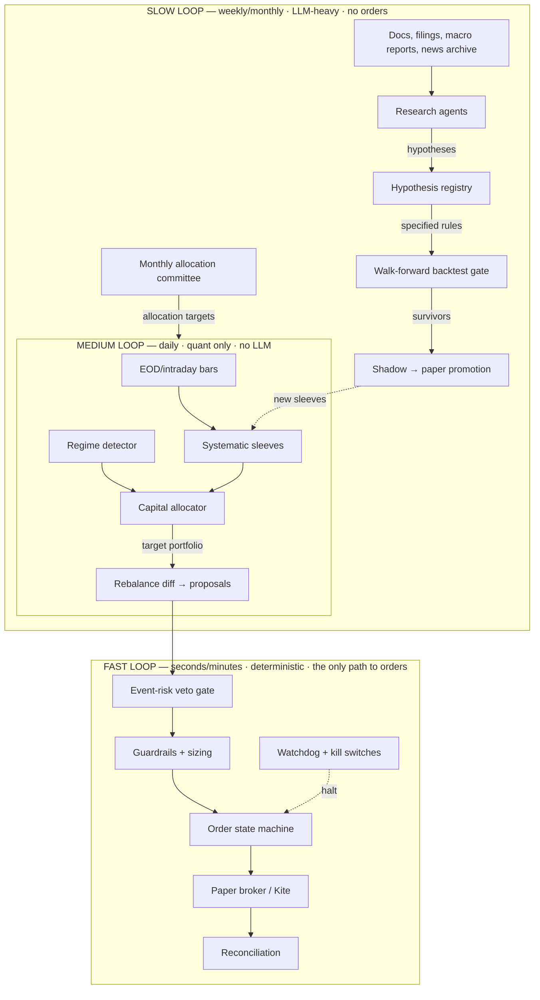

# Three-Loop Architecture — Detailed Plan (2026-07-07)

The redesign agreed in discussion: intelligence placed by timescale, not sprinkled
everywhere. LLMs leave the trade path; a deterministic quant core earns; an agent
research factory improves the core slowly. This document is the working plan —
architecture, fast-loop detail, migration workstreams, and timeline.



Design invariants, in priority order: **never lose the book** (fast loop halts on any
doubt), **every rupee of LLM spend maps to a named decision**, **nothing trades that
did not survive the backtest gate**, **one path to orders** (medium loop proposals
through the fast loop — no side doors).

---

## 1. Fast loop in detail (the part you asked about)

The fast loop is not a trading brain. It is a **protective membrane**: it takes a
desired portfolio from the medium loop and gets there safely, or refuses. Everything
in it is deterministic, unit-testable, and LLM-free. Roughly 70% already exists.

### 1.1 Data integrity gate *(exists, keep)*
Bars are tagged live-vs-synthetic; a degraded feed ratio halts new entries; the
watchdog (market-hours-aware heartbeat) engages the kill switch on sustained silence
and never auto-releases. Files: `market_data/sources.py`, `watchdog/service.py`.
**Add:** a per-symbol staleness check at order time — refuse to submit against a
quote older than N seconds (config `ATS_MAX_QUOTE_AGE_S`, default 90 for paper,
tighter for live).

### 1.2 Event-risk veto gate *(new — the one "news" component in the fast loop)*
A pre-trade check answering one question: *is this a stupid moment to add exposure?*
Sources, all cheap and mostly non-LLM:
- **Calendar vetoes (pure data):** earnings date for the symbol within ±1 session;
  RBI MPC days; Union Budget day; F&O monthly expiry; index rebalancing dates.
  Build as `ats/services/risk/event_calendar.py` with a maintained YAML + optional
  auto-fetch of earnings dates.
- **News severity flag (local NLP):** the existing FinBERT pipeline already scores
  headlines; add a "severity" state per symbol — extreme negative sentiment burst on
  a held/target name sets a 1-session entry veto. No Gemini call.
- **Manual veto:** a dashboard toggle per symbol / global ("I know something's off").

Semantics: vetoes **block new entries only**. Exits and risk-reducing orders always
pass. Every veto is logged with reason to the audit chain.

### 1.3 Pre-trade guardrails + sizing *(exists, keep as-is)*
Position cap 10%, sector cap 35%, gross exposure 100%, per-order value cap, daily
loss limit 3% → kill switch, rate limit, long-only clamp, fractional-Kelly sizing,
netting desired-vs-current so paths can't double-stack. Files: `risk/service.py`,
`risk/guardrails.py`, `risk/allocator.py`. These are immutable in all modes.

### 1.4 Order state machine *(the main new build — required for live, healthy for paper)*
Today the paper broker fills instantly, so no lifecycle exists. Live orders reject,
partially fill, hang, and get cancelled. Build the lifecycle now and make the paper
broker honor it, so going live changes the adapter, not the logic:

```
STAGED → (approval if mode=APPROVAL) → SUBMITTED → ACKED
      → PARTIAL(qty) → FILLED | REJECTED | CANCELLED | EXPIRED
```

- One table (`orders` extended), one transition function, idempotent on
  `decision_id` (dedupe guard already exists — keep it).
- **Price-deviation guard:** each decision carries its reference price; if LTP has
  moved more than X bps (config, default 50) by submission time, the order re-routes
  to STAGED for re-check instead of chasing.
- **Limit-order default:** live orders go as limit-at-reference ± slippage budget,
  never market, so worst-case slippage is bounded by construction.
- Timeouts: unACKed order → cancel + alert; PARTIAL at session end → reconcile.
- New module: `ats/services/execution/order_lifecycle.py` + tests.

### 1.5 Reconciliation *(new — the live-money guardian)*
A periodic job (every 5 min in live, daily in paper) comparing internal book vs
broker truth (positions, cash, orders). Any mismatch beyond rounding → **halt new
entries + alert**; human resolves. This single component prevents the classic
account-blowing failure mode of home-built systems (internal state drift). Module:
`ats/services/execution/reconcile.py`. In paper mode it validates DB consistency
(fills ↔ positions ↔ cash), which also catches bugs early.

### 1.6 Kill switches *(exists — add one)*
Existing: manual, daily-loss, watchdog/feed. **Add:** reconciliation-mismatch halt
(§1.5). All engage-only-auto, release-only-human. Unchanged principle.

### 1.7 What the fast loop will never contain
LLM calls, news parsing beyond the severity flag, strategy logic, parameter tuning,
or anything nondeterministic. If a component in this loop can't be unit-tested with
exact assertions, it belongs in a slower loop.

---

## 2. Medium loop (daily, quant-only — the earner)

Mostly exists; the work is consolidation, not construction.

- **Core allocation sleeve (new, boring, primary):** regime-aware weights across
  NIFTYBEES / GOLDBEES / (optionally LIQUIDBEES as cash proxy), rebalanced weekly or
  on regime flip. This is the ballast — most of the realistic return, near-zero cost.
  Implement as a `UniverseStrategy` using the existing regime service.
- **Alpha sleeves (existing library):** keep the handful with the best walk-forward
  evidence (likely `donchian_trend`, `ts_momentum`, `factor_composite`,
  `rsi2_reversion`); everything else stays `shadow`. The backtest gate
  (`scripts/run_backtests.py`) remains the only promotion path.
- **Allocator (exists):** inverse-vol → ERC risk-parity across sleeves with bounded
  performance tilt; regime service dampens mismatched styles and halves sizing in
  crisis. Keep.
- **Output contract:** the medium loop emits **target portfolio diffs** (proposals),
  never orders. `strategy_trader.py` already does consensus→proposal; it becomes the
  *sole* autonomous proposal source (see WS-3 for what happens to the SME path).

Cadence: signals daily after close (or 60s intraday polling as now, but decisions at
most once per symbol per session for swing sleeves — the cooldown exists).

---

## 3. Slow loop (weekly/monthly, LLM-heavy — the research factory)

The 26 personas stop voting on trades and become a research staff. Concretely:

### 3.1 Hypothesis registry (the backbone)
A new DB table + dashboard page. Lifecycle:

```
PROPOSED → SPECIFIED (exact backtestable rule + params + universe)
        → BACKTESTED (walk-forward result attached)
        → REJECTED | SHADOW → PAPER → (someday) LIVE
```

Every hypothesis records: the agent that proposed it, the evidence cited, the exact
rule, and its out-of-sample result. **Agents are scored by hypothesis survival
rate** — not per-trade attribution (statistically meaningless at our trade counts).
This replaces the current learning/attribution weights as the primary agent metric.

### 3.2 Agent roles (repurposed personas, small roster to start)
- **Macro analyst** (weekly): digests RBI/fiscal/global inputs from the existing
  knowledge corpus + fresh docs → regime commentary + risk flags for the committee.
- **Fundamentals analyst** (event-driven, uses `research/disclosures.py`): earnings
  transcripts/results for held + watchlist names → holds/red-flags, and earnings
  dates feeding the veto calendar (§1.2).
- **Strategy researcher** (weekly): mines the news archive + corpus for candidate
  rules → PROPOSED hypotheses with a testable specification.
- **Risk reviewer** (monthly): adversarial pass — attacks current sleeves, drawdown
  post-mortems, correlation creep, "what would break this."
- **Committee synthesizer / CIO** (monthly): merges all of the above + sleeve
  performance into one allocation recommendation **you approve on the dashboard**
  before it adjusts medium-loop weights (bounded: ±10% tilt max, never overrides
  guardrails).

### 3.3 LLM budget by construction
Autonomous spend only on scheduled runs: ~4 weekly research passes + 1 monthly
committee ≈ a few hundred calls/month, hard-capped (`ATS_LLM_MONTHLY_BUDGET`).
The news→SME fan-out (the expensive path) is deleted from the trade path; news flows
into the archive the researcher reads weekly, and into the local-NLP severity flag.
Console/experts chat stays manual-only, as now.

---

## 4. About "riding the manipulation" — an honest treatment

Two things, plainly. First, the framing "my competition is small traders" is only
true in illiquid small/micro caps — in NIFTY-50 names, your counterparty is
overwhelmingly institutional algos. And illiquid names are precisely where
operator-driven pumps live, where **retail entering mid-pump is the exit liquidity**
— that's the *function* of the pump. The base rate of "making your cut" is terrible.
Second, knowingly trading along a manipulation scheme touches SEBI's PFUTP
(fraudulent & unfair trade practices) regulations; SEBI has prosecuted riders, not
just operators. Not a lane we build for.

**The legitimate version of your instinct** — "detect unusual flow and position
around it" — is a real research hypothesis, and it goes through the slow loop like
any other:
- **Inputs (all public):** bulk/block deal disclosures, delivery-percentage shifts,
  promoter pledge changes, F&O open-interest builds, volume z-scores (already have).
- **Hypothesis A (defensive — build first):** anomaly score as a *veto* — refuse
  entries in names showing pump signatures (price up >X% on volume >N× with falling
  delivery %). Cheap, safe, almost certainly net-positive.
- **Hypothesis B (offensive — only if A's data looks promising):** momentum-ride
  *liquid* names on institutional-flow signatures (delivery-backed volume + block
  deals), strict stops, small size, shadow-tested like everything else.

Registered as hypotheses #1 and #2 in the new registry, credited to you.

---

## 5. Migration workstreams (what we actually change in the repo)

| WS | Work | Key files | Effort |
|---|---|---|---|
| **WS-0 Stabilize** | `.gitattributes` + CRLF fix, commit tree, green `pytest`, deploy always-on, kill-criteria doc, start ₹1L paper run | repo-wide | days |
| **WS-1 Fast loop** | Event calendar + veto gate; quote-staleness check; order state machine; price-deviation guard; reconciliation job + halt | `risk/event_calendar.py` (new), `execution/order_lifecycle.py` (new), `execution/reconcile.py` (new), `risk/service.py` | ~1–2 wks |
| **WS-2 Medium loop** | Core allocation sleeve; demote weak sleeves to shadow per backtest gate; confirm strategy_trader as sole proposal source | `strategies/library.py`, `strategies/allocation.py`, `execution/strategy_trader.py` | ~1 wk |
| **WS-3 SME re-plumb** | Remove news/spike→SME→proposal autonomous path (keep code, config-off `ATS_SME_TRADE_PATH=false`); news → archive + severity flag | `agents/service.py`, `core/config.py` | days |
| **WS-4 Slow loop** | Hypothesis registry (model+API+page); agent role prompts; weekly/monthly scheduled runs; committee approval flow; agent scoring by survival | `agents/` (new `research_*` modules), `core/models.py`, dashboard | ~2–3 wks |
| **WS-5 Flow hypotheses** | Data collectors for bulk deals / delivery %; anomaly veto (Hyp A); Hyp B spec | `services/flows/` (new) | ~1–2 wks, after WS-4 |

Ordering note: **WS-3 is config-off, not deletion** — the current SME trade path
keeps running in paper for the A/B during the evaluation window. In October the data
decides whether it's retired or kept.

---

## 6. Timeline

| When | What | Milestone |
|---|---|---|
| **Week 1** (now) | WS-0 fully; start WS-1 | Paper run live on always-on host; kill criteria committed |
| **Weeks 2–3** | WS-1 done; WS-2 done | Veto gate + order lifecycle in paper; core sleeve trading paper |
| **Week 4** | WS-3 | Both proposal paths toggleable; LLM spend drops to budget |
| **Month 2** | WS-4 | First weekly research pass produces hypotheses; registry live |
| **Month 3** | WS-5; first monthly committee | Flow-anomaly veto in shadow; committee recommendation #1 |
| **~Oct 2026** | Evaluation per kill criteria | vs NIFTYBEES after costs, max DD <15%, per-path verdict, LLM ROI verdict |
| **After, if pass** | Kite adapter + SEBI algo registration (Algo-ID, static IP), ₹10–25k real in APPROVAL | First live order |

Success criteria for the *architecture* (separate from returns): zero unexplained
book/broker mismatches, zero guardrail breaches, LLM spend within budget every
month, every live sleeve traceable to a gated hypothesis, and every order
explainable from the Activity page.

---

## 7. Decisions (locked 2026-07-07)

1. **Always-on host:** home device (Pi/old laptop). Keep it on 24/7; UPS/power-cut
   handling worth checking. Static-IP/VPS question revisited only at live-trading time.
2. **Core sleeve cadence:** weekly rebalance + immediate rebalance on regime flips.
3. **Research roster:** start with the 5 roles; expand only with evidence.
4. **A/B window:** legacy SME trade path stays on (paper) for the full 3-month run;
   verdict in October alongside the overall evaluation.

---

## 8. The trading strategies — what exists, how they work, how they connect

### 8.1 How a strategy connects to a trade today (the missing mental model)

This is the chain you and Opus built but never fully wired end-to-end until June 30:

```
bar arrives (60s poll, market hours)
  → StrategyService runs every registered strategy on that symbol's history
  → each strategy returns a SignalModel {stance, conviction 0..1, features} or None
  → signals publish on Topic.SIGNAL          ← until June 30 the chain STOPPED here
  → StrategyTraderService nets a per-symbol consensus of paper-status strategies
  → net score ≥ buy threshold → Topic.PROPOSAL
  → RiskService (sizing + guardrails) → Topic.DECISION
  → ExecutionService → paper fill → the ONE shared book
```

Two important consequences of the current design: **(a)** strategies never trade
individually — they *vote*, and only the blended consensus trades; **(b)** the
per-strategy "sleeves" you see on `/strategies` are *virtual* (a normalized
equal-weight shadow book marked to market for attribution), not real money walls.
Your request in §9 changes exactly this.

### 8.2 The catalog (24 strategies, 5 files) and how each picks its instruments

**Selection comes in three patterns.** *Scanners* evaluate every symbol in the
watchlist independently (the ~50 NSE large-caps + ETFs in `reference.py`). *Rankers*
see the whole universe at once and pick the top/bottom N. *Specialists* have a
hard-coded instrument list because the trade only exists on those instruments.

| Strategy | Style | Core rule (one line) | Instrument selection | Status |
|---|---|---|---|---|
| `sma_crossover` | trend | 20-SMA crosses 50-SMA | scanner: whole watchlist | paper |
| `donchian_trend` | trend | buy 55-bar breakout, exit 20-bar low (Turtle) | scanner | paper |
| `macd_adx_trend` | trend | MACD cross, only when ADX>25 confirms a trend exists | scanner | shadow |
| `ts_momentum` | momentum | sign of 12-month return (skip last month) | scanner | paper |
| `volume_breakout` | momentum | price breakout + volume z-score confirmation | scanner | paper |
| `high_52w` | momentum | proximity to 52-week high (anchoring effect) | scanner | shadow |
| `xs_momentum` | momentum | rank all names by 12-1 return, hold the top decile | ranker: top N of universe | shadow |
| `dual_momentum` | momentum | relative momentum + absolute filter (cash if trend down) | ranker | shadow |
| `mean_reversion` | mean-rev | Bollinger %b band reversion | scanner | paper |
| `rsi2_reversion` | mean-rev | RSI(2)<10 above the 200-SMA buys the dip | scanner | paper |
| `st_reversal` | mean-rev | buy last week's biggest losers (1-week reversal) | ranker: bottom N | shadow |
| `ou_keltner` | mean-rev | Ornstein-Uhlenbeck / Keltner band reversion | scanner | shadow |
| `pairs_zscore` | stat-arb | z-score of log price ratio of a correlated pair | specialist: chosen pairs | paper |
| `coint_pairs` | stat-arb | cointegration-tested pairs (Engle-Granger) | specialist: pairs that pass the test | shadow |
| `factor_composite` | factor | top-N by momentum+low-vol+value+quality ranks | ranker (uses fundamentals) | paper |
| `value_factor` | factor | cheapest decile by P/E, P/B | ranker (fundamentals) | shadow |
| `quality_qmj` | factor | highest ROE / margins / low D/E | ranker (fundamentals) | shadow |
| `low_vol_bab` | factor | lowest-beta names (betting-against-beta) | ranker | shadow |
| `size_factor` | factor | smaller names within the universe | ranker | shadow |
| `nav_premium` | arbitrage | GOLDBEES/SILVERBEES discount to fair NAV vs COMEX | specialist: those 2 ETFs only | paper |
| `pead_drift` | event | drift after earnings surprises | scanner + earnings dates | shadow |
| `news_sentiment` | event | ride FinBERT sentiment momentum on a name | scanner + news feed | shadow |
| `turn_of_month` | seasonal | hold the index ETF over month-end days | specialist: NIFTYBEES | shadow |
| `vol_target` | overlay | scales exposure to hit a volatility budget | overlay on the book | shadow |
| `vol_premium` | options | sell NIFTY iron condors when IV ≫ realized | specialist: NIFTY options | paper (own options book) |

**Why so many are `shadow`:** the 15 newer ones were gated behind
`scripts/run_backtests.py` (walk-forward + deflated Sharpe) and never promoted.
That gate is correct — the graduated ladder in §12 is where promotion decisions
get made from *evidence you watch*, not defaults.

**Re-assessment for this plan:** under the three-loop design, the medium loop's
earner is the **core allocation sleeve** (new) plus the strongest 4–6 of the above.
The competition framework in §9 is how we find out which 4–6 — that's the point of
segregated accounts.

---

## 9. Segregated accounts: bank simulator + broker simulator

Your requirement, made precise: every trading process gets its **own simulated bank
account and its own broker connection**, trades however it wants, and the dashboard
compares them. The consensus book stops being the only book.

### 9.1 `AccountLedger` — the bank account simulator (new: `ats/services/accounts/ledger.py`)

A double-entry-style ledger per account. No trading logic inside — it only knows
money:

```
Account {account_id, owner ("donchian_trend" | "main" | "sme_legacy"), currency}
  .deposit(amount)  .withdraw(amount)          # funding events
  .reserve(order_id, amount)                    # hold cash when an order stages
  .settle(order_id, fill_value, fees)           # release hold, debit/credit on fill
  .release(order_id)                            # order rejected/cancelled → unhold
  .balance() → {cash, reserved, available}
  .statement(from, to) → journal entries        # every paisa, auditable
```

Every entry is journaled (ts, type, order ref, amount, balance-after) → this becomes
the "passbook" view on the dashboard. Insufficient `available` → order refused at
staging, exactly like a real bank/broker margin check.

### 9.2 `BrokerSim` — the broker simulator (refactor: `ats/services/execution/broker_sim.py`)

The existing `paper_broker.py` (Zerodha fees + 5 bps slippage) becomes the fill
engine inside a **Kite-shaped API**, so the day you hand me the real Zerodha API,
the swap is one adapter class, zero logic changes:

```
BrokerAPI (interface — mirrors Kite Connect's shape)
  .place_order(account_id, symbol, side, qty, order_type, limit_price) → order_id
  .modify_order / .cancel_order(order_id)
  .order_status(order_id)          # STAGED/SUBMITTED/ACKED/PARTIAL/FILLED/REJECTED
  .positions(account_id) / .holdings(account_id)
  .margins(account_id)             # proxies AccountLedger.balance()
  .quote(symbol) / .ltp(symbol)

BrokerSim(BrokerAPI)   — fills via the existing fee+slippage model, per-account
KiteAdapter(BrokerAPI) — real orders later; same interface, gated as today
```

`BrokerSim` also gains the order lifecycle from §1.4 (no more instant fills —
even paper orders pass STAGED→SUBMITTED→FILLED), which is what makes the later
Kite swap honest.

### 9.3 The account structure for the competition

Every account funded with the **same ₹1,00,000 paper** so PnL% is directly
comparable; fees are realistic at that scale:

| Account | Who trades it | Purpose |
|---|---|---|
| `main` | Three-loop system (core sleeve + promoted strategies via consensus) | *our* book — the thing being judged |
| `sme_legacy` | The old SME/CIO pipeline | the A/B vs Opus's design |
| `solo_<strategy_id>` × ~6–10 | One strategy each, full autonomy, own sizing | the strategy league — who earns their keep? |
| `benchmark` | Buy-and-hold NIFTYBEES, day 1 | the bar everyone must clear |

Solo accounts run the *same* immutable guardrails scaled to their own equity
(position cap, daily-loss kill per account) — "trade however they want" within the
laws of physics. Start the league with the 9 current `paper` strategies + the top
2–3 shadow ones by backtest gate score; expand only if the host handles the load.

### 9.4 Trade logbook — improvements to the existing Activity page

What exists is good (Fill→Order→Decision→Opinion/Signal join with full "why").
Additions for the multi-account world: an **account column + filter** (league
account, main, sme_legacy); per-trade **outcome fields** filled in when a position
closes (holding period, realized P&L after fees, max favorable/adverse excursion —
"was the exit good?"); **CSV export** for your own analysis; and a **benchmark-
relative column** (what NIFTYBEES did over the same holding period — a trade that
made 2% while the index made 3% is a loss in disguise).

---

## 10. Dashboard modifications

New/changed pages, in priority order:

1. **`/league` (new — the centerpiece).** Equity-curve overlay of every account
   (main, sme_legacy, all solos, benchmark) normalized to 100; league table with
   return, Sharpe, max DD, hit rate, fees paid, trades count; click into any
   account → its passbook (ledger journal), open positions, trade list. This is
   where your "compare their PnL with our work" question gets answered daily.
2. **`/loops` (new — replaces the pipeline page's mental model).** Three panels
   showing each loop's state: Fast (orders in flight, vetoes active, kill-switch
   state, reconciliation status), Medium (last signal pass, current consensus per
   symbol, next rebalance), Slow (last research run, hypotheses by stage, next
   scheduled run, LLM budget used this month).
3. **`/research` (new).** The hypothesis registry: kanban by lifecycle stage
   (PROPOSED→SPECIFIED→BACKTESTED→SHADOW→PAPER), each card showing proposing agent,
   the rule, and gate results; committee recommendations awaiting your approval.
4. **`/activity` (upgrade).** Per §9.4.
5. **`/strategies` (upgrade).** Keep, but each strategy row links to its solo
   account in the league; show its universe-selection pattern (scanner/ranker/
   specialist) and current instrument list so "what is it allowed to trade" is
   always visible.
6. **Header (all pages).** Account selector; per-loop status pills replacing the
   single pipeline pill.

---

## 11. When the loops run (scheduling — your question answered)

Loops are **event-driven with scheduled triggers**, not "always computing". The
process is always on; each loop wakes when its triggers fire:

| Loop | Active when | Triggers | Sleeps when |
|---|---|---|---|
| **Fast** | NSE session 09:15–15:30 IST (+15 min close grace) | every proposal, order event, bar (staleness checks), 60s watchdog tick | outside hours: only the watchdog heartbeat and reconciliation-at-close run; orders impossible |
| **Medium** | market hours for signals; one main pass at close | 60s bar poll → signals; **15:45 IST daily close pass** (sleeve marks, allocator); **weekly rebalance Monday pre-open** computed Sunday; regime flip → immediate rebalance proposal at next open | overnight/weekends (except the Sunday compute) |
| **Slow** | off-hours by design (cheap compute time, no order risk) | **nightly 20:00 IST**: news archive digest, earnings-calendar refresh (feeds fast-loop veto); **Saturday 10:00**: research agents pass → hypotheses; **first Sunday monthly**: committee run → allocation recommendation for your approval | market hours — the slow loop never acts during a session |

Three details worth knowing. News is still *collected* 24/7 (RSS is free) but only
*processed* by the nightly/weekly slow-loop runs — the severity flag (§1.2) is the
one real-time consumer and it's local NLP, zero LLM. The slow loop's outputs only
take effect at the **next session open**, never mid-session — this is deliberate: a
decision computed calmly overnight is applied mechanically, so no loop ever reacts
in haste. And all of this is APScheduler configuration on the existing orchestrator
— the infrastructure for every one of these cadences already exists.

---

## 12. Graduated testing ladder (replaces "just run 3 months")

Each rung has a **gate question**; passing means climb, failing means fix and
repeat the rung — the clock restarts only for the rung, not from zero:

| Rung | Duration | What we watch | Gate to climb |
|---|---|---|---|
| **R0 smoke** | 1 trading day | plumbing: orders flow, ledgers balance, no crashes, digest email arrives | every fill reconciles ledger↔broker sim↔logbook exactly |
| **R1** | 1 week | behavior: are trades explainable? vetoes firing sensibly? league page truthful? | zero unexplained trades; you can narrate every order from the dashboard |
| **R2** | 2 weeks | stability: restarts survive, feed degradation handled, cooldowns stop churn | uptime through ≥1 deliberate restart + 1 simulated feed outage |
| **R3** | 1 month | first performance read (still noise, treat gently); fee drag per account; LLM spend vs budget | costs within budget; no guardrail breaches; drawdowns behaving per design |
| **R4** | 2 months | early league separation; sleeve decay alerts; first committee cycle completed | slow loop produced ≥1 gated hypothesis; league stable enough to name laggards |
| **R5** | 3 months | the real verdict per kill criteria | beats `benchmark` account after fees, max DD <15% → live-prep begins |

Between rungs you tune (thresholds, cooldowns, promotions) — that's the "see and
improve" you asked for. One honesty rule: **performance conclusions before R4 are
noise.** R0–R2 judge the machine, not the returns.

---

## 13. Zerodha API — when I need it from you

Not yet, and this is worth being precise about:

- **Now → R2:** nothing needed. yfinance paper trading is fine for plumbing and
  behavior testing; the free-personal-API's order endpoints are useless to us while
  every order is simulated.
- **At R3 (the 1-month rung):** arrange the **free Kite personal API** if convenient
  — real-time quotes instead of delayed yfinance make paper fills more honest, and
  the auth/token plumbing gets built and tested with zero risk. Optional but useful.
- **At R5 pass (live-prep):** the real ask — **Kite Connect** (data ₹500/mo),
  API key/secret, plus we start SEBI algo registration through Zerodha (Algo-ID,
  static IP whitelisting from your home connection, 2FA/session rules). Budget
  ~2–4 weeks for that process alongside building the live adapter.

So: pencil the personal API for around **August**, the paid Connect for
**October/November — only if the league earns it**.

---

## 14. Updated workstreams & order of battle

The §5 table stands; these are added/changed:

| WS | Work | Depends on | Effort |
|---|---|---|---|
| **WS-1b Accounts** | `AccountLedger` + journal + funding; per-account guardrail scoping | — | ~1 wk |
| **WS-1c BrokerSim** | Kite-shaped `BrokerAPI` interface; refactor paper broker behind it; order lifecycle (absorbs §1.4) | WS-1b | ~1 wk |
| **WS-2b League** | solo accounts wiring (one strategy → one account), benchmark account, `/league` page | WS-1b/c | ~1 wk |
| **WS-6 Dashboard** | `/loops`, `/research`, Activity + Strategies upgrades | WS-2b, WS-4 | ~1–2 wks |

Revised sequence: **WS-0 (stabilize) → WS-1b/1c (money plumbing) → R0 smoke →
WS-2b (league) → R1 → WS-1 remainder (veto/reconcile) + WS-3 → R2 → WS-2/WS-4
(core sleeve + research factory) during R3 → R4 → WS-5 → R5.** The ladder and the
build interleave: each rung exercises what the previous workstream built.
