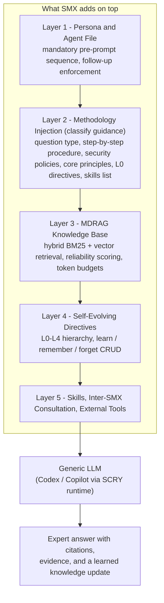
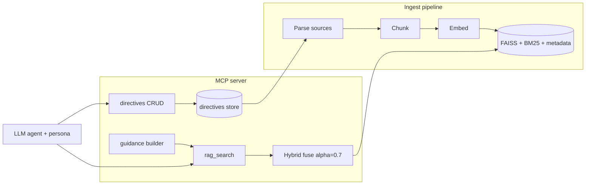

# SMX (Subject Matter eXpert): A Deep-Dive Design Document

> A complete, self-contained explanation of what an SMX is, exactly what happens "on top of" the LLM to turn it into a domain expert, how every component fits together, and a concrete blueprint for rebuilding the system from scratch.
>
> This document is grounded in the actual source of the `smx/` repository. Where it quotes or describes a source file, the relevant content is reproduced inline here so this document is fully self-contained; file paths are given as plain text (not links) so you can locate the source if you wish to verify a claim.

---

## Table of Contents

1. [TL;DR and Mental Model](#1-tldr-and-mental-model)
2. [What Is an SMX?](#2-what-is-an-smx)
3. [The Central Question: What Happens *Upon* the LLM?](#3-the-central-question-what-happens-upon-the-llm)
4. [End-to-End Request Lifecycle](#4-end-to-end-request-lifecycle)
5. [Component Deep-Dives](#5-component-deep-dives)
6. [Configuration Reference](#6-configuration-reference)
7. [Build-Your-Own SMX (Operator Path)](#7-build-your-own-smx-operator-path)
8. [Recreate-From-Scratch Blueprint](#8-recreate-from-scratch-blueprint)
9. [Glossary and File Map](#9-glossary-and-file-map)

---

## 1. TL;DR and Mental Model

**An SMX is a generic Large Language Model wrapped in five layers that, together, force it to behave like a disciplined domain expert.** The LLM weights never change. What changes is *everything around the LLM*: the persona it adopts, the mandatory workflow it must follow before answering, the curated knowledge base it must consult, the structured rules ("directives") it accumulates, and the tools it can call.

The single most important idea in the whole system:

> **The LLM is a stateless reasoning engine. SMX is the apparatus that feeds it the right context, the right procedure, and the right guardrails on every single turn — and then lets it write that context back so it gets smarter over time.**

A traditional "tool MCP" gives an LLM a hammer (an API client) and lets it swing. SMX instead gives the LLM a *brain transplant of domain memory plus a standard operating procedure*. That is why the project calls itself a "config-driven, multi-domain RAG MCP server": one server program becomes a network-routing expert, a security expert, or a compliance expert purely by loading a different YAML file.

### The layered mental model



### A concrete trace ("ask a question")

When a user asks *"Why is my BGP tunnel flapping after I apply this config?"* to a routing SMX:

1. The IDE/CLI loads the domain's **agent file** (persona). Its persona text *forces* a sequence before any answer.
2. The agent calls `rag_search(include_guidance=true, question_type=TROUBLESHOOTING)`. This single call returns both **knowledge chunks** AND a **guidance block**: security policies, the step-by-step TROUBLESHOOTING methodology, the domain's L0 (foundational) directives, and a list of available skills.
3. The agent follows the methodology: query knowledge, collect data, re-query as new facts emerge, cross-check evidence, never guess.
4. If the question needs another domain's expertise, it calls `consult` to ask sibling SMX experts in parallel.
5. It answers with a summary, evidence, likely cause, and next steps — in a prescribed markdown shape.
6. If the user says *"remember that this flapping is caused by MTU mismatch"*, the agent calls the `directives` tool to **write a new directive**, so the next person who asks gets the answer instantly.

Everything below expands each of these steps with the real code that implements it.

---

## 2. What Is an SMX?

### 2.1 Definition

SMX stands for **Subject Matter eXpert**. Per the project's own requirements summary, it is:

> "a single, general-purpose RAG MCP server built on the MDRAG engine. You point it at a domain configuration file, and it becomes a domain expert for that run."

Three properties define it:

- **One server, many domains.** You swap expertise by switching configs at runtime — no per-domain code.
- **Config only.** A domain is a YAML file plus a folder of documents. No code generation, no hardcoded logic.
- **Directives are first-class.** Beyond raw documents, SMX ingests and continuously authors *structured operational guidance* (playbooks, SOPs, rules) that it treats as the most authoritative knowledge.

### 2.2 The paradigm shift vs. traditional tool-MCPs

The project's design description frames the key distinction. Most domain-specific MCP servers give an AI agent **tools to interact with external systems** (a database, an API, a service). Knowledge stays external and static; the LLM is merely an *interface* to those tools. In the project's own words:

> "While most domain-specific MCPs provide AI agents with tools to interact with specific systems (databases, APIs, services), SMX provides tools that enable the LLM itself to become the domain expert through continuous learning and knowledge evolution."

SMX flips this:

| Traditional domain MCP | SMX |
|---|---|
| Provides tool access to external systems | Provides knowledge-synthesis tools so the LLM *internalizes* domain expertise |
| LLM is an interface to tools | LLM *becomes* the domain expert |
| Knowledge is static in external systems | Knowledge continuously evolves via interaction-driven directives |
| Expertise is hardcoded in tool implementations | Expertise is dynamically retrieved and authored |

The practical consequence: you make an LLM an expert not by fine-tuning it and not by handing it a bigger toolbox, but by (a) **retrieving** the right curated knowledge on every turn and (b) **enforcing** an expert's working procedure.

### 2.3 The runtime model

```
domain.yaml  →  smx ingest (build index)  →  smx serve (MCP)  →  client asks via tools
```

- Config is validated at startup.
- `smx ingest` parses sources, chunks them, computes embeddings, and writes a versioned on-disk index.
- `smx serve` opens that index and exposes MCP tools.
- Serving is stateless with respect to sources: it relies entirely on the persisted index plus the live directives.

### 2.4 Where it runs

An SMX is consumed in three ways:

1. **In an IDE** (VS Code / Cursor) through GitHub Copilot or Cursor's MCP client. `smx setup <domain>` writes `.vscode/mcp.json`, `.cursor/mcp.json`, and a custom agent/chatmode file.
2. **From the CLI**: `smx ask <domain> "question"`.
3. **As a Webex bot**: `smx bot` scaffolds a chat bot profile.

---

## 3. The Central Question: What Happens *Upon* the LLM?

This is the question you most wanted answered: *"I know it is powered by an LLM, but what happens upon the LLM?"*

The short answer: **nothing is done to the LLM itself.** SMX uses an off-the-shelf model (OpenAI Codex or GitHub Copilot, see [Section 5.4](#54-llm-runtime-scry-codex-copilot)). It is never fine-tuned. Instead, SMX builds **five layers of scaffolding** that shape the model's input context and constrain its behavior on every turn. Expertise is an emergent property of these layers, not of the weights.

Let us walk each layer with the code that creates it.

### 3.1 Layer 1 — Persona and the Agent File

Every domain produces an **agent file** (a VS Code "chatmode" / Cursor custom-mode markdown file). It is generated by `smx/src/smx/core/agent.py` (`generate_agent_content`) from the domain's `persona`, `description`, and tool list.

This file does two things:

1. **Adopts the persona.** "You are the `<domain_name>` domain expert. Use the SMX MCP tools shown in your tool list for domain knowledge."
2. **Hard-codes a mandatory workflow.** The real persona enforcement (from the reference `smx-expert` chatmode/agent file) opens with:

> "🚨 CORE OPERATING PRINCIPLE 🚨
> You are a specialized domain expert powered by a knowledge base (MDRAG). You MUST query your knowledge base for EVERY user prompt BEFORE taking any actions. Your general training data is NOT sufficient - you need domain-specific context from MDRAG."

And then injects an **implicit prefix on every user prompt**, a numbered "CRITICAL — DO THIS FIRST — MANDATORY SEQUENCE" block:

1. Get the resolution methodology (classify the request).
2. Read the returned methodology and security policies.
3. Query MDRAG for context (even if the question seems trivial, even if you already queried earlier in the conversation).
4. Verify planned actions against security policies.
5. Only then act.

There is also explicit **follow-up enforcement**: even mid-conversation, each new user turn must re-query MDRAG, because the first query only retrieved a few chunks and the follow-up likely needs *different* directives.

> **Why this matters:** an unscaffolded LLM will happily answer "from memory." That memory is generic, stale, and often wrong for a private domain. Layer 1 makes "consult the knowledge base first" a non-negotiable reflex. This is the behavioral backbone of expertise.

The tool list in the agent frontmatter (e.g. `['smx-expert/*', 'edit', 'fetch', ...]`) restricts which tools the IDE exposes; `<domain>/*` always includes the SMX MCP tools.

### 3.2 Layer 2 — Methodology Injection (the `classify` guidance)

This is the most distinctive layer. It is implemented in `smx/src/smx/tools/methodology_tools.py`.

Historically a dedicated `classify` MCP tool returned this guidance. **As of the current code, `classify` is deprecated and unregistered** — its payload now ships inside `rag_search(include_guidance=true, question_type=...)` so the very first knowledge lookup of a request *also* delivers the operating procedure in one round-trip. The function that builds it, `build_classification_guidance(question, question_type)`, is still the source of truth (the `classify` tool body is retained, undecorated, only to ease reverts). The canonical tool description in `smx/src/smx/data/core/tool_descriptions.yaml` explicitly says:

> "NOTE: the smx_classify() tool has been REMOVED/deprecated — its guidance (security policies, methodology, L0 directives, skills) now comes from here. If any instruction tells you to call classify first, call smx_rag_search(include_guidance=true) instead."

and the retained (unexposed) `classify` entry reads:

> "REMOVED. smx_classify() is no longer registered as a tool. Its domain orientation, security policies, methodology, L0 directives, and skills now ship in the `guidance` section of smx_rag_search(include_guidance=true) — call that instead."

The guidance payload has five parts:

#### (a) Question-type classification

The model must label the request as one of eight `question_type_enum` values:

`TRIVIAL`, `GENERAL`, `TROUBLESHOOTING`, `INVESTIGATION`, `EXECUTE_SIMPLE_TASK`, `REPORT_GENERATION`, `MDRAG_DIRECTIVES_CRUD`, `DEEP_INVESTIGATION`.

(There is even an alias map, `_QUESTION_TYPE_ALIASES`, to defensively normalize hallucinated labels like `"howto"` → `GENERAL`.)

#### (b) A per-type methodology (the "expert's SOP")

Each type maps to an explicit, ordered, step-by-step procedure stored in the `methodologies` dict. For example, `TROUBLESHOOTING` is literally:

```
1. Query MDRAG for context (REQUIRED even if you queried earlier - each prompt needs fresh context)
2. Ignore user's initial speculation, but preserve validated findings from prior investigations
3. Collect preliminary data (failures, errors)
4. Query MDRAG for specific directives related to what you found
5. Thorough analysis:
   - Query MDRAG as new points emerge (don't rely on earlier queries)
   - Refine iteratively as you learn more
   - Deep dive: investigate further (ddts, code, examples, other SMX)
   - Continue until queries yield no new insights
6. Validate & finalize:
   - Cross-check conclusions against evidence
   - Test hypotheses with actual data
7. Response framing (required):
   - Provide a concise summary, evidence, likely cause(s), and next steps
   - Use clear markdown headings and bullets; use tables for structured data
```

`GENERAL`, `EXECUTE_SIMPLE_TASK`, `REPORT_GENERATION`, `MDRAG_DIRECTIVES_CRUD`, and `DEEP_INVESTIGATION` each get their own tailored procedure. `DEEP_INVESTIGATION` is guarded so it only triggers AutoTriage (a 20-30 minute multi-step analysis) when the user explicitly uses the word "deep." A common tail is appended to every methodology:

```
Do tasks yourself.
Use actual data, not examples.
Consult other SMX if they have greater expertise.
BEFORE suggesting any answer: Query MDRAG for relevant best practices and apply them.
```

> **Why this matters:** experts do not just *know* facts — they follow a *method*. This layer transplants the method. It is what separates "a chatbot with a wiki" from "an engineer who knows to collect logs before theorizing."

#### (c) Security policies

`_build_security_policies(domain)` returns hard rules: never enable cheating/bypass, never divulge secrets, never produce harmful results, directive edits only via CRUD tools, and a domain-isolation rule ("never access other domains' files outside your own"). `SMX-infra` gets a narrow exception to edit other domains' *config* files for support.

#### (d) Core principles

A fixed `core_principles` block: *Accuracy >> speed; show confidence level; answer questions, don't just describe process; never invent flags/paths; verify all data (no guessing/fabrication).* This is the "Never Guess / Evidence-Based" philosophy from the architecture doc, injected as text.

#### (e) L0 directives + skills catalog

The guidance eagerly loads **all `L0_` (foundational) directives** (via `_list_indexed_files('L0_')` + parallel reads) and renders them as compact markdown, plus the **names of available skills**. L0 directives are the always-on "constitution" of the domain (e.g. `L0_smx_python_usage`).

There is also a **RAG-only fallback notice** (`_build_rag_only_restrictions`): if the agentic backend is unavailable, the guidance tells the model that `consult`, `directives` CRUD, and external MCP are disabled, and it must restrict itself to lookups.

### 3.3 Layer 3 — The MDRAG Knowledge Base (retrieval)

The methodology repeatedly commands "Query MDRAG." MDRAG (Multi-format / Multi-Domain Retrieval-Augmented Generation) is the retrieval engine, bundled in-repo at `smx/src/mdrag/`. It is what `rag_search` actually calls.

Key mechanics (from `smx/src/mdrag/hybrid_search.py`):

- **Hybrid search.** It runs both a **vector** (semantic) search over FAISS embeddings and a **BM25** (keyword) search, then fuses them. The fusion is a weighted sum:

```
hybrid_score = alpha * vector_norm + (1 - alpha) * bm25_norm
```

with a default `alpha = 0.7` (favoring semantic matching) and a default `min_similarity = 0.70` floor. Hybrid retrieval is reported in the architecture docs as 37-85% better than vector-only.

- **Reliability scoring.** Each data source has a `reliability` percentage (0-100). Lower reliability applies a multiplicative penalty to the similarity score, so authoritative docs and directives (100%) outrank chat logs (80%). Directives effectively rank at the top.
- **Token budgets.** Retrieval assembles context up to a configurable token budget, so the model's context window is used efficiently.
- **Embeddings.** `SentenceTransformers` (default `all-MiniLM-L6-v2`, 384-dim; upgradeable to `all-mpnet-base-v2`, 768-dim) via `smx/src/mdrag/embedding.py`.

> **Why this matters:** this is the "memory" of the expert. Without it, the LLM falls back to generic training data. With it, the LLM answers from *your team's* documents, with citations to exact files.

### 3.4 Layer 4 — Self-Evolving Directives

Documents are static knowledge; **directives are living knowledge.** A directive is a small, structured JSON record of operational guidance. Real example from the default directive `L0_smx_python_usage.default_directive.json` (in `smx/src/smx/data/default_directives/`):

```json
{
  "stable_id": "smx_python_usage",
  "level": "L0",
  "title": "Use SMX venv (Python + smx binary)",
  "description": "Check if .venv/bin/smx exists in pwd -> use it. Otherwise use /auto/smxpert/bin/smx.",
  "category": "core_principles",
  "priority": "critical",
  "rule": "SMX BINARY: If $PWD/.venv/bin/smx exists -> use '.venv/bin/smx <cmd>' ... NEVER /usr/bin/python3."
}
```

**Hierarchy (L0-L4)** — a five-level organization (architecture doc):

- **L0 Foundational**: core system knowledge/registries (always injected via guidance).
- **L1 Foundational**: basic concepts, references.
- **L2 Core Operations**: detailed operational knowledge (CRUD workflows, integrations).
- **L3 Advanced**: specialized workflows.
- **L4 Miscellaneous**: preferences, edge cases.

**Stable IDs** follow `<domain>.<subdomain>.<name>` (e.g. `rib.protocols.bgp`) so directives can cross-reference.

**Self-evolution via natural language.** The user-friendly shortcuts, enforced in the persona and the `MDRAG_DIRECTIVES_CRUD` methodology:

- "remember X" → upsert a directive with X
- "learn X" → learn and update directives based on X
- "forget X" → delete the directive for X

These route through the `directives` MCP tool (`smx/src/smx/tools/directive_tools.py`), which enforces owner permission (`action=check_permission`), then `upsert`/`delete`. The `MDRAG_DIRECTIVES_CRUD` methodology adds an explicit *UPDATE-vs-CREATE* decision and an **anti-bloat** rule (prefer updating/consolidating over creating redundant entries — see `L1_anti_directive_bloat_during_updates` and `L2_anti_bloat_update_methodology`).

> **Why this matters:** this is the "continuous learning" loop. The expert does not forget what it learned in a session; it writes it back to disk so the *whole team* benefits next time. This is the difference between a search engine and a colleague.

### 3.5 Layer 5 — Skills, Inter-SMX Consultation, External Tools

The final layer extends the expert's *reach*.

- **Skills** (default skills under `smx/src/smx/data/skills/`, plus per-domain skills). A skill is a `SKILL.md` with frontmatter (`name`, `description`) plus a procedural workflow — e.g. the default `showtech-analysis` skill teaches the agent how to drive a router-diagnostics MCP server step by step. The agent file says: *"Use `rag_search` for domain facts/policies. Use skills for workflows/execution."* Skills are surfaced by name in the guidance and indexed into MDRAG via a generated skills catalog.
- **Inter-SMX consultation** (`smx/src/smx/core/inter_smx.py`, tool `consult`). An SMX can call up to 4 sibling experts *in parallel*. It must justify each consult with a 3-part rationale (verified expertise / knowledge gap / expertise match). Self-consultation and consultation loops are blocked centrally. Access is governed by `access_list` ACLs (deny-by-default outbound).
- **External MCP + custom tools.** `call_external_mcp` (gated by `external_mcp_servers` config, default-deny) lets the expert drive third-party MCP servers (databases, filesystems, the showtech analyzer, etc.). Domains can also load custom Python tool modules from `tools/`.

### 3.6 Summary: the recipe that makes an LLM an expert

Putting it together, "what is done in this repo that makes an LLM a subject matter expert" is precisely this stack:

1. **Force a reflex** to consult knowledge before answering (persona).
2. **Inject an expert's procedure** matched to the question type (methodology).
3. **Retrieve curated, reliability-weighted knowledge** with hybrid search (MDRAG).
4. **Accumulate and refine structured rules** over time (directives).
5. **Extend reach** through skills, sibling experts, and external tools.

No weights are touched. Expertise is *engineered context + enforced process + persistent memory.*

---

## 4. End-to-End Request Lifecycle

This sequence diagram traces a single user prompt through the whole system, including the RAG-only fallback.

```mermaid
sequenceDiagram
    participant U as User
    participant IDE as IDE / CLI / Bot
    participant AG as Agent (LLM via SCRY: Codex/Copilot)
    participant MCP as SMX MCP Server
    participant MD as MDRAG (FAISS + BM25)
    participant DIR as Directives store
    participant OX as Other SMX experts

    U->>IDE: "Why is BGP flapping after this config?"
    IDE->>AG: prompt + agent persona (mandatory sequence)
    Note over AG: Persona forces: classify -> query -> verify -> answer
    AG->>MCP: rag_search(include_guidance=true, question_type=TROUBLESHOOTING)
    MCP->>MD: hybrid search (alpha=0.7, min_sim=0.70)
    MD-->>MCP: top chunks + reliability-weighted scores
    MCP->>DIR: load all L0 directives
    DIR-->>MCP: L0 content
    MCP-->>AG: results[] + guidance{security, methodology, L0, skills}
    Note over AG: Follow methodology steps; never guess
    AG->>MCP: rag_search(query=refined terms)  // iterate as facts emerge
    MCP->>MD: hybrid search
    MD-->>AG: more evidence
    alt Needs another domain
        AG->>MCP: consult(operation=ask, targets={RibXpert: "..."})
        MCP->>OX: parallel expert query (<=4)
        OX-->>AG: expert findings
    end
    AG-->>IDE: Summary + evidence + likely cause + next steps (markdown)
    IDE-->>U: Expert answer with citations
    opt User says "remember this"
        U->>AG: "remember: flapping = MTU mismatch"
        AG->>MCP: directives(action=check_permission)
        MCP-->>AG: permitted (owner)
        AG->>MCP: directives(action=upsert, directive=...)
        MCP->>DIR: write + incremental re-index
    end
```

### RAG-only degradation

If the agentic backend (SCRY/Codex) is unavailable or unauthenticated, `resolve_agent_backend_mode` (in `smx/src/smx/agents/cli_agent.py`) returns `rag_only=True`. The guidance then includes a `mode_restrictions` block telling the model that `consult`, `directives` CRUD, and (optionally) `call_external_mcp` are disabled, and to restrict itself to read-only lookups. The expert still answers from MDRAG; it just cannot take agentic actions or learn.

---

## 5. Component Deep-Dives

### 5.1 MCP server and tool surface

The server is built on **FastMCP** (`smx/src/smx/core/server.py`). At startup it discovers functions decorated as FastMCP tools and registers them (`register_mcp_capabilities` / `add_tool`), subject to config filters (`disabled_tools`, owner-only gating, conditional loading).

The domain-agnostic tool surface (canonical names from `smx/src/smx/data/core/tool_descriptions.yaml`):

| Tool | Purpose | Notes |
|---|---|---|
| `rag_search` | Hybrid retrieval over the MDRAG index | First lookup passes `include_guidance=true` + `question_type` to also get methodology/security/L0/skills. Formerly `semantic_search_smx_knowledge` / `search_smx`. |
| `indexed_files` | List/read indexed files | Used to read a full directive when a chunk is truncated. |
| `directives` | Directive CRUD | `action=upsert` / `delete` / `check_permission`. Owner-gated. |
| `consult` | Inter-SMX consultation | `operation=list` / `ask`. `targets` is an object mapping expert→justification. Formerly `inter_smx` / `ask_smx_experts`. |
| `call_external_mcp` | Drive an external MCP server | Only registered if `external_mcp_servers` is configured (default-deny). |
| `direct_corpus` | Exact access to non-ingested corpora (DCI) | Experimental. `list_roots` / `refresh` / `search` / `read`. |
| `html_report_instructions` | Guidance + save for HTML reports | Two modes: guidance-only, or server-side write with 644 perms. |
| `classify` | (Deprecated/unregistered) | Guidance folded into `rag_search(include_guidance=true)`. |

**Communication modes:** `stdio` (direct IDE integration), `SSE` (persistent HTTP server), and **bridge mode** (a stdio↔SSE translator, `smx bridge`, so the IDE talks stdio while a long-lived SSE server holds the loaded FAISS index — avoiding cold-start on every prompt).

### 5.2 MDRAG: ingest → embed → index → serve

The MDRAG package (`smx/src/mdrag/`) implements the retrieval engine:

- `parsing.py`: format-aware extraction (Markdown, text, HTML, PDF, JSON/YAML directives). Strips boilerplate, preserves structure/metadata (title, anchors, tags).
- `chunking.py`: chunking strategies — `word_boundary` (default), `fixed`, `sentence`, `paragraph`, `semantic`, and `json` (auto-used for directives, respecting field boundaries).
- `embedding.py`: SentenceTransformers embeddings, batched.
- `faiss.py`: FAISS vector index build/load.
- `bm25s_store.py`: BM25 keyword index.
- `hybrid_search.py`: the fusion (`alpha=0.7`, `min_similarity=0.70`) and reliability-weighted ranking.
- `storage.py` / `jsonl_metadata.py`: persisted index, metadata manifests, raw-document cache.

**Ingestion policy** (`smx/src/smx/core/ingestion.py`) is notable: it **denies source code** by default (a long suffix deny-list: `.py`, `.c`, `.js`, …) and blocks dynamic-source prompts that try to clone repos or "index code." SMX is for *documentation and operational knowledge*, not a code-search tool. Ingestion is **incremental** (mtime/hash change detection), prunes deleted docs, and forces a full rebuild when the chunking strategy or embedding model changes.

### 5.3 CLI command surface

From `smx/src/smx/core/cli.py` (argparse subparsers). Core lifecycle:

| Command | Purpose |
|---|---|
| `smx init <name> -g <group>` | Scaffold a new domain (expert layout) with access group. |
| `smx ingest <domain>` | Parse → chunk → embed → build versioned index (`--force`, `--watch`, `--update-dynamic-sources`). |
| `smx serve <domain>` | Start MCP server (stdio default; `--sse --port`; `--tools-root`). |
| `smx bridge <domain>` | stdio↔SSE bridge for IDEs. |
| `smx setup <domain>` | Write IDE MCP config + agent file (`--copilot` / `--cursor` / `--no-ide`). |
| `smx cleanup <domain>` | Remove IDE integration. |
| `smx query <domain> "q"` | Local retrieval test (bypasses MCP). |
| `smx ask <domain> "q"` | Run an agentic query from the CLI. |
| `smx agent ...` | Launch the SCRY-backed agent runtime. |
| `smx list` / `smx info` | Discover domains / show domain info. |
| `smx deploy` / `smx redeploy` | Deploy a domain from Git. |
| `smx sync init/migrate/status/push/pull` | Staged filesystem (staging-tree / Git) domain workflow. |
| `smx bot` | Scaffold a Webex bot profile. |
| `smx skill list/validate` | Manage skills. |

### 5.4 LLM runtime (SCRY, Codex, Copilot)

This answers "which LLM, and how is it invoked?" Logic in `smx/src/smx/agents/cli_agent.py`.

- Selection is driven by the `SMX_USE_SCRY` env var, parsed by `parse_smx_use_scry`:
  - empty / `1` / `codex` → **SCRY-backed Codex** (default model `DEFAULT_SCRY_CODEX_MODEL`).
  - `copilot` → SCRY-backed Copilot.
  - `tool:model` → explicit tool + model.
  - `0` / `off` / `legacy` → **legacy Copilot** path (no SCRY container).
- `create_cli_agent(...)` is a factory returning a `ScryAgent` or `CopilotAgent` (both subclass the abstract `CLIAgent`).
- **SCRY** is Cisco's agent runner that wraps the Codex/Copilot CLI tools; SMX shells out to it (`scry_api`, `resolve_preferred_scry_binary`).
- `resolve_agent_backend_mode` performs availability/auth checks (SCRY binary present, `scry_api` importable, Codex authenticated). If any check fails, it returns **`rag_only=True`** and SMX degrades gracefully (Section 4).
- Codex auth is set up once via `codex-wrapper.sh login` and validated by `verify-codex-auth.sh` (also checks passwordless localhost SSH for SSHFS mounts).

The model is therefore a **standard frontier coding model** (Codex/Copilot). All "expertise" is the scaffolding from Section 3 — not a custom model.

### 5.5 Storage layout and zero-downtime index switching

Each domain lives under a deterministic, versioned tree (default root `/auto/smx/` or `/auto/smxpert-sjc/domains/`):

```
<domain>/
  .runtime/                         # runtime-generated, NOT git-tracked
    directives/                     # source-of-truth structured directives (L0_*.json ... + *.md)
    vectordb/
      mdrag_db -> mdrag_db_YYYYMMDD_HHMMSS   # symlink to the ACTIVE build
      mdrag_db_YYYYMMDD_HHMMSS/              # an immutable build
        config.json                 # build/config snapshot
        embeddings.index            # FAISS index
        metadata.pkl                # metadata manifest
        raw_documents.pkl           # normalized docs cache
    configs/                        # runtime-generated (e.g. agent files)
  expert/                           # git-tracked (expert layout)
    configs/<domain>.yaml
    docs/
    tools/
```

**Zero-downtime deploys:** `smx ingest` writes a *new* timestamped `mdrag_db_YYYYMMDD_HHMMSS` directory, then atomically flips the `mdrag_db` symlink. Rollback = point the symlink at an older build (`rotate_active_db`). The running server can keep serving the old build until the flip.

**Two layouts:** the **expert layout** (`expert/configs|docs|tools`, used by `smx init`) and the older **legacy layout** (flat `configs|docs|tools` at domain root, used by `smx deploy` until the first `ingest` migrates it).

### 5.6 Data sources

Configured under `data_sources`:

- **Static** (no `type`): a directory of docs (MD/HTML/PDF/TXT) with `include`/`exclude` globs and a `reliability` score.
- **Dynamic** (`type: dynamic`): an **LLM prompt** that fetches and writes content (Confluence wikis, JIRA, PRs, DDTS, TechZone bugs, emails). `auto_refresh_hours` keeps it fresh on a schedule (requires an owner with a live SMX). `smx ingest --update-dynamic-sources` triggers a manual refresh.
- **Directives** (`type: directives`): git-tracked custom directive directories, additive to the always-indexed `.runtime/directives/`.
- **Direct corpus (DCI)** (`direct_corpus`, experimental): non-ingested raw corpora (emails, logs, oversized code/doc stores) accessed *exactly* via the `direct_corpus` tool rather than vectorized. The recommended pattern is: keep raw material in `direct_corpus`, curate it into markdown via a dynamic source's prompt, then ingest only the curated markdown.

**Reliability tiers:** 100% (no penalty: directives, official docs) → 90% (reviewed community docs) → 80% (emails/chat). Lower reliability multiplies down the similarity score in ranking.

### 5.7 Access control and security

- **`owners`**: usernames or Linux AD groups authorized to write directives / run admin tools. Empty list = open write. Checked by the `directives` tool and admin tools.
- **`group_ownership`**: sets the Linux group on the domain directory (e.g. `eng`, a team group, or `private` for owner-only `600`/`660` perms). Only group members can access the data.
- **`access_list.outbound`**: who this domain may `consult`. **Secure-by-default**: an implicit `deny:.*` is appended, so `outbound: []` or a missing section means "consult nobody." Rules are `allow:<regex>` / `deny:<regex>`, first match wins. Outbound ACL also controls which other SMX *summaries* get ingested.
- **`access_list.inbound`**: who may consult this domain (defaults to allow-all for compatibility).
- **Domain isolation** is also enforced in the injected security policies (Section 3.2c): the model must not touch files outside its own domain.

### 5.8 IDE integration and bridge mode

`smx setup <domain>` (idempotent) writes:

- `.vscode/mcp.json` (Copilot) — `{"servers": {"smx": {"command": "smx", "args": ["serve", "DOMAIN"], "timeout": 300000}}}`.
- `.cursor/mcp.json` (Cursor) — `mcpServers.smx` with `"tools": ["*"]`.
- `.github/agents/<domain>.agent.md` — the persona/agent file.
- `.cursor/commands/<domain>.md` — a Cursor slash-command.

The 5-minute timeout accommodates large FAISS index load. **Bridge mode** keeps a warm SSE server so the IDE's stdio client gets sub-second responses after warmup.

### 5.9 Telemetry

`build_classification_guidance` fires **non-blocking** telemetry to a FireX/Lumens backend on the first lookup of each request (`_export_telemetry_to_lumens` in `smx/src/smx/tools/methodology_tools.py`): user, domain, question type, prompt source, and LLM runtime/tool/model. **Privacy**: for `group_ownership: private` domains the question text is replaced with `"[REDACTED - Private SMX]"`. Telemetry only exports from production paths (`/auto/smxpert`) unless `SMX_TELEMETRY_FORCE` is set.

---

## 6. Configuration Reference

The schema is defined as Python dataclasses in `src/smx/core/config.py` and documented in `smx/docs/schema.md`. Only the identity block is strictly required; everything else has defaults.

### 6.1 Minimal config

```yaml
version: 1                              # int, required (must be 1)
description: "Short description"        # required
persona: |                             # required - system persona/instructions
  You are a precise, helpful subject-matter expert for <domain>.
owners: ["alice", "bob"]               # required - usernames or Linux AD groups (empty = open write)
```

A minimal config can scaffold a domain but **cannot ingest** until at least one data source exists (if none is given, `docs/` is indexed by default at 100% reliability).

### 6.2 Full annotated config

```yaml
version: 1
description: "Full-featured network security domain"
persona: |
  You are a precise, helpful subject-matter expert for network security.
  Provide detailed, accurate answers with proper citations.
owners: ["alice", "security-team"]      # usernames + Linux AD groups
group_ownership: "security-team"        # Linux group on the domain dir ('eng' | 'private' | <group>)
frequent_collaborators: ["RibXpert"]    # pre-started sibling SMXs (ACL still applies)

data_sources:
  - root_path: "docs"                   # static; relative to content root
    include: ["**/*.md", "**/*.pdf", "**/*.html"]
    exclude: ["**/temp/*"]
    recursive: true
    reliability: 100                    # 0-100; lower => ranking penalty

  - type: dynamic                       # LLM-prompt-driven source
    root_path: "dynamic_data/team_wiki"
    auto_refresh_hours: 168             # refresh weekly (needs a live owner)
    prompt: |
      Fetch all pages from Confluence space 'SEC' and save as markdown with metadata.
      Keep pages updated in the last 180 days.
    include: ["**/*.md"]
    reliability: 90

  - type: directives                    # git-tracked custom directives
    root_path: "directives"
    reliability: 100

chunking:
  strategy: "word_boundary"             # word_boundary|fixed|sentence|paragraph|semantic
  size: 1000                            # chars
  overlap: 200                          # ~20% recommended

embeddings:
  provider: "sentence-transformers"     # only supported provider
  model: "all-MiniLM-L6-v2"             # or all-mpnet-base-v2 (higher quality)
  batch_size: 64

tools:
  chatmode_tools: ['edit', 'fetch', 'web_search']   # IDE tools in the agent file (SMX tools always included)

external_mcp_servers:                   # default-deny; enables call_external_mcp when present
  predefined:
    showtech:
      type: "stdio"
      command: "/auto/smartdev/mcp-beta/showtech.mcp"
      description: "Router showtech analyzer"
  allowed: ["test-.*"]                  # regex allowlist for non-predefined servers

disabled_tools: ["html_report_instructions"]   # turn off specific MCP tools

direct_corpus:                          # experimental, non-ingested exact-evidence roots
  roots:
    - id: email
      mode: filesystem
      root_path: ~/.local/state/smx-pa/email/artifacts
      source_type: email
      ingest: false
      allowed_operations: [list, search, read, refresh]

agent:                                  # smx agent (SCRY) runtime defaults
  tool: codex
  model: gpt-5.4/high

access_list:
  outbound:                             # who this SMX may consult (implicit deny:.* appended)
    - "allow:^RibXpert$"
    - "allow:^SMX-infra$"
  inbound:                              # who may consult this SMX (defaults allow-all)
    - "allow:security.*"
    - "deny:test.*"
```

> Changing `embeddings.model` or `chunking.strategy` invalidates the index and forces a full re-ingest.

---

## 7. Build-Your-Own SMX (Operator Path)

Standing up a domain on the *existing* SMX platform. This is the "I just want my own expert" path — no coding.

```bash
# 0) One-time auth (Codex licence + GitHub Copilot)
/auto/smxpert/bin/codex-wrapper.sh login
/auto/smxpert/bin/verify-codex-auth.sh
/auto/binos-tools/bin/gh auth login

# 1) Initialize a domain (pick a unique name; -g sets the access group)
/auto/smxpert/bin/smx init myteam-expert -g eng

# 2) Add knowledge
#    Option A: drop static docs
cp -r /path/to/team/docs/* /auto/smxpert-sjc/domains/myteam-expert/expert/docs/
#    Option B: edit the config to add dynamic sources (Confluence/JIRA/TechZone)
vim /auto/smxpert-sjc/domains/myteam-expert/expert/configs/myteam-expert.yaml

# 3) Build the index
/auto/smxpert/bin/smx ingest myteam-expert

# 4) Wire it into your IDE (run from your workspace root)
cd /path/to/your/workspace
/auto/smxpert/bin/smx setup myteam-expert

# 5) (optional) smoke-test retrieval without the IDE
/auto/smxpert/bin/smx query myteam-expert "How do I rotate the service cert?"
```

Then chat with it in the IDE. Train it conversationally:

- "learn about this tool: \<url>" → it ingests and remembers.
- "remember that deploys now require security approval first" → writes a directive.
- "forget the old escalation path" → removes a directive.

The whole team using `myteam-expert` immediately benefits from every learned directive.

---

## 8. Recreate-From-Scratch Blueprint

This is the "if I wanted to rebuild SMX myself, what do I do" path. The architecture is reproducible with open components. You do **not** need a custom model — you need the five scaffolding layers.

### 8.1 Minimal tech stack

| Concern | SMX uses | Open-source equivalent you can use |
|---|---|---|
| Embeddings | SentenceTransformers (`all-MiniLM-L6-v2`) | Same — `sentence-transformers` (pip) |
| Vector index | FAISS | `faiss-cpu` |
| Keyword index | BM25 | `bm25s` or `rank_bm25` |
| MCP server | FastMCP | `mcp` Python SDK / `fastmcp` |
| LLM runtime | Codex/Copilot via SCRY | Any agentic CLI/SDK (Claude, GPT, local) that speaks MCP |
| Config | YAML dataclasses | `pydantic` + `PyYAML` |
| Doc parsing | custom (md/html/pdf/json) | `markdown-it`, `beautifulsoup4`, `pypdf` |

### 8.2 Architecture you must reproduce



### 8.3 Phased milestones

**Phase 1 — Retrieval core (the "memory").**
1. Write a parser per format (md, txt, html, pdf, json). Strip boilerplate; keep title/path/tags metadata.
2. Implement chunking (start with word-boundary, size ~1000, overlap ~200).
3. Embed chunks with SentenceTransformers; build a FAISS index and a BM25 index; persist both plus a metadata manifest.
4. Implement hybrid search: normalize vector and BM25 scores, fuse with `alpha*vector + (1-alpha)*bm25` (`alpha=0.7`), apply a `min_similarity` floor and per-source reliability penalty.
5. Make ingest **versioned**: write to a timestamped dir, then atomically swap an `active` symlink. Add incremental ingest via mtime/hash.

**Phase 2 — MCP surface (the "interface").**
6. Stand up an MCP server (FastMCP/`mcp`) exposing `rag_search(query, top_k, filters)` and `indexed_files(list|read)`.
7. Add a config loader: a YAML schema with `version/description/persona/owners` + `data_sources/chunking/embeddings`. One server, many configs.

**Phase 3 — The expertise layers (the differentiators).**
8. **Persona/agent file:** generate a per-domain agent markdown that (a) sets the persona and (b) injects the mandatory "classify → query → verify → answer" sequence and follow-up enforcement. This is the single highest-leverage piece — copy the structure from the reference `smx-expert` chatmode/agent file.
9. **Methodology guidance:** implement a `question_type` enum and a dict of per-type step lists, plus fixed `security_policies` and `core_principles`. Return them — together with auto-loaded L0 directives and skill names — from your first-lookup path (SMX folds this into `rag_search(include_guidance=true)`).
10. **Directives:** define a small JSON schema (`stable_id`, `level`, `title`, `rule`, `priority`, …). Always index `directives/` first. Add a `directives` tool with `check_permission`/`upsert`/`delete`, owner-gated, that writes the JSON and triggers an incremental re-index. Wire the "learn/remember/forget" intents.

**Phase 4 — Reach and ops.**
11. **Skills:** a `SKILL.md` loader (frontmatter + procedure); expose names in guidance; index a generated catalog.
12. **Inter-expert consultation:** a `consult` tool that fans out to sibling servers (cap ~4, parallel), gated by allow/deny ACLs (deny-by-default outbound), with loop/self-consult guards.
13. **External tools:** a gated `call_external_mcp` proxy.
14. **IDE integration:** a `setup` command writing `.vscode/mcp.json` / `.cursor/mcp.json` + the agent file.
15. **Telemetry, bridge mode, dynamic sources** as needed.

### 8.4 Pitfalls and "why" (lessons baked into SMX)

- **Why a separate ingest step?** Pre-computing embeddings/indexes makes serving sub-second and auditable, enables versioned zero-downtime swaps, and supports incremental updates and provenance.
- **Why format-aware parsing (not plain text)?** Structure → better chunk boundaries, cleaner text (fewer tokens), precise citations (anchors), and safe handling of tables/code. Plain text keeps noise and garbles structure.
- **Why directives-first?** Curated, structured rules are the highest-signal knowledge and must outrank prose. Treating them as first-class (always-indexed, boosted, CRUD-able) is what enables continuous learning.
- **Why force "query before answer"?** Without the persona reflex, the model answers from generic memory and confidently hallucinates domain specifics. The mandatory sequence is the behavioral core of accuracy.
- **Why deny-by-default ACL and domain isolation?** Multiple experts share infra; an expert that can silently query/modify others is a security and correctness hazard.
- **Why deny source code in ingestion?** SMX is for operational knowledge, not code search; indexing code bloats the index and dilutes retrieval. (Enforced in `smx/src/smx/core/ingestion.py`.)
- **Why graceful RAG-only degradation?** The agentic backend (auth/runtime) can fail; the expert should still answer from memory rather than break.

---

## 9. Glossary and File Map

### Glossary

- **SMX** — Subject Matter eXpert: a config-driven RAG MCP server that becomes a domain expert at runtime.
- **MDRAG** — Multi-format / Multi-Domain Retrieval-Augmented Generation: the bundled retrieval engine (FAISS + BM25 hybrid).
- **MCP** — Model Context Protocol: the standard by which the IDE/agent calls SMX tools.
- **Directive** — a small structured JSON record of operational guidance, organized L0-L4; the highest-signal, CRUD-able, self-evolving knowledge.
- **Stable ID** — unique cross-reference key for a directive (`<domain>.<subdomain>.<name>`).
- **Methodology / classify guidance** — the per-question-type SOP plus security policies, core principles, L0 directives, and skills, injected before answering.
- **Skill** — a `SKILL.md` procedural workflow the agent executes (vs. directives which are facts/rules).
- **SCRY** — the agent runtime that wraps the Codex/Copilot CLI; selected via `SMX_USE_SCRY`.
- **RAG-only mode** — degraded mode when the agentic backend is unavailable (lookups only, no CRUD/consult).
- **Bridge mode** — stdio↔SSE translator that keeps a warm index for fast IDE responses.
- **Reliability** — per-source trust percentage that scales retrieval scores.
- **Consult / Inter-SMX** — parallel consultation of sibling experts, governed by ACLs.
- **DCI / direct_corpus** — Direct Corpus Interaction: exact access to non-ingested raw corpora.

### Repository file map (key entry points)

| Area | File |
|---|---|
| Concept & paradigm | `smx/docs/description.md`, `smx/README.md` |
| Architecture overview | `smx/docs/architecture/SMX_Architecture_Design.md` |
| Config schema | `smx/docs/schema.md`, `smx/docs/requirements.md` |
| Methodology / guidance ("upon the LLM") | `smx/src/smx/tools/methodology_tools.py` |
| Persona / agent file generation | `smx/src/smx/core/agent.py` |
| Example persona enforcement | `smx/domains/smx-expert/configs/smx-expert.chatmode.md` |
| Tool descriptions | `smx/src/smx/data/core/tool_descriptions.yaml` |
| LLM runtime selection | `smx/src/smx/agents/cli_agent.py` |
| Retrieval engine | `smx/src/mdrag/hybrid_search.py`, `smx/src/mdrag/faiss.py`, `smx/src/mdrag/chunking.py`, `smx/src/mdrag/embedding.py` |
| MCP server | `smx/src/smx/core/server.py` |
| RAG / directive / consult tools | `smx/src/smx/tools/mdrag_tools.py`, `smx/src/smx/tools/directive_tools.py`, `smx/src/smx/core/inter_smx.py` |
| Ingestion policy | `smx/src/smx/core/ingestion.py` |
| Example directives | `smx/src/smx/data/default_directives/` |
| Example skill | `smx/src/smx/data/skills/default/showtech-analysis/SKILL.md` |
| CLI | `smx/src/smx/core/cli.py` |

---

*This document was produced by studying the `smx/` repository directly. Behavioral claims (hybrid `alpha=0.7`/`min_similarity=0.70`, the deprecation of the standalone `classify` tool in favor of `rag_search(include_guidance=true)`, the SCRY/Codex runtime selection, directive schema, and storage layout) were verified against the cited source files.*