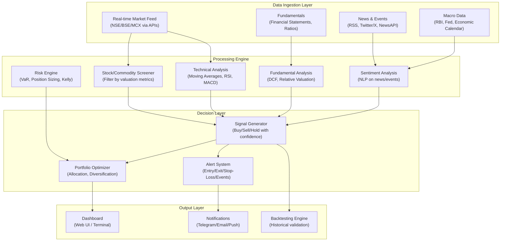
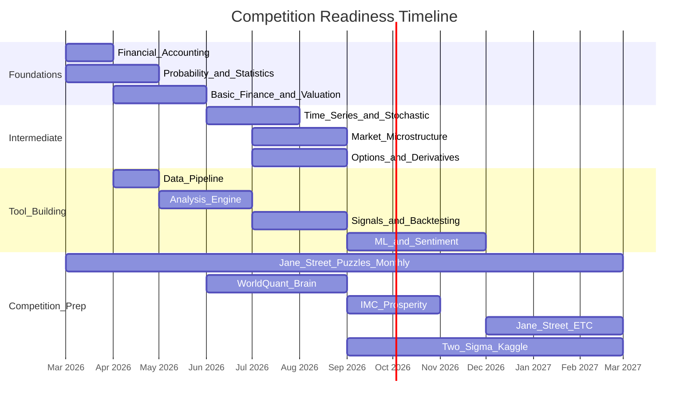

# Quant Finance & Algorithmic Trading Roadmap

## Part 1: How to Calculate "True Value" (Intrinsic Valuation)

There is no single magic number for "true value." Different asset classes use different methods. Here is how professionals think about each:

### Stocks — Intrinsic Value Methods

- **Discounted Cash Flow (DCF)**: Project future free cash flows, discount them back to present value using a discount rate (WACC). If DCF value > current price, the stock is "undervalued." This is the gold standard.
- **Relative Valuation**: Compare P/E, P/B, EV/EBITDA ratios against peers and historical averages. A stock trading at 10x P/E when its sector averages 20x *might* be undervalued (or might deserve it).
- **Dividend Discount Model (DDM)**: For dividend-paying stocks. Value = Dividend / (Required Return - Growth Rate).
- **Margin of Safety**: Benjamin Graham's concept — only buy when price is significantly below your calculated intrinsic value (e.g., 30%+ discount). This protects you from calculation errors.

### Commodities (Silver, Gold, Oil) — Value Drivers

Commodities don't have "earnings" so DCF doesn't apply. Instead:

- **Cost of Production Floor**: If silver costs ~$15-20/oz to mine, prices rarely stay below production cost for long (miners shut down, reducing supply, pushing price back up).
- **Supply-Demand Balance**: Track annual production vs consumption. Persistent deficits = bullish. Surpluses = bearish.
- **Inventory Levels**: Low exchange inventories (like current COMEX/Shanghai) = supply stress = bullish.
- **Cost of Carry Model** (for futures): Fair futures price = Spot + Storage + Insurance - Convenience Yield.
- **Contango vs Backwardation**: If futures price > spot (contango), market expects prices to rise or storage costs are high. If futures < spot (backwardation), market wants metal NOW — signals physical shortage.

### ETFs — Fair Value

- **NAV (Net Asset Value)**: The ETF's actual holdings divided by units outstanding. If market price > NAV, you're paying a premium. If price < NAV, you're getting a discount.
- **Premium/Discount**: For SILVERBEES, compare market price to NAV daily. Buy at discount, avoid at premium.
- **Tracking Error**: How much the ETF deviates from its benchmark. Lower = better.

### Options — Pricing

- **Black-Scholes Model**: The foundational formula. Inputs: stock price, strike price, time to expiry, volatility, risk-free rate.
- **The Greeks**: Delta (directional exposure), Gamma (rate of delta change), Theta (time decay), Vega (volatility sensitivity).
- **Implied Volatility vs Historical Volatility**: If IV > HV, options are "expensive." If IV < HV, options are "cheap."

---

## Part 2: Subjects to Study (Priority Order)

You come from engineering, so you already have math foundations. Here is the study sequence:

### Phase 1: Foundations (Months 1-3)

1. **Financial Accounting** — Read financial statements (balance sheet, income statement, cash flow). You must be able to read an annual report.
2. **Microeconomics** — Supply/demand, market equilibrium, elasticity. This is how commodity markets work.
3. **Probability & Statistics** — Distributions, hypothesis testing, regression, Bayesian thinking. You likely have some of this from engineering.
4. **Basic Finance** — Time value of money, CAPM, efficient market hypothesis, portfolio theory (Markowitz).

### Phase 2: Intermediate (Months 3-6)

1. **Time Series Analysis** — ARIMA, GARCH, stationarity, autocorrelation. This is how you model price data.
2. **Stochastic Calculus** — Brownian motion, Ito's lemma, geometric Brownian motion. This is the language of options pricing.
3. **Linear Algebra** — Matrix operations, eigenvalues, PCA. Critical for portfolio optimization and ML.
4. **Market Microstructure** — How orders work, bid-ask spreads, market makers, order books, latency.

### Phase 3: Advanced (Months 6-12)

1. **Machine Learning** — Supervised/unsupervised learning, feature engineering, overfitting (the biggest trap in finance ML).
2. **Derivatives Pricing** — Black-Scholes deeply, Monte Carlo simulation, binomial trees.
3. **Risk Management** — VaR, CVaR, Kelly Criterion (optimal bet sizing), drawdown analysis.
4. **Behavioral Finance** — Why markets are irrational, cognitive biases, sentiment analysis.

---

## Part 3: Books (Read in This Order)

### Tier 1 — Start Here

| Book                                              | Why                                                                                                        |
| ------------------------------------------------- | ---------------------------------------------------------------------------------------------------------- |
| "The Intelligent Investor" — Benjamin Graham      | The bible of value investing. Teaches margin of safety, Mr. Market metaphor. Read chapters 8 and 20 first. |
| "One Up on Wall Street" — Peter Lynch             | How to find undervalued stocks using common sense. Accessible and practical.                               |
| "A Random Walk Down Wall Street" — Burton Malkiel | Understand efficient markets, why most people lose, and index investing. Gives you healthy skepticism.     |

### Tier 2 — Build Depth

| Book                                                  | Why                                                                                                       |
| ----------------------------------------------------- | --------------------------------------------------------------------------------------------------------- |
| "Options, Futures, and Other Derivatives" — John Hull | The textbook for derivatives. Dense but essential. Covers futures pricing, Black-Scholes, Greeks.         |
| "Trading and Exchanges" — Larry Harris                | How markets actually work at the microstructure level. Order types, market makers, information asymmetry. |
| "Security Analysis" — Graham & Dodd                   | The deep version of valuation. Heavy, but the definitive work on fundamental analysis.                    |

### Tier 3 — Quant & Algo Trading

| Book                                                             | Why                                                                                                                                                          |
| ---------------------------------------------------------------- | ------------------------------------------------------------------------------------------------------------------------------------------------------------ |
| "Quantitative Trading" — Ernest Chan                             | Practical guide to building trading systems. Covers backtesting, risk management, execution. Python-oriented.                                                |
| "Algorithmic Trading" — Ernest Chan                              | The sequel. Mean reversion, momentum, statistical arbitrage. More advanced strategies.                                                                       |
| "Advances in Financial Machine Learning" — Marcos Lopez de Prado | The best book on applying ML to finance properly. Covers triple barrier labeling, meta-labeling, purged cross-validation. Critical for avoiding overfitting. |
| "Python for Finance" — Yves Hilpisch                             | Hands-on coding for financial analysis and trading systems.                                                                                                  |

### Tier 4 — Competition Prep

| Book                                                                               | Why                                                                         |
| ---------------------------------------------------------------------------------- | --------------------------------------------------------------------------- |
| "Heard on the Street" — Timothy Crack                                              | Quant interview questions. Probability, brainteasers, options.              |
| "A Practical Guide to Quantitative Finance Interviews" — Xinfeng Zhou (Green Book) | The go-to for Jane Street, Two Sigma, Citadel interview prep.               |
| "Fifty Challenging Problems in Probability" — Frederick Mosteller                  | Sharpens probabilistic thinking. Short, fun, essential.                     |
| "Puzzle-Based Learning"                                                            | Jane Street specifically values creative problem-solving under uncertainty. |

---

## Part 4: YouTube Channels and Free Courses

### Foundational Courses (Free)

- **MIT 18.S096 — Topics in Mathematics with Applications in Finance** (YouTube, MIT OCW) — 26 lectures. Covers stochastic calculus, Black-Scholes, portfolio theory. Graduate-level but accessible for engineers.
- **Khan Academy — Finance & Capital Markets** — Start here if accounting/finance basics feel shaky.
- **Yale ECON 252 — Financial Markets (Robert Shiller)** — Nobel laureate teaching market fundamentals. Excellent.
- **Aswath Damodaran (NYU Stern)** — "The Dean of Valuation." His entire MBA valuation course is free on YouTube. Watch his DCF and relative valuation lectures. His website has spreadsheets for every valuation model.

### Quant/Algo Trading Channels

- **QuantConnect** — Free algorithmic trading platform with tutorials. Python/C#. Excellent for backtesting.
- **Sentdex (Harrison Kinsley)** — Python for finance, ML for trading. Practical and hands-on.
- **The Trading Channel / Rayner Teo** — Technical analysis fundamentals.
- **Patrick Boyle** — Hedge fund manager who explains quant strategies clearly.
- **Quantopian Legacy (now QuantConnect)** — Archived lectures on alpha research, risk models, portfolio construction.

### Competition-Specific

- **Jane Street Puzzles** — Monthly puzzles at janestreet.com/puzzles. Solve them regularly.
- **3Blue1Brown** — Linear algebra, calculus visualized. Builds deep intuition.
- **Numberphile / Stand-up Maths** — Mathematical thinking and problem-solving.

---

## Part 5: Building the Market Analysis Tool

This is a multi-phase engineering project. Here is the architecture:

### Recommended Tech Stack

- **Language**: Python (primary) + Rust or C++ (for performance-critical components later)
- **Data**: `yfinance`, `nsepython`, `jugaad-data` (Indian markets), Alpha Vantage API, Twelve Data API
- **Analysis**: `pandas`, `numpy`, `scipy`, `statsmodels`, `ta-lib` (technical indicators)
- **ML**: `scikit-learn`, `xgboost`, `pytorch` (for deep learning later)
- **NLP/Sentiment**: `transformers` (HuggingFace), `FinBERT` (finance-specific NLP model)
- **Backtesting**: `backtrader`, `zipline-reloaded`, or build custom
- **Dashboard**: `streamlit` or `dash` for quick web UI
- **Alerts**: Telegram Bot API, email via SMTP
- **Database**: PostgreSQL + TimescaleDB (time-series optimized)
- **Scheduling**: `APScheduler` or `celery` for periodic tasks

### Build Phases

**Phase 1 (Weeks 1-4): Data Pipeline**

- Connect to NSE/BSE/MCX data APIs
- Store historical and real-time price data in a database
- Build basic screener (filter stocks by P/E, P/B, market cap, volume)

**Phase 2 (Weeks 5-8): Analysis Engine**

- Implement technical indicators (SMA, EMA, RSI, MACD, Bollinger Bands)
- Implement basic fundamental analysis (DCF calculator, ratio comparisons)
- Build a backtesting framework to test signals against historical data

**Phase 3 (Weeks 9-12): Signals and Alerts**

- Combine technical + fundamental signals into buy/sell scores
- Implement position sizing using Kelly Criterion
- Set up Telegram/email alerts for entry/exit signals

**Phase 4 (Months 4-6): Intelligence Layer**

- Add news sentiment analysis using FinBERT
- Add macro event tracking (Fed meetings, RBI policy, earnings dates)
- Build a web dashboard to visualize everything

**Phase 5 (Months 6-12): Advanced**

- ML-based signal generation (with proper walk-forward validation to avoid overfitting)
- Options pricing and Greeks calculator
- Portfolio optimization (mean-variance, risk parity)
- Geopolitical event impact analysis

---

## Part 6: Competition Preparation Path

### Target Competitions

- **Jane Street ETC (Electronic Trading Challenge)** — Team-based simulated market-making. Focuses on probability, game theory, quick decision-making under uncertainty.
- **Jane Street Puzzles** — Monthly math/logic puzzles. Solve them at janestreet.com/puzzles.
- **Two Sigma / Kaggle Competitions** — Data science + finance. Time series prediction, alpha factor research.
- **Citadel Data Open / Datathon** — Data analysis + financial insight competitions.
- **JPMC Code for Good** — More software engineering, but good networking.
- **WorldQuant Brain** — Build alpha factors (signals) using their platform. Free, self-paced, and directly relevant.
- **IMC Trading Competition (Prosperity)** — Algorithmic trading simulation. Excellent practice.

### Preparation Timeline

### Key Skills for Each Firm

- **Jane Street**: Probability, expected value, game theory, mental math, market-making intuition. They care about *how you think*, not just answers.
- **Two Sigma**: Statistics, ML, large-scale data analysis, time series. Heavy on Python/data science.
- **HRT (Hudson River Trading)**: Low-latency systems, C++, algorithms, competitive programming.
- **Citadel/Citadel Securities**: Mix of quant research and engineering. Strong math + coding.
- **JPMC**: Broader — risk management, derivatives, software engineering.

---

## Part 7: Immediate Action Items

1. **Today**: Start reading "The Intelligent Investor" (chapters 8 and 20 first). Watch one Aswath Damodaran valuation lecture.
2. **This week**: Set up a Python environment. Install `yfinance` and pull SILVERBEES historical data. Calculate its NAV premium/discount over time. This is your first mini-project.
3. **This month**: Complete Khan Academy's finance basics. Solve your first Jane Street puzzle. Start "Quantitative Trading" by Ernest Chan.
4. **Month 2-3**: Build Phase 1 of your tool (data pipeline + basic screener). Start MIT 18.S096.
5. **Month 3-6**: Build analysis engine. Register for WorldQuant Brain. Read Hull's "Options, Futures, and Other Derivatives."
6. **Month 6+**: Enter competitions. Iterate on your tool. Start ML-based signals.

The engineering mindset — systematic thinking, debugging, building systems — is exactly what quant finance rewards. The biggest trap to avoid: **overfitting**. A model that perfectly predicts the past is useless. Always validate out-of-sample.