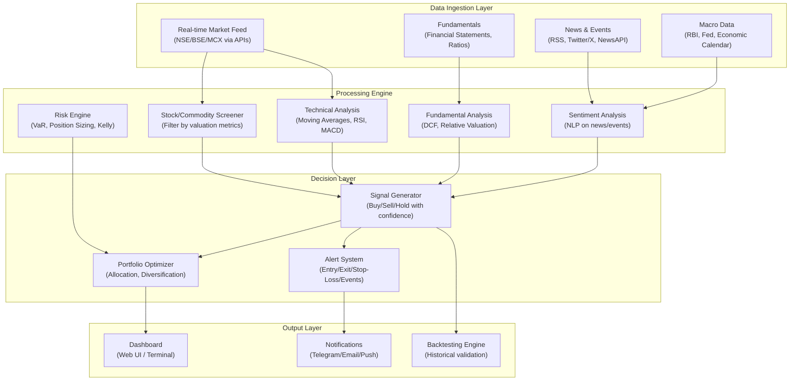
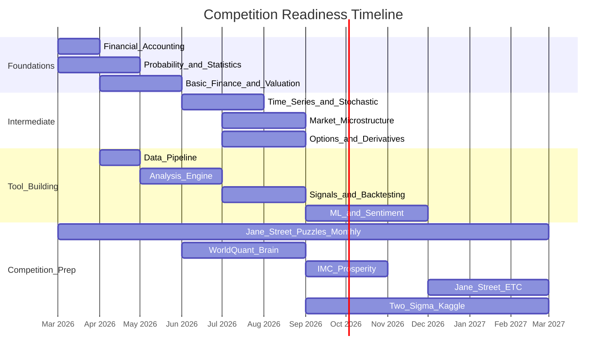
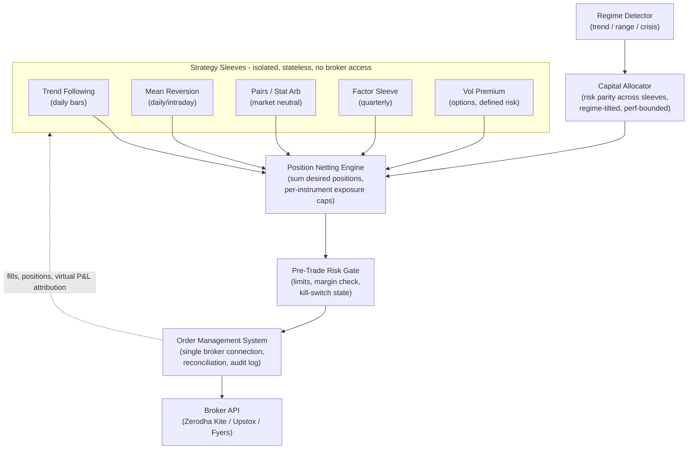

# Quant Finance & Algorithmic Trading Roadmap

## Part 1: How to Calculate "True Value" (Intrinsic Valuation)

There is no single magic number for "true value." Different asset classes use different methods. Here is how professionals think about each:

### Stocks — Intrinsic Value Methods

- **Discounted Cash Flow (DCF)**: Project future free cash flows, discount them back to present value using a discount rate (WACC). If DCF value > current price, the stock is "undervalued." This is the gold standard.
- **Relative Valuation**: Compare P/E, P/B, EV/EBITDA ratios against peers and historical averages. A stock trading at 10x P/E when its sector averages 20x *might* be undervalued (or might deserve it).
- **Dividend Discount Model (DDM)**: For dividend-paying stocks. Value = Dividend / (Required Return - Growth Rate).
- **Margin of Safety**: Benjamin Graham's concept — only buy when price is significantly below your calculated intrinsic value (e.g., 30%+ discount). This protects you from calculation errors.

### Commodities (Silver, Gold, Oil) — Value Drivers

Commodities don't have "earnings" so DCF doesn't apply. Instead:

- **Cost of Production Floor**: If silver costs ~$15-20/oz to mine, prices rarely stay below production cost for long (miners shut down, reducing supply, pushing price back up).
- **Supply-Demand Balance**: Track annual production vs consumption. Persistent deficits = bullish. Surpluses = bearish.
- **Inventory Levels**: Low exchange inventories (like current COMEX/Shanghai) = supply stress = bullish.
- **Cost of Carry Model** (for futures): Fair futures price = Spot + Storage + Insurance - Convenience Yield.
- **Contango vs Backwardation**: If futures price > spot (contango), market expects prices to rise or storage costs are high. If futures < spot (backwardation), market wants metal NOW — signals physical shortage.

### ETFs — Fair Value

- **NAV (Net Asset Value)**: The ETF's actual holdings divided by units outstanding. If market price > NAV, you're paying a premium. If price < NAV, you're getting a discount.
- **Premium/Discount**: For SILVERBEES, compare market price to NAV daily. Buy at discount, avoid at premium.
- **Tracking Error**: How much the ETF deviates from its benchmark. Lower = better.

### Options — Pricing

- **Black-Scholes Model**: The foundational formula. Inputs: stock price, strike price, time to expiry, volatility, risk-free rate.
- **The Greeks**: Delta (directional exposure), Gamma (rate of delta change), Theta (time decay), Vega (volatility sensitivity).
- **Implied Volatility vs Historical Volatility**: If IV > HV, options are "expensive." If IV < HV, options are "cheap."

---

## Part 2: Subjects to Study (Priority Order)

You come from engineering, so you already have math foundations. Here is the study sequence:

### Phase 1: Foundations (Months 1-3)

1. **Financial Accounting** — Read financial statements (balance sheet, income statement, cash flow). You must be able to read an annual report.
2. **Microeconomics** — Supply/demand, market equilibrium, elasticity. This is how commodity markets work.
3. **Probability & Statistics** — Distributions, hypothesis testing, regression, Bayesian thinking. You likely have some of this from engineering.
4. **Basic Finance** — Time value of money, CAPM, efficient market hypothesis, portfolio theory (Markowitz).

### Phase 2: Intermediate (Months 3-6)

1. **Time Series Analysis** — ARIMA, GARCH, stationarity, autocorrelation. This is how you model price data.
2. **Stochastic Calculus** — Brownian motion, Ito's lemma, geometric Brownian motion. This is the language of options pricing.
3. **Linear Algebra** — Matrix operations, eigenvalues, PCA. Critical for portfolio optimization and ML.
4. **Market Microstructure** — How orders work, bid-ask spreads, market makers, order books, latency.

### Phase 3: Advanced (Months 6-12)

1. **Machine Learning** — Supervised/unsupervised learning, feature engineering, overfitting (the biggest trap in finance ML).
2. **Derivatives Pricing** — Black-Scholes deeply, Monte Carlo simulation, binomial trees.
3. **Risk Management** — VaR, CVaR, Kelly Criterion (optimal bet sizing), drawdown analysis.
4. **Behavioral Finance** — Why markets are irrational, cognitive biases, sentiment analysis.

---

## Part 3: Books (Read in This Order)

### Tier 1 — Start Here


| Book                                              | Why                                                                                                        |
| ------------------------------------------------- | ---------------------------------------------------------------------------------------------------------- |
| "The Intelligent Investor" — Benjamin Graham      | The bible of value investing. Teaches margin of safety, Mr. Market metaphor. Read chapters 8 and 20 first. |
| "One Up on Wall Street" — Peter Lynch             | How to find undervalued stocks using common sense. Accessible and practical.                               |
| "A Random Walk Down Wall Street" — Burton Malkiel | Understand efficient markets, why most people lose, and index investing. Gives you healthy skepticism.     |


### Tier 2 — Build Depth


| Book                                                  | Why                                                                                                       |
| ----------------------------------------------------- | --------------------------------------------------------------------------------------------------------- |
| "Options, Futures, and Other Derivatives" — John Hull | The textbook for derivatives. Dense but essential. Covers futures pricing, Black-Scholes, Greeks.         |
| "Trading and Exchanges" — Larry Harris                | How markets actually work at the microstructure level. Order types, market makers, information asymmetry. |
| "Security Analysis" — Graham & Dodd                   | The deep version of valuation. Heavy, but the definitive work on fundamental analysis.                    |


### Tier 3 — Quant & Algo Trading


| Book                                                             | Why                                                                                                                                                          |
| ---------------------------------------------------------------- | ------------------------------------------------------------------------------------------------------------------------------------------------------------ |
| "Quantitative Trading" — Ernest Chan                             | Practical guide to building trading systems. Covers backtesting, risk management, execution. Python-oriented.                                                |
| "Algorithmic Trading" — Ernest Chan                              | The sequel. Mean reversion, momentum, statistical arbitrage. More advanced strategies.                                                                       |
| "Advances in Financial Machine Learning" — Marcos Lopez de Prado | The best book on applying ML to finance properly. Covers triple barrier labeling, meta-labeling, purged cross-validation. Critical for avoiding overfitting. |
| "Python for Finance" — Yves Hilpisch                             | Hands-on coding for financial analysis and trading systems.                                                                                                  |


### Tier 4 — Competition Prep


| Book                                                                               | Why                                                                         |
| ---------------------------------------------------------------------------------- | --------------------------------------------------------------------------- |
| "Heard on the Street" — Timothy Crack                                              | Quant interview questions. Probability, brainteasers, options.              |
| "A Practical Guide to Quantitative Finance Interviews" — Xinfeng Zhou (Green Book) | The go-to for Jane Street, Two Sigma, Citadel interview prep.               |
| "Fifty Challenging Problems in Probability" — Frederick Mosteller                  | Sharpens probabilistic thinking. Short, fun, essential.                     |
| "Puzzle-Based Learning"                                                            | Jane Street specifically values creative problem-solving under uncertainty. |


---

## Part 4: YouTube Channels and Free Courses

### Foundational Courses (Free)

- **MIT 18.S096 — Topics in Mathematics with Applications in Finance** (YouTube, MIT OCW) — 26 lectures. Covers stochastic calculus, Black-Scholes, portfolio theory. Graduate-level but accessible for engineers.
- **Khan Academy — Finance & Capital Markets** — Start here if accounting/finance basics feel shaky.
- **Yale ECON 252 — Financial Markets (Robert Shiller)** — Nobel laureate teaching market fundamentals. Excellent.
- **Aswath Damodaran (NYU Stern)** — "The Dean of Valuation." His entire MBA valuation course is free on YouTube. Watch his DCF and relative valuation lectures. His website has spreadsheets for every valuation model.

### Quant/Algo Trading Channels

- **QuantConnect** — Free algorithmic trading platform with tutorials. Python/C#. Excellent for backtesting.
- **Sentdex (Harrison Kinsley)** — Python for finance, ML for trading. Practical and hands-on.
- **The Trading Channel / Rayner Teo** — Technical analysis fundamentals.
- **Patrick Boyle** — Hedge fund manager who explains quant strategies clearly.
- **Quantopian Legacy (now QuantConnect)** — Archived lectures on alpha research, risk models, portfolio construction.

### Competition-Specific

- **Jane Street Puzzles** — Monthly puzzles at janestreet.com/puzzles. Solve them regularly.
- **3Blue1Brown** — Linear algebra, calculus visualized. Builds deep intuition.
- **Numberphile / Stand-up Maths** — Mathematical thinking and problem-solving.

---

## Part 5: Building the Market Analysis Tool

This is a multi-phase engineering project. Here is the architecture:




### Recommended Tech Stack

- **Language**: Python (primary) + Rust or C++ (for performance-critical components later)
- **Data**: `yfinance`, `nsepython`, `jugaad-data` (Indian markets), Alpha Vantage API, Twelve Data API
- **Analysis**: `pandas`, `numpy`, `scipy`, `statsmodels`, `ta-lib` (technical indicators)
- **ML**: `scikit-learn`, `xgboost`, `pytorch` (for deep learning later)
- **NLP/Sentiment**: `transformers` (HuggingFace), `FinBERT` (finance-specific NLP model)
- **Backtesting**: `backtrader`, `zipline-reloaded`, or build custom
- **Dashboard**: `streamlit` or `dash` for quick web UI
- **Alerts**: Telegram Bot API, email via SMTP
- **Database**: PostgreSQL + TimescaleDB (time-series optimized)
- **Scheduling**: `APScheduler` or `celery` for periodic tasks

### Build Phases

**Phase 1 (Weeks 1-4): Data Pipeline**

- Connect to NSE/BSE/MCX data APIs
- Store historical and real-time price data in a database
- Build basic screener (filter stocks by P/E, P/B, market cap, volume)

**Phase 2 (Weeks 5-8): Analysis Engine**

- Implement technical indicators (SMA, EMA, RSI, MACD, Bollinger Bands)
- Implement basic fundamental analysis (DCF calculator, ratio comparisons)
- Build a backtesting framework to test signals against historical data

**Phase 3 (Weeks 9-12): Signals and Alerts**

- Combine technical + fundamental signals into buy/sell scores
- Implement position sizing using Kelly Criterion
- Set up Telegram/email alerts for entry/exit signals

**Phase 4 (Months 4-6): Intelligence Layer**

- Add news sentiment analysis using FinBERT
- Add macro event tracking (Fed meetings, RBI policy, earnings dates)
- Build a web dashboard to visualize everything

**Phase 5 (Months 6-12): Advanced**

- ML-based signal generation (with proper walk-forward validation to avoid overfitting)
- Options pricing and Greeks calculator
- Portfolio optimization (mean-variance, risk parity)
- Geopolitical event impact analysis

---

## Part 6: Competition Preparation Path

### Target Competitions

- **Jane Street ETC (Electronic Trading Challenge)** — Team-based simulated market-making. Focuses on probability, game theory, quick decision-making under uncertainty.
- **Jane Street Puzzles** — Monthly math/logic puzzles. Solve them at janestreet.com/puzzles.
- **Two Sigma / Kaggle Competitions** — Data science + finance. Time series prediction, alpha factor research.
- **Citadel Data Open / Datathon** — Data analysis + financial insight competitions.
- **JPMC Code for Good** — More software engineering, but good networking.
- **WorldQuant Brain** — Build alpha factors (signals) using their platform. Free, self-paced, and directly relevant.
- **IMC Trading Competition (Prosperity)** — Algorithmic trading simulation. Excellent practice.

### Preparation Timeline




### Key Skills for Each Firm

- **Jane Street**: Probability, expected value, game theory, mental math, market-making intuition. They care about *how you think*, not just answers.
- **Two Sigma**: Statistics, ML, large-scale data analysis, time series. Heavy on Python/data science.
- **HRT (Hudson River Trading)**: Low-latency systems, C++, algorithms, competitive programming.
- **Citadel/Citadel Securities**: Mix of quant research and engineering. Strong math + coding.
- **JPMC**: Broader — risk management, derivatives, software engineering.

---

## Part 7: Proven Trading Strategies Library

These are the strategy families with decades of live institutional track records and published academic evidence. For each: the edge (why it makes money and why the edge persists), the mechanics, the statistical profile, when it fails, and which module of our system it plugs into. The deep insight of multi-strategy funds (Millennium, Citadel, Point72): **no single strategy is the edge — the portfolio of uncorrelated strategies is the edge.**

### 7.1 Trend Following / Time-Series Momentum

- **The edge**: Prices trend more than random-walk theory predicts, across every asset class and century of data tested (Moskowitz, Ooi & Pedersen, "Time Series Momentum", 2012; AQR's "A Century of Evidence on Trend-Following"). Persists because investors under-react to news initially and herd later.
- **Mechanics**: Classic Turtle rules — buy a 55-day high breakout (Donchian channel), exit on a 20-day low; or 50/200-day MA crossover. Size positions by volatility: risk a fixed 1% of capital per trade, position size = (1% × capital) / (2 × ATR). Apply long AND short, across many uncorrelated instruments (equity indices, gold, silver, crude on MCX).
- **Profile**: Win rate only 30–40%, but strongly positive skew — small frequent losses, occasional huge winners. Holding period weeks to months. Daily bars are sufficient — **no latency requirements, ideal first live strategy**.
- **Fails in**: Choppy, range-bound markets ("death by a thousand cuts"). 2011–2013 was brutal for CTAs. Survives by trading many markets at once.
- **Plugs into**: TechAnalysis module + RiskEngine (ATR sizing).
- **Read**: Andreas Clenow, "Following the Trend"; Michael Covel, "Trend Following".

### 7.2 Cross-Sectional (Relative) Momentum

- **The edge**: Stocks that outperformed peers over the last 12 months tend to keep outperforming over the next 3–12 months (Jegadeesh & Titman, 1993 — one of the most replicated results in finance).
- **Mechanics**: Each month, rank NIFTY 200 stocks by trailing 12-month return *excluding the most recent month* (short-term reversal pollutes it). Long the top decile, rebalance monthly. Long-only works fine for retail.
- **Profile**: Holding 1–12 months. Steady in normal markets.
- **Fails in**: "Momentum crashes" at sharp regime reversals (e.g., 2009 rebound) — mitigate with volatility scaling and the regime filter (7.12).
- **Plugs into**: Screener + PortfolioOpt.

### 7.3 Short-Term Mean Reversion

- **The edge**: Over 1–10 day horizons, equity prices over-react and snap back. The behavioral edge: panic selling and FOMO buying are systematic.
- **Mechanics**: Larry Connors' RSI(2): when a stock is above its 200-day SMA (long-term uptrend filter) and 2-period RSI drops below 10, buy; exit when RSI(2) crosses above 70 or after 5–10 days. Variants: Bollinger %b reversion, 3-day pullback systems.
- **Profile**: Win rate 60–75%, negative skew — many small wins, occasional large losses. The mirror image of trend following, which is exactly why they pair beautifully in one portfolio.
- **Fails in**: Trending crashes — "catching falling knives." The 200-day filter and a hard stop are non-negotiable.
- **Plugs into**: TechAnalysis + RiskEngine.
- **Read**: Connors & Alvarez, "Short Term Trading Strategies That Work".

### 7.4 Pairs Trading / Statistical Arbitrage

- **The edge**: Economically linked stocks (same sector, same business model) have cointegrated prices; when the spread stretches, it reverts (Gatev, Goetzmann & Rouwenhorst, 2006).
- **Mechanics**: Test pairs for cointegration (ADF test on the spread residual). Trade the z-score of the spread: enter when |z| > 2 (long the cheap leg, short the rich leg), exit at z = 0, hard stop at |z| > 3.5 or if cointegration breaks. Indian candidates: HDFCBANK/ICICIBANK, TCS/INFY, and the gold/silver ratio on MCX (directly relevant to the SILVERBEES interest).
- **Profile**: Market-neutral — profits don't depend on market direction, making it nearly uncorrelated with 7.1–7.3. This is the diversification crown jewel.
- **Fails in**: Structural breaks — one company's fundamentals genuinely change (a scandal, a disruption) and the spread never reverts. Re-test cointegration on rolling windows; respect stops.
- **Plugs into**: A new StatArb module + the backtesting framework.
- **Read**: Ernest Chan, "Algorithmic Trading" (covers this in depth); Vidyamurthy, "Pairs Trading".

### 7.5 ETF NAV Arbitrage & Futures Cash-and-Carry

- **The edge**: Mechanical mispricings with near-deterministic convergence. **This is already our first project** — SILVERBEES premium/discount.
- **Mechanics**: (a) Track SILVERBEES market price vs iNAV; buy when discount exceeds a threshold (after costs), avoid/exit at premiums. (b) Cash-and-carry: when the futures price exceeds spot + cost of carry, buy spot / short the future and lock in the spread to expiry; reverse cash-and-carry in backwardation.
- **Profile**: High win rate, small edges, capacity-constrained — won't make you rich, but it's nearly riskless, teaches execution discipline, and validates the whole data pipeline.
- **Fails when**: Costs (STT, slippage, impact) eat the edge — measure them precisely first.
- **Plugs into**: The cost-of-carry model already in Part 1 + Screener.

### 7.6 Carry & Calendar Strategies

- **The edge**: Futures curves pay you to hold positions: in backwardation, long futures earn positive "roll yield" as contracts converge to spot; in steep contango, shorts earn it. Carry is a documented premium across commodities, FX, and bonds (Koijen et al., "Carry", 2018).
- **Mechanics**: Rank MCX/global commodity futures by curve slope (annualized % difference between near and next contract); favor longs in backwardated markets, shorts/avoidance in steep contango. Also: dividend capture timing in cash equities.
- **Profile**: Slow, steady, low turnover. Pairs naturally with trend following on the same instruments.
- **Plugs into**: The contango/backwardation tracking already planned in Part 1.

### 7.7 Volatility Risk Premium (Option Selling) — ⚠ handle with care

- **The edge**: Implied volatility is persistently higher than subsequently realized volatility — option buyers pay an insurance premium, sellers collect it. Robust, decades of evidence (CBOE PUT index).
- **Mechanics**: Defined-risk only: iron condors or credit spreads on NIFTY when IV rank is high; or the "wheel" (cash-secured puts → covered calls) on stocks you'd happily own at the strike.
- **Profile**: Very high win rate (75–90%), **severely negative skew** — this is "picking up pennies in front of a steamroller." March 2020 wiped out many naked sellers.
- **Hard rules**: Never naked short options. Cap this sleeve at 10–15% of capital. Build it LAST, after finishing Hull and the options Greeks calculator (Phase 5).
- **Plugs into**: Options pricing module (Phase 5) + RiskEngine.
- **Read**: Euan Sinclair, "Positional Option Trading".

### 7.8 Event-Driven Strategies

- **PEAD (Post-Earnings Announcement Drift)**: Stocks beating earnings estimates drift upward for 1–3 months after the announcement (Ball & Brown, 1968 — the oldest anomaly in the literature). Buy strong positive surprises with positive price reaction, hold 4–8 weeks.
- **Index rebalancing**: Stocks announced for inclusion in NIFTY/MSCI indices get forced buying from index funds — buy on announcement, exit on effective date.
- **News sentiment**: The FinBERT layer (Phase 4) generates short-horizon signals from news flow — this strategy is why that module exists.
- **Merger arbitrage**: Buy the target below deal price, capture the spread at close. Hard for Indian retail (deal flow, borrow constraints) — study it, deprioritize implementation.
- **Plugs into**: SentimentEngine + MacroData (earnings calendar tracking is already planned in Phase 4).

### 7.9 Market Making — for competitions, not live retail

- **The edge**: Quote both bid and ask, earn the spread, manage inventory risk (Avellaneda-Stoikov model). This is Jane Street's core business.
- **Reality check**: Not viable for retail live trading — you'll lose to colocated HFTs on latency. But it is **THE skill tested in Jane Street ETC and IMC Prosperity**. Implement a market-making bot inside our backtesting simulator: quote around fair value, skew quotes against inventory, widen spreads in volatility.
- **Plugs into**: Backtesting engine (build an order-book simulator mode) + competition prep.

### 7.10 Factor Investing (the long-horizon compounding sleeve)

- **The edge**: Value (cheap on P/B, EV/EBITDA), Quality (high ROE, low debt, clean accruals), Low Volatility, and Momentum factors earn premia over decades (Fama-French; AQR's entire research library).
- **Mechanics**: Quarterly: screen NSE universe on a composite factor score, hold the top 20–30 names, rebalance. This is the "investment" sleeve that compounds quietly while trading sleeves work the short term — and it directly uses the DCF/ratio engine from Phase 2.
- **Fails in**: Single factors have decade-long droughts (value 2010–2020) — always combine factors.
- **Plugs into**: FundAnalysis + Screener.

### 7.11 Seasonality & Calendar Effects (filters, not strategies)

- Turn-of-month equity strength, expiry-day effects, gold demand around Indian wedding/festival seasons. These edges are real but weak and decaying — use them as **entry-timing tilts and filters** on other strategies, never as standalone systems.

### 7.12 Regime Detection (the meta-layer that conducts the orchestra)

- **Mechanics**: Start simple — index above/below 200-day MA (trend/range), realized volatility bands (calm/normal/crisis). Later: Hidden Markov Models on returns.
- **Role**: Routes capital between sleeves. Trending regime → weight trend following up, mean reversion down. Range regime → reverse. Crisis regime → cut all gross exposure 50%+, disable option selling entirely.
- **This single component is the biggest robustness multiplier in the whole system.**

### Strategy Summary Table

| # | Strategy | Hold period | Win rate | Skew | Best regime | Worst regime | Build priority |
|---|----------|------------|----------|------|-------------|--------------|----------------|
| 7.5 | ETF NAV / basis arb | Days–weeks | Very high | Neutral | Any | High-cost env | **1 (already planned)** |
| 7.1 | Trend following | Weeks–months | 30–40% | Positive | Trending | Choppy | **2** |
| 7.3 | Short-term mean reversion | 1–10 days | 60–75% | Negative | Range-bound | Crash | **3** |
| 7.4 | Pairs / stat arb | Days–weeks | 55–70% | Mild negative | Any (neutral) | Structural breaks | **4** |
| 7.10 | Factor sleeve | Months–years | n/a | Neutral | Any | Factor droughts | **5** |
| 7.2 | Cross-sectional momentum | 1–12 months | ~50% | Mild negative | Steady trends | Sharp reversals | 6 |
| 7.6 | Carry / calendar | Weeks–months | Moderate | Mild negative | Stable curves | Curve shocks | 7 |
| 7.8 | Event-driven (PEAD, rebalance) | Days–months | Moderate | Neutral | Any | Thin liquidity | 8 |
| 7.7 | Vol premium (defined-risk) | Weeks | 75–90% | **Very negative** | Calm | Vol spike | **Last** |
| 7.9 | Market making | Seconds–minutes | High | Negative | Liquid, calm | Toxic flow | Sim only |

Note how the portfolio is deliberately constructed from **opposites**: trend (positive skew) + mean reversion (negative skew) + market-neutral pairs + a slow factor sleeve. When one bleeds, another usually earns — that is the institutional multi-strat formula.

---

## Part 8: Multi-Strategy Architecture — Running Strategies Without Conflicts

The core design principle: **strategies decide, the engine allocates, one OMS executes.** Strategies never touch the broker.



### 8.1 The Strategy Interface Contract

Every strategy is a pure function: market data in → **desired portfolio** out. No orders, no broker, no shared state.

```python
@dataclass
class TargetPosition:
    symbol: str
    target_weight: float    # desired % of THIS sleeve's capital, signed (+long/-short)
    conviction: float       # 0..1, scales sizing
    stop_loss: float | None # strategy's own exit level
    ttl: timedelta          # signal expiry — stale signals are dropped

class Strategy(Protocol):
    def on_data(self, market_state: MarketState) -> list[TargetPosition]: ...
```

Because every strategy speaks this language, adding strategy #6 never requires touching strategies #1–5 — that's what makes the system scale without conflicts.

### 8.2 Virtual Capital Sleeves

Each strategy gets a **virtual sub-account** (a "sleeve" or "book") with its own capital allocation, its own virtual P&L, and its own risk budget. The money sits in one real account, but accounting is per-sleeve. This gives you:

- **Performance attribution** — you know exactly which strategy earns and which bleeds.
- **Independent kill switches** — disable one sleeve without touching the others.
- **Clean capital reallocation** — shrink a losing sleeve, grow a winning one, with rules.

### 8.3 Conflict Resolution — the four conflict types and their fixes

1. **Opposing signals** (trend says long RELIANCE, mean reversion says short): **This is not a bug — it's diversification.** The netting engine sums sleeve-weighted targets: if trend wants +100 shares and mean reversion wants -40, the engine sends one order for net +60. Each sleeve is still credited its own virtual fill at the same price, so attribution stays honest. Bonus: netting cuts transaction costs and STT.
2. **Same-direction crowding** (three sleeves all long the same stock): per-instrument **exposure cap** (e.g., max 10% of total capital in one name, max 25% in one sector) applied at the netting layer. Excess is scaled down pro-rata across sleeves.
3. **Resource conflicts** (margin, API rate limits): a margin budget per sleeve enforced at the risk gate; one OMS owning the single broker session serializes orders and respects rate limits.
4. **Regime conflicts** (strategy designed for a regime we're not in): the regime detector tilts the allocator's weights rather than hard-disabling (except crisis mode, which cuts gross exposure mechanically).

### 8.4 Capital Allocation Across Sleeves (evolve in stages)

1. **Stage 1 — Equal weight**: every sleeve gets capital/N. Simple, unbiased, fine while track records are short.
2. **Stage 2 — Inverse volatility**: weight each sleeve by 1/σ of its returns so each contributes equal risk (naive risk parity). A volatile options sleeve automatically gets less capital.
3. **Stage 3 — Risk parity with correlation**: full covariance-based equal risk contribution.
4. **Stage 4 — Performance-tilted with bounds**: tilt toward sleeves with better rolling 6-month Sharpe, but **bounded** (no sleeve below 5% or above 35%) — unconstrained performance-chasing is how you end up 100% in the strategy about to mean-revert.
- Rebalance sleeves monthly, not daily — reacting to noise is worse than not reacting.

### 8.5 Strategy Decay Detection

Every edge decays. Monitor each sleeve's rolling Sharpe and drawdown against its backtest distribution. If live performance falls below the 5th percentile of what the backtest said was plausible (use Monte Carlo resampling of backtest trades to build that distribution), auto-flag for review and halve its allocation. This converts "is the strategy broken?" from a feeling into a statistical test.

---

## Part 9: Safeguarding Capital — Layered Risk Controls

Defense in depth: any single control can fail; five independent layers won't all fail at once.

### Layer 1 — Per-trade
- Risk max **1% of total capital per trade** (distance to stop × position size ≤ 1%).
- Every position has a stop decided **before entry**, placed **at the broker** (GTT order on Zerodha), not only in our software — survives our system crashing.
- Position sizing: **fractional Kelly (¼ to ½ Kelly)**. Full Kelly is theoretically optimal and practically ruinous because your edge estimates are noisy; quarter-Kelly keeps ~75% of the growth at a fraction of the drawdown risk.

### Layer 2 — Per-strategy
- Each sleeve has a max drawdown budget (e.g., **10% of sleeve capital**) — breach auto-disables the sleeve pending manual review.
- Max positions per sleeve; max % of sleeve in one instrument.

### Layer 3 — Portfolio
- **Daily loss kill switch**: portfolio down 3% in a day → flatten or freeze all new entries, require manual re-arm.
- **Peak-to-trough kill switch**: 15% drawdown from equity high → everything stops, full post-mortem before restart.
- Gross exposure cap (e.g., ≤ 100% — no leverage until you have 12+ months of live profitable track record; leverage converts survivable mistakes into fatal ones).
- Sector and single-name concentration caps enforced at the netting layer.

### Layer 4 — Operational security
- Broker API keys scoped to **trading only — withdrawals disabled**; keys in a secrets manager / encrypted store, never in code or git.
- 2FA on broker and email; a **separate trading account** holding only the capital you allocate to the bot — your savings are physically unreachable by the system.
- Append-only audit log of every order, fill, and decision (event-sourced) — for debugging, taxes, and SEBI compliance.
- A **dead-man's switch**: heartbeat monitor (separate process or external cron) that flattens or alerts if the main engine stops responding.
- Never deploy code to live that hasn't run in paper mode; never edit live code "just quickly."

### Layer 5 — Capital staging (the ladder of trust)
1. **Backtest** passes with realistic costs →
2. **Paper trading** 3+ months, production-identical code →
3. **Live with ₹25–50k** ("tuition money") 3+ months →
4. Scale in steps (2× at a time), only after each stage's live results match backtest expectations.
- New strategies always re-enter at step 1 regardless of how the others are doing.

### India-specific guardrails
- **SEBI's retail algo framework** (effective 2025) requires algos to run through registered broker APIs with exchange registration of algo strategies, static IP whitelisting, and order-rate limits — build against Zerodha Kite Connect / Upstox / Fyers official APIs and follow your broker's algo registration process. Never screen-scrape or automate the broker's web UI.
- **Costs are a strategy-killer in India**: STT, exchange charges, stamp duty, GST, and slippage can exceed 0.2% round-trip on delivery equity. Model ALL of them in the backtester; high-turnover strategies that look great gross are often net losers.
- **Taxes**: intraday equity = speculative business income; F&O = non-speculative business income; both taxed at slab rates. Keep the audit log clean — it doubles as your tax record.

### On "maximizing profits"
The honest framing: **profit maximization = survival × compounding × cost control.**
- The single biggest driver of long-run wealth is *not blowing up* — a 50% loss requires a 100% gain to recover. Every rule above is a profit-maximization rule in disguise.
- Second biggest: **cutting costs** (netting across sleeves, lower turnover, limit orders over market orders, avoiding over-trading) — costs compound against you exactly like returns compound for you.
- Third: **diversification across uncorrelated sleeves** raises portfolio Sharpe, which (via volatility targeting) lets you safely run the same risk budget at higher return.
- Realistic expectation-setting: 15–25% annualized with controlled drawdowns is an excellent retail systematic result. Anyone promising more per month is selling something.

---

## Part 10: The Autonomy Ladder — From Alerts to Self-Driving

Don't build "fully autonomous" as one leap. Climb levels, with promotion criteria, exactly like self-driving cars:

| Level | What the system does | Human role | Promotion criterion to next level |
|-------|---------------------|------------|----------------------------------|
| **L0** | Signals + alerts only (current plan Phase 3) | Makes every trade manually | Signals proven useful for 2–3 months |
| **L1** | Prepares complete orders; sends to Telegram for **one-tap approve/reject** | Approves each trade | 3 months of approvals where you rarely override |
| **L2** | Auto-executes within hard constraints: small size, whitelisted instruments, market hours only, all Layer 1–3 limits active | Reviews daily digest, can pause anytime | 3–6 months live, results match backtest |
| **L3** | Fully autonomous incl. capital reallocation between sleeves | Weekly review; handles flagged anomalies | 12+ months stable track record |
| **L4** | Self-monitoring: detects own strategy decay, demotes/disables sleeves, re-runs walk-forward validation on schedule | Strategic oversight only | — |

Autonomy infrastructure to build (mostly in Phase 4–5):
- **Watchdog process** (separate machine/process): heartbeats, data-feed staleness detection, broker connectivity checks; alerts → auto-flatten on prolonged failure.
- **Startup reconciliation**: on every boot, fetch actual positions/orders from the broker and reconcile against internal state — never assume; the broker's record is the truth.
- **Idempotent order logic**: crash between "send order" and "record order" must not cause a duplicate on restart (use client order IDs).
- **Scheduled self-checks**: nightly job re-validates data integrity, recomputes sleeve P&L vs broker statement, re-runs regime detection.
- **Anomaly escalation**: anything unexplained (position mismatch, fill far from expected price, P&L spike) → freeze affected sleeve + notify, don't "self-heal" blindly.

---

## Part 11: Sourcing Financial Knowledge — Continuous Pipeline

### Strategy research sources (ranked by signal-to-noise)
- **Quantpedia** (quantpedia.com) — an encyclopedia of 700+ trading strategies extracted from academic papers, each with the paper reference, expected Sharpe, and implementation notes. **The single best answer to "where do proven strategies come from."** Free tier covers dozens of strategies.
- **SSRN** (ssrn.com) + **arXiv q-fin** — primary academic literature. Start with the citation classics named in Part 7 (Jegadeesh & Titman 1993; Gatev et al. 2006; Moskowitz et al. 2012; Koijen et al. "Carry").
- **AQR research library** (aqr.com/Insights/Research) — institutional-quality, free papers on momentum, value, carry, defensive factors.
- **Alpha Architect blog** — rigorous, readable factor-investing research summaries.
- **QuantConnect Learning + archived Quantopian lectures** — practical implementation of academic strategies.
- **Ernest Chan's blog (epchan.blogspot.com)**, **Robot Wealth**, **QuantStart** — practitioner-grade implementation detail.
- **Podcasts**: Chat With Traders, Flirting with Models (Corey Hoffstein), Top Traders Unplugged (trend following).
- **Forums**: r/algotrading (filter heavily), Nuclear Phynance, QuantNet (also for competition/career prep).

### The research-to-production pipeline (treat every idea identically)
1. **Source** an idea (paper, Quantpedia, observation) → write a one-page hypothesis: what's the edge, why does it persist, who's on the other side of the trade?
2. **Replicate** in the backtester with realistic Indian costs and slippage.
3. **Torture it**: walk-forward validation, parameter sensitivity (the edge must survive on a plateau of parameters, not one magic peak), different sub-periods, Monte Carlo trade-resampling.
4. **Paper trade** 3 months minimum.
5. **Deploy small** at the bottom of the capital ladder (Part 9, Layer 5).
6. **Monitor decay** (Part 8.5) forever.
- Expect ~1 in 10 ideas to survive to step 5. That's normal and fine — the pipeline is the asset.

### Live data and knowledge feeds for the system itself
- **Indian market data**: Zerodha Kite Connect (real-time websocket + historical), Upstox/Fyers/Angel One SmartAPI as alternates; NSE/BSE bhavcopy (free EOD official data); `jugaad-data`/`nsepython` for scraped supplements.
- **Global/backup**: yfinance (free, delayed, fine for research), Twelve Data, Polygon.io, Databento (serious tick data when you need it).
- **Fundamentals**: screener.in exports, company annual reports, Damodaran's datasets (free, updated yearly).
- **Macro**: RBI database (DBIE), FRED (US), economic calendars (Investing.com API or scrape), earnings calendars.
- **Always two sources for critical data** — cross-validate prices between feeds and flag discrepancies > 0.5% as bad ticks.

---

## Part 12: Robustness Engineering Checklist

The backtest-to-live gap is where most retail systems die. This checklist is the bridge.

### Data integrity
- [ ] Adjust for splits, bonuses, dividends (corporate actions) — unadjusted data fabricates fake signals.
- [ ] Survivorship-bias-free universe — include delisted stocks in backtests or your results are inflated.
- [ ] Bad-tick filter: reject prints > n×ATR from last price; cross-validate across two feeds.
- [ ] All timestamps stored in UTC; exchange timezone applied only at the edge.
- [ ] Handle missing data explicitly (market holidays, halts, illiquid strikes) — never forward-fill silently into signals.

### Backtest hygiene (the overfitting defense, expanding the plan's closing warning)
- [ ] Model **all** costs: brokerage, STT, exchange fees, stamp duty, GST, slippage (≥ 1 tick + impact for size).
- [ ] No lookahead: signals computed only from data available at decision time (the #1 silent bug — e.g., using today's close to trade today's close).
- [ ] Walk-forward validation: optimize on window N, test on window N+1, roll forward; report ONLY out-of-sample results.
- [ ] Parameter plateaus: if performance collapses when a parameter moves 20%, the "edge" is curve-fit noise.
- [ ] Deflated Sharpe ratio / multiple-testing correction (Lopez de Prado): testing 100 variants and picking the best one guarantees a great backtest and a dead live strategy.
- [ ] Monte Carlo on trade sequence: reshuffle/resample trades to get a drawdown distribution — size capital for the 95th-percentile drawdown, not the backtest's lucky path.

### Production engineering
- [ ] Paper and live run the **same code path** — only the execution adapter differs (sim fill vs broker API).
- [ ] State persisted on every transition; crash recovery = reload state + reconcile with broker.
- [ ] Retries with exponential backoff on all API calls; circuit breaker after repeated failures (stop trading, alert — don't hammer).
- [ ] Structured logging of every decision with its inputs — when a trade looks wrong, you can replay why the system made it.
- [ ] Time-sync (NTP) on the trading machine; reject signals computed from stale data (data age check before every order).
- [ ] Deployment rule: changes go paper → small-live → full, never straight to full, even "trivial" ones.

---

## Part 13: Immediate Action Items

1. **Today**: Start reading "The Intelligent Investor" (chapters 8 and 20 first). Watch one Aswath Damodaran valuation lecture.
2. **This week**: Set up a Python environment. Install `yfinance` and pull SILVERBEES historical data. Calculate its NAV premium/discount over time. This is your first mini-project.
3. **This month**: Complete Khan Academy's finance basics. Solve your first Jane Street puzzle. Start "Quantitative Trading" by Ernest Chan.
4. **Month 2-3**: Build Phase 1 of your tool (data pipeline + basic screener). Start MIT 18.S096.
5. **Month 3-6**: Build analysis engine. Register for WorldQuant Brain. Read Hull's "Options, Futures, and Other Derivatives." Define the Strategy interface (Part 8.1) and implement strategy #2: trend following on daily bars.
6. **Month 6-9**: Add mean reversion and pairs sleeves. Build the netting engine, risk gate, and watchdog (Parts 8-9). Run everything in paper mode. Browse Quantpedia weekly and run one new idea through the research pipeline (Part 11) each month.
7. **Month 9-12**: Enter competitions (market-making sim doubles as ETC/Prosperity prep). Go live at the bottom of the capital ladder — ₹25-50k, L1 autonomy (Telegram approve/reject). Start ML-based signals.
8. **Month 12+**: Climb the autonomy ladder one level at a time as live results earn it. Add the factor sleeve and, only after mastering options, a small defined-risk vol premium sleeve.

The engineering mindset — systematic thinking, debugging, building systems — is exactly what quant finance rewards. The biggest trap to avoid: **overfitting**. A model that perfectly predicts the past is useless. Always validate out-of-sample (Part 12 is the full defense). And remember the two governing equations: the portfolio of uncorrelated strategies is the edge (Part 7), and profit maximization = survival × compounding × cost control (Part 9).